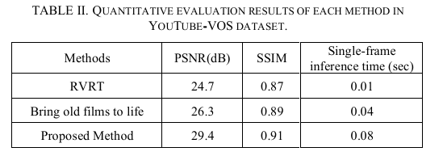

# Research on the Digital Restoration of Female Hero Images in Shandong Red Films

> "Research on the Digital Restoration of Female Hero Images in Shandong Red Films" ECNCT, 2024 Jul 19
> [paper](https://ieeexplore.ieee.org/document/10704335) [code]() [pdf](./2024_07_ECNCT_Research-on-the-Digital-Restoration-of-Female-Hero-Images-in-Shandong-Red-Films.pdf) [note](./2024_07_ECNCT_Research-on-the-Digital-Restoration-of-Female-Hero-Images-in-Shandong-Red-Films_Note.md)
> Authors: Qingshuang Dong, Guangran Zhong, Bing Wu

## Key-point

- Task
- Problems
- :label: Label:

## Contributions

## Introduction

## methods

## setting

## Experiment

> ablation study 看那个模块有效，总结一下

分辨率多大也没说。。。

## Limitations

## Summary :star2:

> learn what

### how to apply to our task

