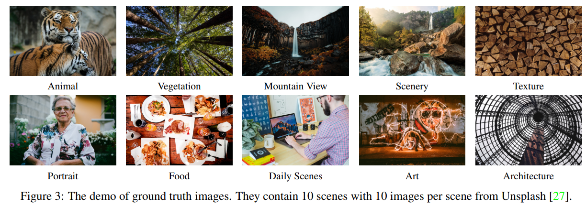
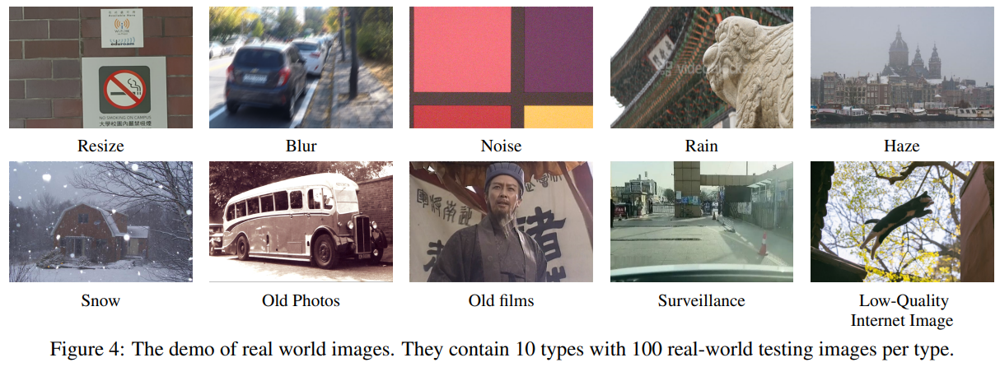
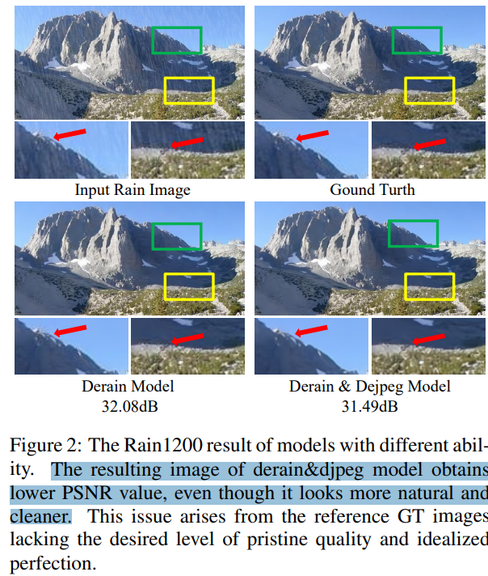

# A Preliminary Exploration Towards General Image Restoration

> "A Preliminary Exploration Towards General Image Restoration" Arxiv, 2024 Aug 27
> [paper](http://arxiv.org/abs/2408.15143v2) [code]() [pdf](./2024_08_Arxiv_A-Preliminary-Exploration-Towards-General-Image-Restoration.pdf) [note](./2024_08_Arxiv_A-Preliminary-Exploration-Towards-General-Image-Restoration_Note.md)
> Authors: Xiangtao Kong, Jinjin Gu, Yihao Liu, Wenlong Zhang, Xiangyu Chen, Yu Qiao, Chao Dong

## Key-point

- Task: Real IR
- Problems
  -  the lack of generalization ability
  - complex and unknown degradations in real-world scenarios

- :label: Label:

## Contributions

- we present a new problem called general image restoration (GIR) which aims to address these challenges within a unified model.

- the establishment of new datasets and a thorough evaluation framework for GIR models is discussed

  - 做了 Old Films 的修复 :star:

- SOTA

- 可以尝试作为新的研究方向

  > we also try to understand and interpret these models’ behaviors to inspire the future direction

## Introduction

## methods

### data

参考一下如何对图像按场景分类 :star:

GT 数据

RealWorld 数据

## setting

## Experiment

> ablation study 看那个模块有效，总结一下

PSNR 不准，PSNR 很低但主管效果比 GT 好

## Limitations

## Summary :star2:

> learn what

### how to apply to our task

- the establishment of new datasets and a thorough evaluation framework for GIR models is discussed
  - 做了 Old Films 的修复 :star:
