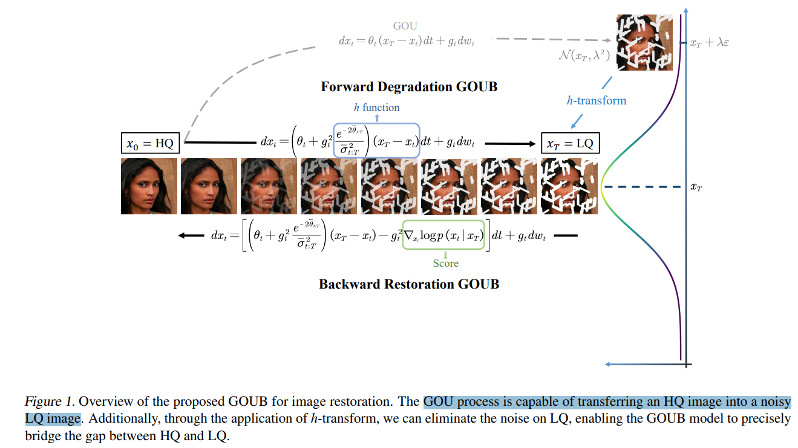
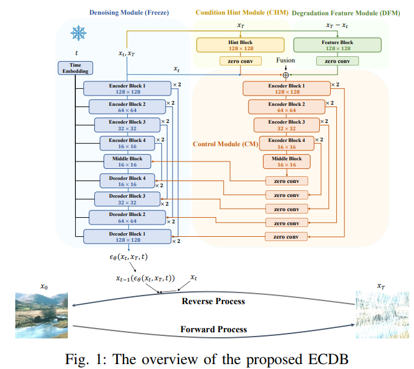
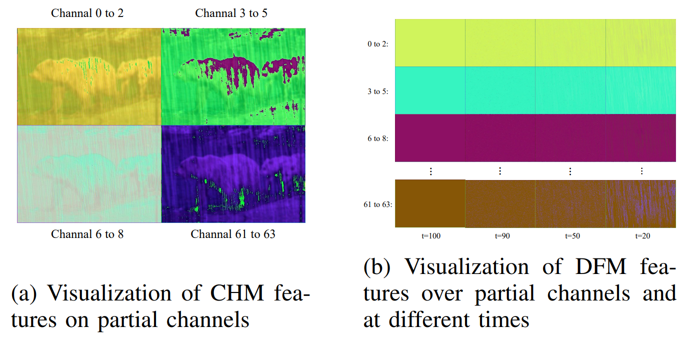
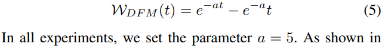
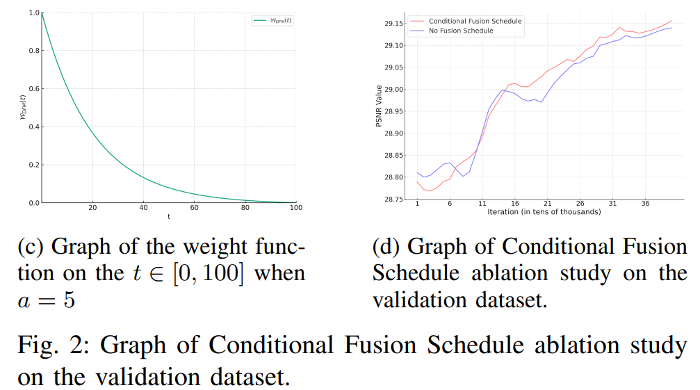
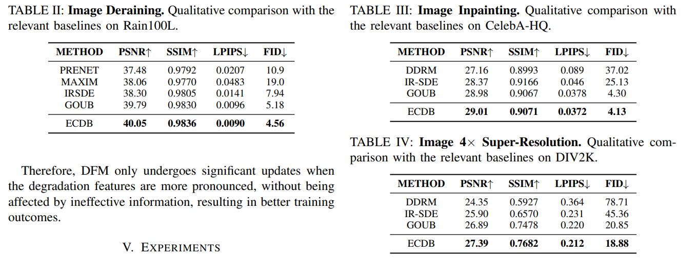
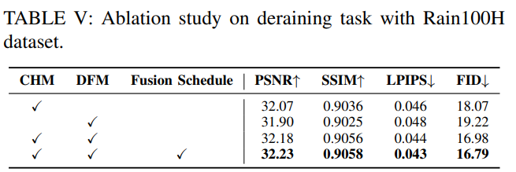

# Enhanced Control for Diffusion Bridge in Image Restoration

> "Enhanced Control for Diffusion Bridge in Image Restoration" Arxiv, 2024 Aug 29
> [paper](http://arxiv.org/abs/2408.16303v1) [code](https://github.com/Hammour-steak/ECDB) [pdf](./2024_08_Arxiv_Enhanced-Control-for-Diffusion-Bridge-in-Image-Restoration.pdf) [note](./2024_08_Arxiv_Enhanced-Control-for-Diffusion-Bridge-in-Image-Restoration_Note.md)
> Authors: Conghan Yue, Zhengwei Peng, Junlong Ma, Dongyu Zhang

## Key-point

- Task: Image restoration
- Problems
  - the current diffusion bridge restoration models do not emphasize the idea of conditional control
- :label: Label:

## Contributions

- introduces the ECDB model enhancing the control of the diffusion bridge with **low-quality images as conditions.**
- propose a **Conditional Fusion Schedule**, which more effectively handles the conditional feature information of various modules
- state-of-the-art results in many image restoration tasks, including deraining, inpainting and super-resolution.

## Introduction

- "Image Restoration Through Generalized Ornstein-Uhlenbeck Bridge" ICML, 2023 Dec 16
  [paper](http://arxiv.org/abs/2312.10299v2) [code](https://github.com/Hammour-steak/GOUB) [pdf](./2023_12_ICML_Image-Restoration-Through-Generalized-Ornstein-Uhlenbeck-Bridge.pdf) [note](./2023_12_ICML_Image-Restoration-Through-Generalized-Ornstein-Uhlenbeck-Bridge_Note.md)
  Authors: Conghan Yue, Zhengwei Peng, Junlong Ma, Shiyan Du, Pengxu Wei, Dongyu Zhang

本文大部分模块用的 GOUB 里面的

## methods

- 大部分模块基于该组先前工作 GOUB

> As shown in Figure 1, our ECDB model primarily consists of DM, CHM, DFM and CM, which accept the current state xt, LQ conditions xT

- DM 冻住，使用 GOUB 参数

> DM is the structure used by GOUB, primarily featuring a U-Net architecture that accepts xt, xT and t as inputs. t is first encoded by an MLP encoder, then concatenated with xt and xT put into the U-Net for processing

- CHM 提取 LQ 图像颜色、边缘特征？

> The purpose of CHM is to extract LQ condition features. As shown in Figure 2a, it primarily focuses on color and edge features across various channels. 
>
> Its core architecture is composed of **four convolution layers and one zero convolution layer** that is initialized to zero, with SiLU (Sigmoid Linear Unit) activation function

- DFM 模块提取退化特征 :star:
- Q：怎么做到某一个模块专门去提取划痕？

> DFM is designed to extract degradation features, which correspond to raindrop information in the task of deraining or mask information in the task of inpainting. Its core structure is consistent with the CHM. 

t=0 可视化 DFM 出来的特征，**发现和雨水很像**；这里学习的是 LQ->HQ 的映射**（xT 从 LQ 开始，只需要学习退化是啥就 ok，$xT-xt$ 就是退化信息）** :star:

> As shown in Figure 2b, we visualized the output features of DFM on different channels for the task of deraining. It is evident that as t approaches 0, the extracted features distinctly resemble raindrops

### Conditional Fusion Schedule

看 DFM 模块的**退化特征**，**发现去噪 100->50 步 基本没什么退化信息！！**

> It is evident that at the beginning of the restoration process, when t from 100 to 50, the output consists mostly of meaningless zero information and slight noise, while information about the degradation operator only appears after t = 50.

发现去噪初期，xt 的偏差较小，造成几乎没什么有效信息，**这里很低效！！所以提出一个策略去优化一下**

> xt has a low level of denoising at the beginning, making xT −xt close to zero, lacking effective information, and thus it is difficult to perform any control function. 
>
> However, this part of the **ineffective information will also be involved in the training process**. Therefore, we propose a feature fusion strategy intended to a**ssign appropriate weights to the DFM features**

就是对 DFM 特征加权一下。。。

>  Our requirement for the weight function WDFM is that it **smoothly approaches 0 from t = 100 to 50**, and **tends towards 1 from t = 50 to 0**

Fig2 c 就是设计的权重曲线。。。**PSNR 差别不是很大。。。没啥用。。。**

## setting

## Experiment

> ablation study 看那个模块有效，总结一下

提升不是很明显，用了个 Controlnet 没啥用。。。。

## Limitations

## Summary :star2:

> learn what

### how to apply to our task

- Q：怎么做到某一个模块专门去提取划痕？

> DFM is designed to extract degradation features, which correspond to raindrop information in the task of deraining or mask information in the task of inpainting. Its core structure is consistent with the CHM. 

t=0 可视化 DFM 出来的特征，**发现和雨水很像**；这里学习的是 LQ->HQ 的映射**（xT 从 LQ 开始，只需要学习退化是啥就 ok，$xT-xt$ 就是退化信息）** :star:
