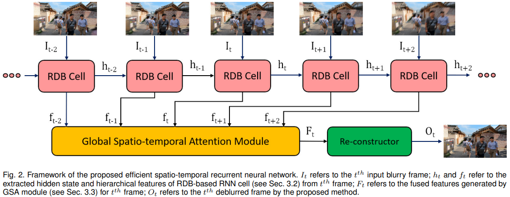

# Rethinking Video Deblurring with Wavelet-Aware Dynamic Transformer and Diffusion Model

> "Rethinking Video Deblurring with Wavelet-Aware Dynamic Transformer and Diffusion Model" ECCV, 2024 Aug 24, `VD-Diff`
> [paper](http://arxiv.org/abs/2408.13459v1) [code](https://github.com/Chen-Rao/VD-Diff) [pdf](./2024_08_ECCV_Rethinking-Video-Deblurring-with-Wavelet-Aware-Dynamic-Transformer-and-Diffusion-Model.pdf) [note](./2024_08_ECCV_Rethinking-Video-Deblurring-with-Wavelet-Aware-Dynamic-Transformer-and-Diffusion-Model_Note.md)
> Authors: Chen Rao, Guangyuan Li, Zehua Lan, Jiakai Sun, Junsheng Luan, Wei Xing, Lei Zhao, Huaizhong Lin, Jianfeng Dong, Dalong Zhang

## Key-point

- Task: video deblurring

- Problems

  - 现有 deblur 修复的高频细节垃圾，regression loss 对高频约束少？？？

    > the regression losses are conservative with high-frequency details

- :label: Label:

## Contributions

- 提出用 Diffusion 做 Video deblur

> We propose a novel method combining the Wavelet-Aware Dynamic Transformer (WADT) and the **diffusion model for video deblurring**

- 提出 WADT 模块融合视频低频特征 & DM 生成的高频特征 

> Our proposed **WADT can capture low-frequency information while utilizing the prior features generated by the DM to supplement high-frequency information**, which further enhance the quality of deblurred video

- SOTA

## Introduction

现有 deblur 修复的高频细节垃圾，regression loss 对高频约束少？？？

> the regression losses are conservative with high-frequency details

用 DM 去生成高频细节

> Since Diffusion Models (DMs) have strong capabilities in generating high-frequency details, we consider introducing DMs into the video deblurring task.

- Q：DM 太慢；blurry artifact 区域生成出来不相关的物体

> However, we found that directly applying DMs to the video deblurring task has the following problems: (1) DMs require many iteration steps to generate videos from Gaussian noise, which consumes many computational resources. (2) DMs are easily misled by the blurry artifacts in the video, resulting in irrational content and distortion of the deblurred video.

用 deblur 的低频信息，融合 DM 生成的高频特征

> To address the above issues, we propose a novel video deblurring framework VD-Diff that integrates the diffusion model into the Wavelet-Aware Dynamic Transformer (WADT)
>
> We design the WADT to preserve and recover the low-frequency information in the video while utilizing the high-frequency information generated by the diffusion model. 

### deblur

**CCN 方法**没法减模长时序特征，spatial 特征受限

> Early deep learning methods mainly use CNNbased models [13, 14, 26, 28, 36, 42, 46] to extract video features for capturing the spatio-temporal information between frames. Nevertheless, these approaches **have limitations in modelling long-range spatial dependencies and capturing nonlocal self-similarities**

- "Efficient Spatio-Temporal Recurrent Neural Network for Video Deblurring" ECCV, `ESTRNN`
  [paper](https://arxiv.org/abs/2106.16028v1) [code](https://github.com/zzh-tech/ESTRNN)

**改成 transformer 的方法**，没法生成高频细节，局部窗口的 attention 感受野还是有限

> Recently, Transformer has been employed in video deblurring tasks [4, 21, 22, 37] to address limitations in CNN-based methods, which can establish longrange spatial dependencies and capture non-local spatial information.
>
> On the one hand, the methods using standard global Transformer [8] tend to deblur videos based on low-frequency details and have limited perception of high-frequency information. On the other hand, when the local window-based Transformer [37] is used to reduce the computational cost, selfattention is calculated within a location-specific window, resulting in a limited receptive field

DM 能生成高频特征

- "Hierarchical Integration Diffusion Model for Realistic Image Deblurring" NIPS-spotlight, 2023 May 
  [paper](http://arxiv.org/pdf/2305.12966v4) [code](https://github.com/zhengchen1999/HI-Diff) [note](2023_05_NIPS_Hierarchical-Integration-Diffusion-Model-for-Realistic-Image-Deblurring_Note.md)

- Q：DM 迭代慢，对 motion blur 很敏感，生成出来无关内容

> However, directly applying DMs to video deblurring tasks has the following problems. First, DMs demand a large number of iteration steps to generate videos from Gaussian noise, which costs a lot of computational resources. Second, DMs are sensitive to motion blur in videos, resulting in irrational content and distortion of the deblurred video.

在 VAE space 做修复，减少计算量

> Although some methods, such as DDIM [45] and LDM [31], have reduced the computational complexity of DM by changing the denoising process or compressing the image, using existing DM for video deblurring still requires unaffordable computational resources. To cope with the above issue, we apply DM in a highly compact latent space to reduce the iteration steps

### Wavelet-based

- "Rethinking Fast Fourier Convolution in Image Inpainting" ICCV, 2023 Oct 1, `UFFC`
  [paper](https://openaccess.thecvf.com/content/ICCV2023/papers/Chu_Rethinking_Fast_Fourier_Convolution_in_Image_Inpainting_ICCV_2023_paper.pdf) [code](https://github.com/1911cty/Unbiased-Fast-Fourier-Convolution) [pdf](./2023_10_ICCV_Rethinking-Fast-Fourier-Convolution-in-Image-Inpainting.pdf) [note](./2023_10_ICCV_Rethinking-Fast-Fourier-Convolution-in-Image-Inpainting_Note.md)
  Authors: Tianyi Chu, Jiafu Chen, Jiakai Sun, Shuobin Lian, Zhizhong Wang, Zhiwen Zuo

## methods

去噪到 z0 加一个 Wavelet Attention Blocks (Attn +FFN)

## setting

## Experiment

> ablation study 看那个模块有效，总结一下

## Limitations

## Summary :star2:

> learn what

### how to apply to our task

