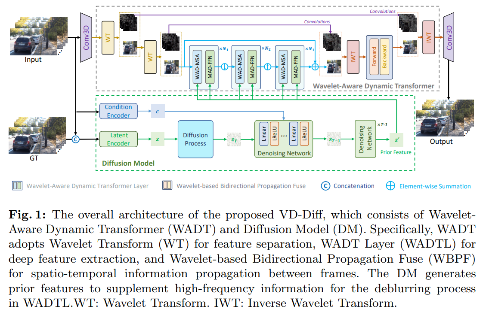

# Rethinking Video Deblurring with Wavelet-Aware Dynamic Transformer and Diffusion Model

> "Rethinking Video Deblurring with Wavelet-Aware Dynamic Transformer and Diffusion Model" ECCV, 2024 Aug 24
> [paper](http://arxiv.org/abs/2408.13459v1) [code](https://github.com/Chen-Rao/VD-Diff) [pdf](./2024_08_ECCV_Rethinking-Video-Deblurring-with-Wavelet-Aware-Dynamic-Transformer-and-Diffusion-Model.pdf) [note](./2024_08_ECCV_Rethinking-Video-Deblurring-with-Wavelet-Aware-Dynamic-Transformer-and-Diffusion-Model_Note.md)
> Authors: Chen Rao, Guangyuan Li, Zehua Lan, Jiakai Sun, Junsheng Luan, Wei Xing, Lei Zhao, Huaizhong Lin, Jianfeng Dong, Dalong Zhang

## Key-point

- Task: video deblurring
- Problems
- :label: Label:

## Contributions

## Introduction

## methods

去噪到 z0 加一个 Wavelet Attention Blocks (Attn +FFN)

## setting

## Experiment

> ablation study 看那个模块有效，总结一下

## Limitations

## Summary :star2:

> learn what

### how to apply to our task

