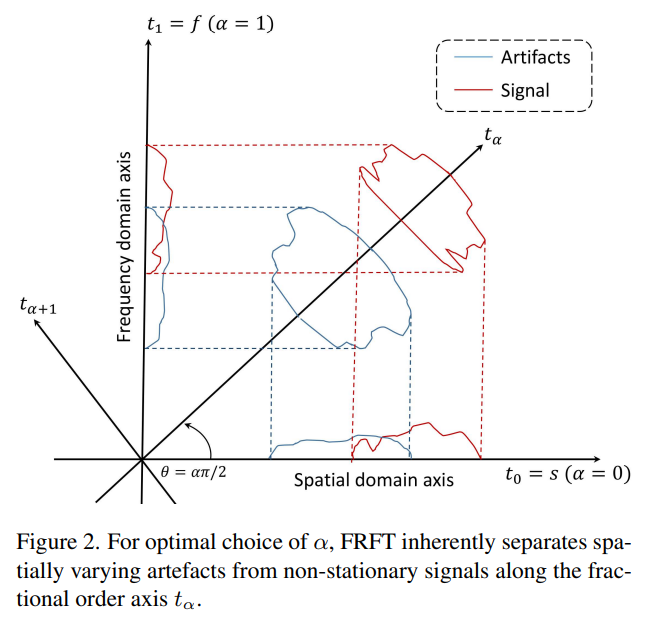
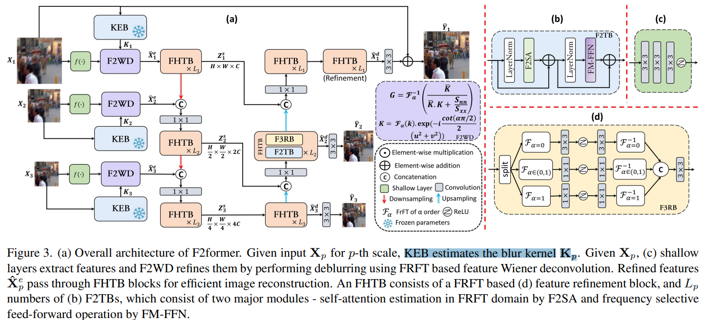
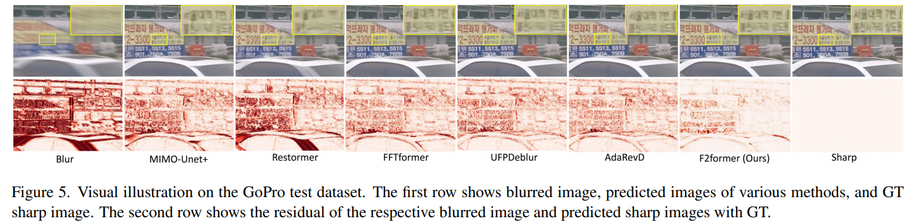

# F2former: When Fractional Fourier Meets Deep Wiener Deconvolution and Selective Frequency Transformer for Image Deblurring

> "F2former: When Fractional Fourier Meets Deep Wiener Deconvolution and Selective Frequency Transformer for Image Deblurring" Arxiv, 2024 Sep 3
> [paper](http://arxiv.org/abs/2409.02056v1) [code]() [pdf](./2024_09_Arxiv_F2former--When-Fractional-Fourier-Meets-Deep-Wiener-Deconvolution-and-Selective-Frequency-Transformer-for-Image-Deblurring.pdf) [note](./2024_09_Arxiv_F2former--When-Fractional-Fourier-Meets-Deep-Wiener-Deconvolution-and-Selective-Frequency-Transformer-for-Image-Deblurring_Note.md)
> Authors: Subhajit Paul, Sahil Kumawat, Ashutosh Gupta, Deepak Mishra

## Key-point

- Task: image deblur
- Problems
- :label: Label:

## Contributions

- In this paper, we propose a novel approach based on the Fractional Fourier Transform (FRFT), a **unified spatial-frequency representation** leveraging both spatial and frequency components simultaneously, making it ideal for processing non-stationary signals like images. 
- fractional frequency aware transformer block (F2TB)

## Introduction

## methods

## setting

## Experiment

> ablation study 看那个模块有效，总结一下

## Limitations

## Summary :star2:

> learn what

### how to apply to our task

