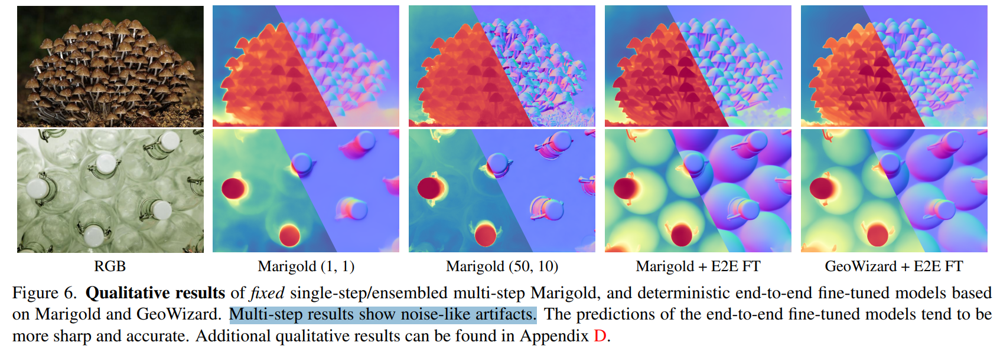
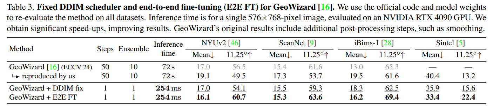

# Fine-Tuning Image-Conditional Diffusion Models is Easier than You Think

> "Fine-Tuning Image-Conditional Diffusion Models is Easier than You Think" Arxiv, 2024 Sep 17
> [paper](http://arxiv.org/abs/2409.11355v1) [code]() [pdf](./2024_09_Arxiv_Fine-Tuning-Image-Conditional-Diffusion-Models-is-Easier-than-You-Think.pdf) [note](./2024_09_Arxiv_Fine-Tuning-Image-Conditional-Diffusion-Models-is-Easier-than-You-Think_Note.md)
> Authors: Gonzalo Martin Garcia, Karim Abou Zeid, Christian Schmidt, Daan de Geus, Alexander Hermans, Bastian Leibe

## Key-point

- Task: monocular depth estimators
- Problems
  - 先前 diffusion depth estimator 推理计算量很大

- :label: Label: `depth estimators`

先前方法发现 diffusion 可以做单目深度估计 SOTA

> Recent work showed that large diffusion models can be reused as highly precise monocular depth estimators by casting depth estimation as an image-conditional image generation task.

推理计算量很大

> While the proposed model achieved state-of-the-art results, high computational demands due to multi-step inference limited its use in many scenarios.

## Contributions

> 个人理解：发现 diffusion 推理有 bug（之前一个 WACV 的工作发现的），发现 one-step 训练效果比 diffusion loss 更好（one-step image restore 的方法已经验证过），**这篇工作用先前工作的发现的 bug & fix，在 depth estimate 模型上验证了一下。。。**

- 分析先前 diffusion 类似方法推理中存在的 bug，修复后快了 x200 倍
  - 把 DDIM 调整为 single-step，变为 deterministic model，效果 SOTA

> In this paper, we show that the perceived inefficiency was caused by a flaw in the inference pipeline that has so far gone unnoticed. The fixed model performs comparably to the best previously reported configuration while being more than 200× faster

> To optimize for downstream task performance, we perform end-to-end fine-tuning on top of the single-step model with task-specific losses and get a deterministic model that outperforms all other diffusionbased depth and normal estimation models on common zero-shot benchmarks.

- 直接微调 SD，不微调 controlnet 效果很好！质疑先前工作有问题 :laughing:

> We surprisingly find that this finetuning protocol also works directly on Stable Diffusion and achieves comparable performance to current state-of-theart diffusion-based depth and normal estimation models, calling into question some of the conclusions drawn from prior works.

- SOTA 。。。

## Introduction

Fig1 右边，蓝色的对 DDIM 修复为 single step；绿色的直接对 SD 微调效果比之前好

单目深度估计，可以在下游任务作为强 prior ，提供深度信息供模型学习

> Monocular depth estimation has long been used in many downstream tasks, such as image and video editing, scene reconstruction, novel view synthesis, and robotic navigation. 
>
> Since the task is inherently ill-posed due to the scale-distance ambiguity, learning-based methods need to incorporate strong semantic priors in order to perform well

最原始的 SD 工作，用 image-condition 实现深度估计，**输出的细节好非常多！**

> For this reason, recent work has proposed to adapt large diffusion models [41] for monocular depth estimation by casting depth prediction as a conditional image generation task [26]. 
>
> The resulting models show good task performance and exhibit remarkably high levels of details.

### Q：SD 深度估计太慢了！！！ :star:

> However, the consensus in the community is that they tend to be slow [16, 18, 26], since they need to perform many evaluations of a large neural network during inference

先前工作

- "Repurposing Diffusion-Based Image Generators for Monocular Depth Estimation" CVPR-oral, 2023 Dec 4, `Marigold`
  [paper](http://arxiv.org/abs/2312.02145v2) [code](https://github.com/prs-eth/Marigold) [web](https://marigoldmonodepth.github.io) [pdf](./2023_12_CVPR-oral_Repurposing-Diffusion-Based-Image-Generators-for-Monocular-Depth-Estimation.pdf) [note](./2023_12_CVPR_Repurposing-Diffusion-Based-Image-Generators-for-Monocular-Depth-Estimation_Note.md)
  Authors: Bingxin Ke, Anton Obukhov, Shengyu Huang, Nando Metzger, Rodrigo Caye Daudt, Konrad Schindler

- "GeoWizard: Unleashing the Diffusion Priors for 3D Geometry Estimation from a Single Image" ECCV
  [web](https://fuxiao0719.github.io/projects/geowizard/)

> https://fuxiao0719.github.io/projects/geowizard/images/normal_relighting.mp4

可以通过深度指定图像光照，呈现的焦距

看效果和 marigold 接近

- 实现 cross domain 融合

- Q：发现 marigold 推理时候存在 **diffusion 训练的 bug**，对于 image-condition 影响很大；

> We investigate the behavior of Marigold and find that its dismal performance in the few-step regime is due to a critical flaw in the inference pipeline. While this bug has already been reported in the general diffusion model literature [30], we **demonstrate that it is particularly critical in the scope of image-conditional methods such as Marigold.** 
>
>  In particular, our results indicate that existing works have probably drawn wrong conclusions due to flawed inference results
>
> - "Common diffusion noise schedules and sample steps are flawed" WACV :star:

对后续工作矫正一下发现的 bug，发现 single-step 效果很 ok

> With a small correction to the inference pipeline, Marigold-like models [16, 26] obtain single-step performance that is comparable to multi-step, ensembled inference, while being more than 200× faster
>
> - "GeoWizard: Unleashing the Diffusion Priors for 3D Geometry Estimation from a Single Image" ECCV
>   [web](https://fuxiao0719.github.io/projects/geowizard/)

1. one-step 能够实现 end2end 训练，效率 up
2. 使用 self-training 训练技巧，之前对于鉴别器很有用

用 one-step 方式微调 Marigold 使用新的 loss；又在法向量预测，训练的结果类似

> We fine-tune Marigold end-to-end into a deterministic affine-invariant depth estimator for monocular images using a scale and **shift invariant loss function** [39].

- Q：什么是 shift invariant loss function？

TODO

**发现用 task 相关的 loss 比 （改结构 + 加数据）效果要好**

> end-to-end fine-tuning with a task-specific loss outperforms more complicated architectures which were trained on more data

因为 diffusion 训练的bug，直接微调 SD 的效果都比 marigold 好一些。。

>  direct fine-tuning of Stable Diffusion (SD) into a deterministic feed-forward model, outperforms Marigold and other diffusion-based depth- and normal estimation methods

1. 深度 & 法向量预测，在实际使用场景需要大幅加速才可用
2. 加 condition 方式训练效率不如直接 end2end 微调
3. 少量 + 合成数据效果可以的

## methods

### Fixing Single-Step Inference

> We observe very small differences for almost all pixels, indicating that the model changes predictions very little during inference

c图：可视化了一下 marigold 推理中 single-step 出来纯噪声了。。可以修复为 d 图！！！

b图：用结果还可以的 DDIM 50steps 结果**计算下和 GT 的标准差，发现几乎每个像素都变了！！！**

- Q：分析为啥上面 one-step 就不行？？

喂给模型的 input 中 timestep 和 latent-noise 不匹配。。。噪声太多了；
one-step 时候，**模型输入的 timestep 对应的是 GT depth，而模型输入是纯高斯噪声**。。。模型接收到了 RGB 图更多的 noise，结果基本没改就出来了

> In other words, the model receives significantly more noise than it expects, and forwards the noise almost unchanged

- Q：解决？

**对 timestep 改造一下使之与 noise-level 匹配** :star:，具体参考 "Common diffusion noise schedules and sample steps are flawed" WACV :star:；修复完就有这个 c,d 图的结果

> align the timestep with the noise level. To do this, we can **use the trailing setting as proposed in recent work** [30] for image-generative models.

### End-to-End Fine-Tuning

- Q：修复完 marigold 的结果**有很多 artifacts，例如模糊 or 过度补充的细节？**看 fig6

> While diffusion-based depth estimation models show good overall performance and accurate details, they also exhibit artifacts such as blurred or over-sharpened outputs;

- Q：为啥？？从提出假设开始！！！:star2: （也不一定对哦。。）

猜测是 diffusion loss 的问题，**多个 task（text2image, image-restore）都用同一个 loss，模糊不清。。**

> This could be due to the diffusion training objective, which **does not guarantee that models are trained for the desired downstream task, but for the surrogate denoising task**

尝试用 end2end 方式训练

> To fix this, we directly finetune the diffusion model in an end-to-end manner.

- Q：如果用原始 diffusion 多 step 训练的方式，不同 timestep 出来结果存在可信度不高的问题。。这样为了**计算 loss，要多 step 出来太慢了。。。**

> Note that end-to-end fine-tuning of a diffusion model without sensible single-step predictions would require backpropagation through multiple network invocations, which is computationally infeasible for models with hundreds of millions of parameters.

没解决，只是证明 one-step 的重要性！

- Q：咋办？

1. 固定使用一个 timestep 不去采样了

> we do not sample the timestep t anymore and instead fix t = T in order to always train the model for single-step prediction

2. 改一下 noise？？:question:

> we replace the noise with the mean of the noise distribution, i.e., zero, and only forward the RGB latent through the model.

3. 改一下 loss

- Q：diffusion 训练 loss 和现在的 loss 有啥区别？

> Marigold trains to match the latents of the GT depth maps using an MSE loss

直接对 depth map 做 loss 更精确，（这个方案不是很新，看一下 PASD 后面一篇做 image-restoration one-step 的工作就是这么搞得。。）

> we optimize to predict good decoded depth maps

看图就是这样的。。没什么新的信息

#### Task Loss

> For monocular depth estimation, we use an **affine-invariant loss function** which is invariant to global scale and shift of the depth map. :star:

- affine-invariant loss function：拟合出 scale 参数 s & shift 参数 t，**调整一下预测的 depth；再做下 L1 Loss**

$$
\hat{d} = sd + t\\
\text{Task Specific Loss:} \\
L_{depth} = \frac{1}{HW} \sum{\abs{d_{i,j} - \hat{d_{i,j}}}} 
$$

> we perform **least-squares fitting** between the ground-truth depth d ∗ and the predicted depth map d to estimate the scale and shift values

法向量 Loss

这里的 Loss 根据 metrics 指标来的。。

> - AbsRel 指标，越小越好
>
> Absolute Mean Relative Error (AbsRel)，M 为像素数, a 为预测的 depth
> $$
> Absolute Mean Relative Error (AbsRel) = \frac{1}{M}\sum_{i=1}^{M}\abs{a_i - d_i}/d_i
> $$
>
> - $\delta1$ accuracy 越大，每个depth 的差距越小
>
> > The second metric, δ1 accuracy, measures the proportion of pixels satisfying **max(ai/di , di/ai) < 1.25**
>

## setting

dataset 使用 marigold 一样的训练数据

- Hypersim
- Virtual KITTI 2

训练的模型细节：直接微调 Marigold 方法；法向量预测，重新训练一个 marigold

> For depth estimation, we use the official Marigold checkpoint, whereas for normal estimation, we train a model with the same training setup as Marigold’s depth estimation, encoding normal maps as 3D vectors in the color channels.

- 20K iterations using the AdamW optimizer 3 × 10−5  100-step warm-up
- batch=32

> Fine-tuning takes approximately **3 days on a single Nvidia H100 GPU.**

## Experiment

> ablation study 看那个模块有效，总结一下

修复完 bug 和 marigold 对比，指标确实好了很多（用 one-step 和之前的 50 step 比）

- 对比 LCM 模型（先前做 few-steps 推理的方法）

> compare vanilla Marigold and a variant **distilled into Latent Consistency Model (LCM)** [34] for few-step inference with our single-step variants in Tab. 1

1. LCM 确实垃，比原来的 DDIM 50 垃圾多了
2. **这里修复 bug 后的模型和原始没差多少，但是效果接近，时间少了很多啊！！**。。。展示出来的图像多多少少是挑出来的图了。。。

重新训练一个 marigold 用于法向量（不好说，可能训得不行。。。）

- 自己重新训练 GeoWizard 发现效果不行。。。打人家

- 既然复现出来效果拉，所有模型效果重新比对一次

#### ablation: noise

- 用提出的 zeros noise 训练下来效果好了一丢丢，但不多。。。

## Limitations

## Summary :star2:

> learn what

- 对比 LCM 模型（先前做 few-steps 推理的方法）

> compare vanilla Marigold and a variant **distilled into Latent Consistency Model (LCM)** [34] for few-step inference with our single-step variants in Tab. 1

1. LCM 确实垃，比原来的 DDIM 50 垃圾多了
2. **这里修复 bug 后的模型和原始没差多少，但是效果接近，时间少了很多啊！！**。。。展示出来的图像多多少少是挑出来的图了。。。

- 用提出的 zeros noise 训练下来效果好了一丢丢，但不多。。。

### how to apply to our task

- 用 one-step 方式微调 Marigold 使用新的 loss；又在法向量预测，训练的结果类似，**发现用 task 相关的 loss 比 （改结构 + 加数据）效果要好**

- affine-invariant loss function：拟合出 scale 参数 s & shift 参数 t，**调整一下预测的 depth；再做下 L1 Loss**

$$
\hat{d} = sd + t\\
L_{depth} = \frac{1}{HW} \sum{\abs{d_{i,j} - \hat{d_{i,j}}}}
$$

