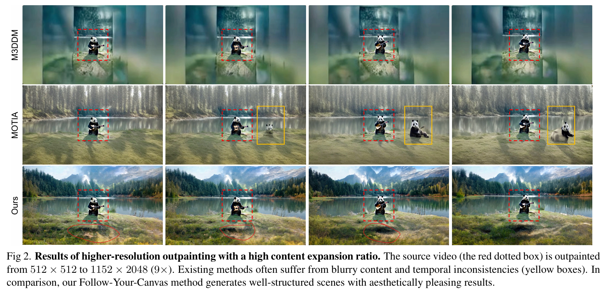

# Follow-Your-Canvas: Higher-Resolution Video Outpainting with Extensive Content Generation

> "Follow-Your-Canvas: Higher-Resolution Video Outpainting with Extensive Content Generation" Arxiv, 2024 Sep 2
> [paper](http://arxiv.org/abs/2409.01055v1) [code](https://github.com/mayuelala/FollowYourCanvas) [pdf](./2024_09_Arxiv_Follow-Your-Canvas--Higher-Resolution-Video-Outpainting-with-Extensive-Content-Generation.pdf) [note](./2024_09_Arxiv_Follow-Your-Canvas--Higher-Resolution-Video-Outpainting-with-Extensive-Content-Generation_Note.md)
> Authors: Qihua Chen, Yue Ma, Hongfa Wang, Junkun Yuan, Wenzhe Zhao, Qi Tian, Hongmei Wang, Shaobo Min, Qifeng Chen, Wei Liu

## Key-point

- Task: higher-resolution video outpainting with extensive content generation
- Problems
  - the generation of low-quality content and limitations imposed by GPU memory

- :label: Label:

## Contributions

- we distribute the task across spatial windows and seamlessly merge them. It allows us to outpaint videos of any size and resolution without being constrained by GPU memory.
- source video and its relative positional relation are injected into the generation process of each window.
- from 512×512 to 1152×2048(9×)
- SOTA

## Introduction

同样存在 DemoDiffusion 中物体重复的问题

## methods

输入 Mask Image, 提取 VAE 特征

Visual Embedding 使用 SAM Encoder(ViT-B-16)，代替 CLIP Image Encoder

> Specifically, LE consists of a SAM encoder [15], a layout extraction module, and a Q-former [16]. Instead of employing the CLIP visual encoder [26] like many previous works [34, 35], we find SAM encoder (ViT-B/16 structure) is more effective to extract visual features by providing finer visual details (see comparisons in experiments).

训练 Q-former 去修复 SAM embedding 的误差

> we employ a Q-former (Querying Transformer) to extract and refine visual representations of the layout in formation by learnable query tokens. We train the layout extraction module and the Q-former while fixing the SAM encoder. 

**Patch 相对位置编码**

对两个 bbox 的坐标差距，使用 Sinsodial 编码，

> RRE employs sinu soidal position encoding [40] to embed the size and relative position relation between the anchor and target windows,

在 Self-Attn 和 text-cross attn 之间加了一层 layout cross-attn，用于获取相对位置信息 & SAM embedding

> We incorporate the LE and RRE using a cross-attention layer inserted in each spatial-attention block of the model.

### infer

> outpainting is performed within each window in parallel on separate GPUs to accelerate inference

- Q：多个 patch 如何融合？

xt 是 VAE 特征加噪的特征！**参考 Multidiffusion 融合！**

>  The denoised out puts in the N windows,i.e., {xk t−1}N k=1, are then merged via Gaussion weights [1] to get a smooth outcome xt−1
>
> - Multidiffusion: Fusingdiffusionpathsforcontrolledimage generation.arXivpreprintarXiv:2302.08113,2023

每个 window 独立。。spatial 一致性会差好多！

>  Importantly, the inference process of each window is independent of the others, allowing us to perform out painting within each window in parallel on separate GPUs, thereby accelerating the inference. We analyze its efficiency in experiments.

伪代码，看不出啥

## setting

- metrics
  - PSNR, SSIM, LPIPS,
  -  aesthetic quality (AQ) and imaging quality (IQ) [13] :star:
  - FVD
- Baseline
  - M3DDM
  - MOTIA
- Model: 在 AnimateDiff 基础上做的
- 8 个 A100 训练 50w iteration
  -  The target window size remains fixed at 512×512
  - The minimum overlap between the target window and the source video is set to 128

> The learning rate is set to 1 × 10−5, and the batch size is set to 8. Eight NVIDIA A800 GPUs are used for both training (50K steps)
>
> 40 DDIM steps with classifier-free guidance (cfg) of 7.5)

## Experiment

> ablation study 看那个模块有效，总结一下

PSNR 才 20 （生成的和 GT 物体不一样）。。。**LPIPS 还可以啊**

## Limitations

## Summary :star2:

> learn what

### how to apply to our task

- Q：完整画面取一个 patch 的 VAE，最后怎么融合起来组成整个画面？
  - 说了用 multidiffusion 的方式加 gaussian kernel 融合 VAE 特征，没其他具体说明；看 MultiDiffusion 实现

- metrics
  - PSNR, SSIM, LPIPS,
  -  aesthetic quality (AQ) and imaging quality (IQ) [13] :star:
  - FVD
