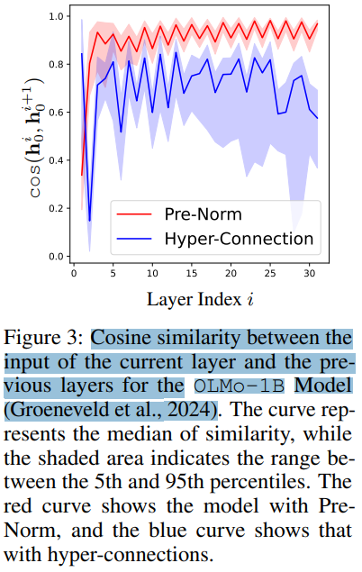
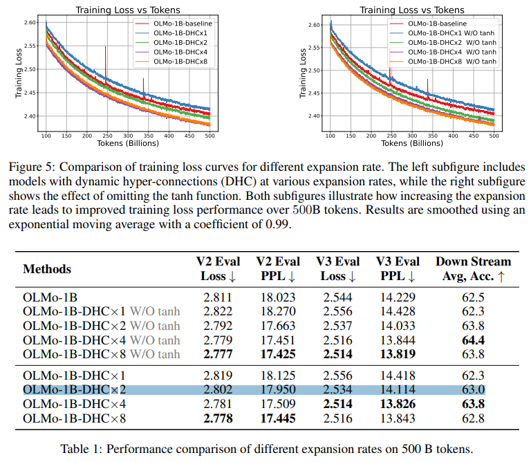

# Hyper-Connections

> "Hyper-Connections" Arxiv, 2024 Sep 29
> [paper](http://arxiv.org/abs/2409.19606v1) [code]() [pdf](./2024_09_Arxiv_Hyper-Connections.pdf) [note](./2024_09_Arxiv_Hyper-Connections_Note.md)
> Authors: Defa Zhu, Hongzhi Huang, Zihao Huang, Yutao Zeng, Yunyao Mao, Banggu Wu, Qiyang Min, Xun Zhou (字节豆包)

## Key-point

- Task
- Problems
  - drawbacks observed in residual connection variants, such as the seesaw effect between gradient vanishing and representation collapse.

- :label: Label:

## Contributions

- 提出 hyper-connections，代替 residual connection。支持动态学习用哪一层的特征，重排网络层级

> We present hyper-connections, a simple yet effective method that can serve as an alternative to residual connections.
>
> Theoretically, hyperconnections allow the network to adjust the strength of connections between features at different depths and dynamically rearrange layers

- 微调 LLM & VLM，效果都比 residual 好

> We conduct experiments focusing on the pre-training of large language models, including dense and sparse models, where hyper-connections show significant performance improvements over residual connections. 

## Introduction

- Q：residual 有什么问题？

梯度消失 vs 学习的表征崩掉。之前方法用 Pre-Norm or Post-Norm 处理残差，没法同时解决这两个问题

对比 residual，使用 hyer-connection 可以加速训练

>  Our method converges 1.8 times faster compared to the baseline and maintains a significant advantage at the 500B tokens.

### main variants of residual connections

> The two main variants of residual connections, **Pre-Norm and Post-Norm**, each make distinct trade-offs between gradient vanishing and representation collapse

Pre-Norm 在残差输入之前加一个 layernorm 避免梯度消失，但会导致学习的表征崩掉（深层网络的特征都很接近，白学）

> Pre-Norm applies normalization operations to the input before each residual block, effectively addressing the problem of gradient vanishing (Bengio et al., 1994; Glorot & Bengio, 2010). 
>
> However, it can also lead to the issue of collapse in deep representations (Liu et al., 2020), where **hidden features in deeper layers become highly similar,** diminishing the contribution of additional layers as their number increases.

Post-Norm 在残差块之后加 layernorm，表征还 ok 但梯度消失问题还是有

> Post-Norm applies normalization operations after the output of each residual block, weakening the "strength" of residuals. This approach can alleviate the issue of representation collapse but also reintroduces the problem of vanishing gradients.

- Q：什么是 seesaw problem?

梯度消失 vs 学习的表征崩掉

> The vanishing gradient and the representation collapse are like two ends of a seesaw, with these two variants making respective trade-offs between these issues. 

问题是**先前方法 residual 传入的特征强度是固定的**

> The key issue is that residual connections, including both Pre-Norm and Post-Norm variants, predefine the strength of connections between the output and input within a layer.

提出 HC 去学习这个 residual 特征强度

> **Can neural networks autonomously learn the optimal strength of connections to improve performance?** To address this, we propose hyper-connections (HC), which lead to significantly improved performance with a negligible increase in computation and parameters.

- Q：如何验证 representation collapse？

也就是验证深层网络输出特征的相似度，**对于一个模块输入输出特征，计算余弦相似度**

## methods

- **将网络输入 copy N 份**，每一份有自己的 residual
- 对于 depth 和 width（同一层）特征都有交互

> To enable the network to model different depthconnections simultaneously, we expand the network’s input into n copies, each having its own depth connection, as shown in Fig. 2 (a). Moreover, we establish width connections between the n hidden vectors, allowing information exchange between hidden vectors within the same layer, as shown in Fig. 2 (b)

- 缺陷，会把网络 width 提升 N 倍，但涉及的参数量几乎可以忽略不计？

> Notably, although hyper-connections seem to increase the network’s width by n times, the additional parameters and computational cost are almost negligible.

把输入复制 N 份
$$
input: ~h^{k-1}\\
\text{ hyper hidden matrix:   }H^{k-1} = (h_1^{k-1}, h_2^{k-1}, \dots, h_n^{k-1}) ^T \in \mathbb{R}^{n \times d}
$$

- 这里的 N 称作 expandion rate

>  n is called the expansion rate
>
> Finally, we sum the last hyper hidden matrix row-wise to obtain the required hidden vector, which is then passed through a final projector to produce the final output of the network (i.e., a normalization layer and an unembedding layer in transformers

这里**两个子网络（可学习的）** $A_m$ 用来把 N 份加权相加输入 self-attn. $A_r$ 用于处理残差

> - Am as weights to perform a weighted sum on the input H = (h1 h2 . . . hn)
> - Ar is used to connect H and map it into a residual hyper hidden matr

### HC 矩阵初始化

参考 PreNorm，设置成一样的形式

PreNorm 和 PostNorm 可以设置为 HC 矩阵的特殊形式，设置 expansion_rate = 1

设置 expansion rate=2

> Without loss of generality, we set the expansion rate to n = 2.

## setting

## Experiment

> ablation study 看那个模块有效，总结一下

在 NLP LLM 模型上实验

### expansion rate

different expansion rate

n=2 没有差很多。。n=1 反而会更烂；**n=4 才有点效果，复制 4 份搞 P 啊。。**

N=4 对于训练能加速

### Vision

ImageNet 256x256 **图像生成**

资源消耗太大，要用 FP16 + Flash-attention

> In order to save experimental costs, we use FP16 precision, introduce flash-attention to speed up training, a

ViT-B-16 图像分类，看指标效果增加了一丢丢

> For the image classification experiments, we train ViT/16-Base and ViT/16-Large models with images at a resolution of 224 × 224 for 300 epochs, following the experimental setup used by (Dosovitskiy et al., 2020).

## Limitations

## Summary :star2:

> learn what

### how to apply to our task

- 分析先前 residual 方法缺陷，推断是 residual 特征没有可学习的强度问题，直接去用实验验证；
  需要把每个 block 的输入，复制 N 份（expansion rate），和 HC Matrix 做相乘。。。
- expansion rate **N=4 才有点效果，资源消耗看起来不小** 
- 可以**加速训练**
