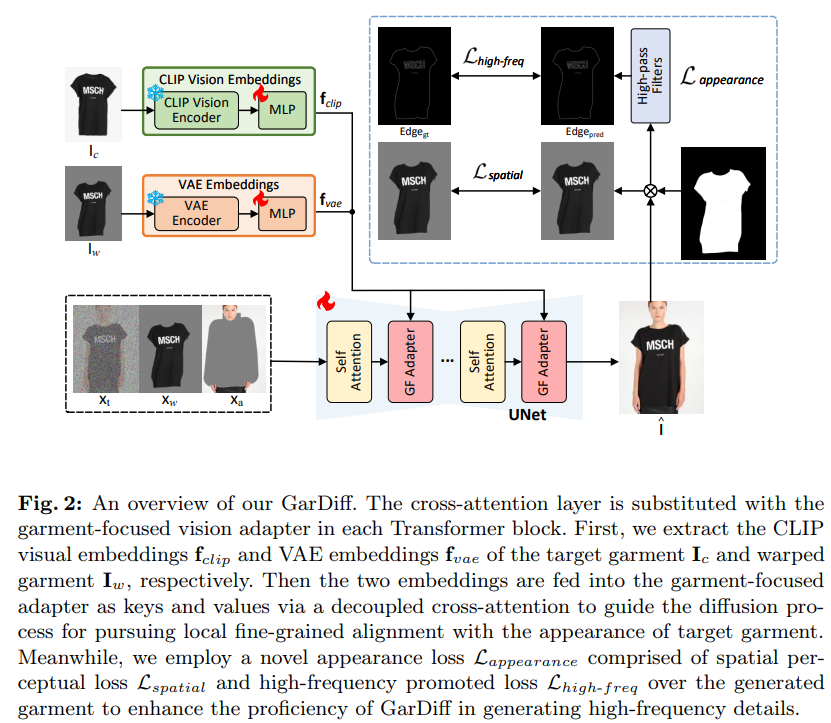
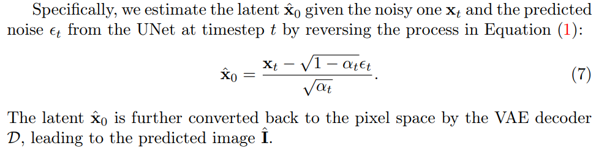

# Improving Virtual Try-On with Garment-focused Diffusion Models

> "Improving Virtual Try-On with Garment-focused Diffusion Models" Arxiv, 2024 Sep 12
> [paper](http://arxiv.org/abs/2409.08258v1) [code](https://github.com/siqi0905/GarDiff/tree/master) [pdf](./2024_09_Arxiv_Improving-Virtual-Try-On-with-Garment-focused-Diffusion-Models.pdf) [note](./2024_09_Arxiv_Improving-Virtual-Try-On-with-Garment-focused-Diffusion-Models_Note.md)
> Authors: Siqi Wan, Yehao Li, Jingwen Chen, Yingwei Pan, Ting Yao, Yang Cao, Tao Mei

## Key-point

- Task
- Problems
- :label: Label:

## Contributions

## Introduction

DDPM 加噪去噪公式

- "Denoising Diffusion Probabilistic Models" NIPS-2020,
   https://arxiv.org/pdf/2006.11239

根据 eq4 先得到模型预测的噪声 $\hat{x0}$

根据 eq6&7 去噪一步，实现从 $x_t \to x_{t-1}$。

## methods

参考图用 CLIP image + VAE embedding

### Appearance Loss

> Generally, diffusion model is merely optimized with the mean-squared loss defined in Equation (3), which treats all the regions of the synthesized image equally without emphasizing the texture details in the garment area, failing to generate the accurate garment patterns.

区分高低频，用边缘图作为高频

> The appearance loss, as a composite adaptation loss, can be decomposed into two components: a spatial perceptual loss Lspatial and a high-frequency promoted loss Lhigh-f req.

UNet 预测噪声 -> 一步去噪 -> **过 VAE 转为 RGB 图像**

DISTS loss

- Q：超参？

> The hyperparameter λ in Equation (10) and the weight decay are set to **0.001** and 0.01, respectively

## setting

## Experiment

> ablation study 看那个模块有效，总结一下

### ablation

看这个指标，加的 appearance loss 确实有用

## Limitations

## Summary :star2:

> learn what

### how to apply to our task

- 加的 VAE loss 确实有用啊

