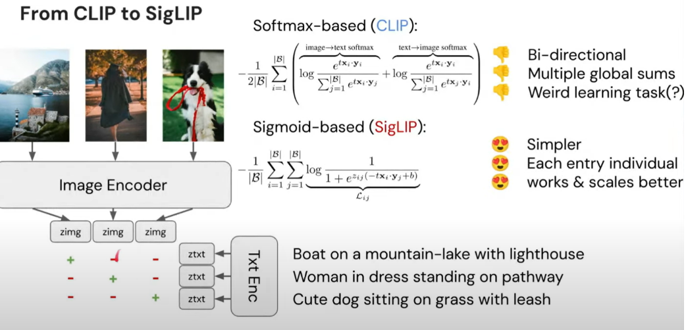
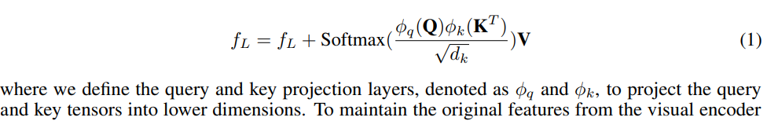
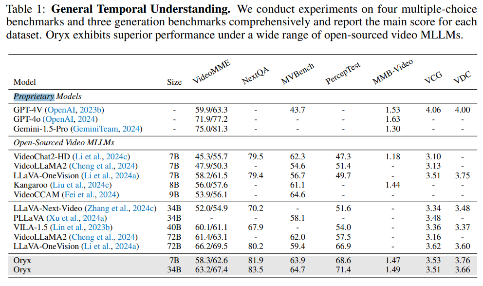

# Oryx MLLM: On-Demand Spatial-Temporal Understanding at Arbitrary Resolution

> "Oryx MLLM: On-Demand Spatial-Temporal Understanding at Arbitrary Resolution" Arxiv, 2024 Sep 19
> [paper](http://arxiv.org/abs/2409.12961v1) [code](https://github.com/Oryx-mllm/Oryx) [web](https://github.com/Oryx-mllm/Oryx) [pdf](./2024_09_Arxiv_Oryx-MLLM--On-Demand-Spatial-Temporal-Understanding-at-Arbitrary-Resolution.pdf) [note](./2024_09_Arxiv_Oryx-MLLM--On-Demand-Spatial-Temporal-Understanding-at-Arbitrary-Resolution_Note.md)
> Authors: Zuyan Liu, Yuhao Dong, Ziwei Liu, Winston Hu, Jiwen Lu, Yongming Rao

## Key-point

- Task: Arbitrary Resolution 的视觉内容理解

- Problems

  - 现有 LLM 不考虑分辨率 & 视频长度**都标准化为同一个尺寸的信息，喂给 visual encoders**，对于超级长的视频 or 多模态内容，**没有高效利用信息**

  > Existing multi-modal LLMs usually standardize these diverse visual inputs to a fixed resolution for visual encoders and yield similar numbers of tokens for LLMs, which is non-optimal for multimodal understanding and inefficient for processing long visual content. 

  

- :label: Label:

处理多模态信息

> **Oryx**, a unified multimodal architecture for the spatial-temporal understanding of images, videos, and multi-view 3D scenes.

- model 改进：Oryx 实验 OryxViT 对任意分辨率图像提取特征；提出一个压缩模块

> Oryx offers an on-demand solution to **seamlessly and efficiently process visual inputs with arbitrary spatial sizes and temporal lengths** with two core designs: 1) a pre-trained OryxViT model that can **encode images at any resolution** into LLM-friendly visual representations; 2) a dynamic compressor module that **supports 1x to 16x compression on visual tokens by request**.

- 训练数据改进 

>  enhanced data curation and specialized training on long-context retrieval and spatial-aware data

## Contributions

## Introduction

### sigLIP

- "Sigmoid Loss for Language Image Pre-Training" 
  [paper](https://arxiv.org/abs/2303.15343)

## methods

### NATIVE RESOLUTION

先前方法直接 resize & crop 会影响特征提取

>  Common practice typically involves resizing and cropping visual inputs to a fixed resolution with a square shape. However, such processes may negatively impact the performance of vision backbones, as previous studies on vision recognition have demonstrated the effectiveness of maintaining visual content in its original form.

- Plan1: 训练时使用多 scale 的图像，训练一个 ViT
- Plan2: 使用 MLLM 中的 visual 表证（先验） :star:

> the effectiveness of native or arbitrary resolution in the realm of MLLM has barely been explored

- Q：Plan1 训出来的 ViT 会把 H!=W 的图像 resize，再分 patch，**之前工作发现 position embedding 直接 resize 加入会让效果降低很多**

> Conventional Vision Transformers utilize a fixed-size position embedding matrix P corresponding to the predefined image size N × N

因此使用 MLLM visual encoder，**在 SigLIP 基础上，对 visual encoder 加入超级大的 position embedding matrix P** :star:

> native resolution processing, we introduce a visual encoder named OryxViT, which builds upon the advanced SigLIP (Zhai et al., 2023) models and is based on the Vision Transformer (Dosovitskiy, 2020) architecture

- Q：不同分辨率内容组成一个 batch 数据，每个数据的 tokens 序列长度不同咋办？

> A significant challenge is managing the dynamic sequence length N

直接在把 $N_i$ 维度 concat ，`[1, sum_Ni, C]` 送入 ViT block；**Vit Block 内部使用 flash attention 模块提供的 variable-length attention**

>  variable-length attention operator provided **in flash attention (Dao et al., 2022) :star:**

### A dynamic compressor

对于视频数据如何减少冗余

> To address this, we propose a Dynamic Compressor, which is capable of performing higher compression ratios for longer contexts.

- **对 visual 特征使用 downsample**，对数据分为 images, short video, long video 使用不同压缩比例 d3 = 4d2 = 16d1, **得到缩小的 QKV 特征**

> We obtain the low-resolution feature map $f_L = d_i(f_H)$

- 做 QK 乘积时候进一步缩小
- 最后使用 2layer-MLP 提升维度，实现和原始 Visual embedding 大小一致

### 多模态训练

#### Needle-In-A-Haystack

> To enhance the Oryx model’s capability to pinpoint details, we prepare long-form temporal needle-in-a-haystack training data.

- MovieNet dataset 电影数据哦！

> https://movienet.github.io/
>
> Specifically, we source video samples from the MovieNet (Huang et al., 2020) dataset, which comprises an average of 1000 frames per movie and an average duration of 45 minutes

captioning and differing.

#### Coarse Correspondences

- 使用 TrackAnything 制作轨迹数据

> Specifically, we utilize Track-Anything (Yang et al., 2023b) as our tracking model to generate coarse correspondences for the ScanQA training set.

> Building on the work of (Liu et al., 2024a), we introduce coarse correspondences into our training dataset. The core concept is to assign a consistent label to the same object across different frames, allowing the model to better capture spatial correlations across multiple views. This approach aims to enhance the model’s ability to develop a more accurate 3D spatial understanding of the scene.

## setting

- We adopt the total batch size at 128 and conduct our experiments on **64 NVIDIA A100-40G GPUs** for Oryx-7B and **64 NVIDIA A800-80G GPUs for Oryx-34B**, as larger models need more GPU memories. The total model maximum length is set as 8192.

## Experiment

> ablation study 看那个模块有效，总结一下

- 效果没有版权的模型好没问题（标出来），**比开源方法好就行**

完全体的效果和 LLaVA 接近，但参数量只有一半哦！！

## Limitations

## Summary :star2:

> learn what

- Q：Plan1 训出来的 ViT 会把 H!=W 的图像 resize，再分 patch，**之前工作发现 position embedding 直接 resize 加入会让效果降低很多**

> Conventional Vision Transformers utilize a fixed-size position embedding matrix P corresponding to the predefined image size N × N

因此使用 MLLM visual encoder，**在 SigLIP 基础上，对 visual encoder 加入超级大的 position embedding matrix P** :star:

- Q：不同分辨率内容组成一个 batch 数据，每个数据的 tokens 序列长度不同咋办？

> A significant challenge is managing the dynamic sequence length N

直接在把 $N_i$ 维度 concat ，`[1, sum_Ni, C]` 送入 ViT block；**Vit Block 内部使用 flash attention 模块提供的 variable-length attention**

>  variable-length attention operator provided **in flash attention (Dao et al., 2022) :star:**

### how to apply to our task

- 效果没有版权的模型好没问题（标出来），**比开源方法好多了就行**

- MovieNet dataset 电影数据哦！ https://movienet.github.io/ :star:
  - **Scene Segmentation**
  - 预告片，有片头
  - 动作：shoot gun
  - 镜头：close-up, longshot, extreme closeup shot

