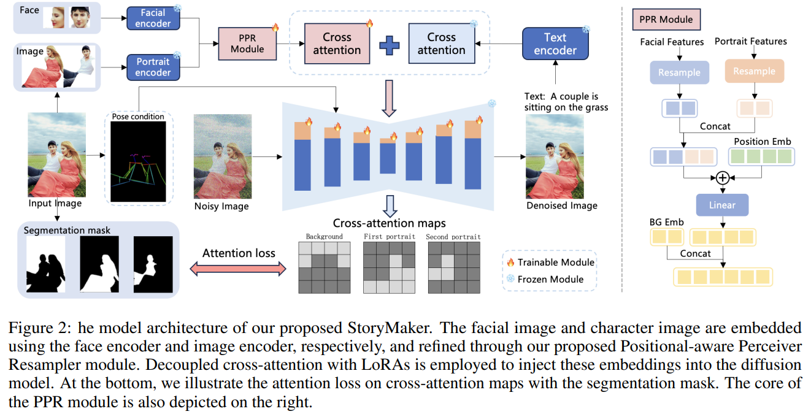

# StoryMaker: Towards Holistic Consistent Characters in Text-to-image Generation

> "StoryMaker: Towards Holistic Consistent Characters in Text-to-image Generation" Arxiv, 2024 Sep 19
> [paper](http://arxiv.org/abs/2409.12576v1) [code](https://github.com/RedAIGC/StoryMaker.) [pdf](./2024_09_Arxiv_StoryMaker--Towards-Holistic-Consistent-Characters-in-Text-to-image-Generation.pdf) [note](./2024_09_Arxiv_StoryMaker--Towards-Holistic-Consistent-Characters-in-Text-to-image-Generation_Note.md)
> Authors: Zhengguang Zhou, Jing Li, Huaxia Li, Nemo Chen, Xu Tang

## Key-point

- Task

- Problems

  - 人物一致性很烂

  > lack of holistic consistency in scenes with multiple characters 

- :label: Label:

> In this paper, we introduce StoryMaker, a personalization solution that preserves not only facial consistency but also clothing, hairstyles, and body consistency, thus facilitating the creation of a story through a series of images.

## Contributions

- using the Positional-aware Perceiver Resampler (PPR) to obtain distinct character features. 

- 增加 cross-attention map 一致性的 loss，强调 attn-map 中指定区域的一致性

  > To prevent intermingling of multiple characters and the background, we separately constrain the cross-attention impact regions of different characters and the background using MSE loss with segmentation masks.

- 训练 LoRA & 增加 Pose condition


## Introduction

attention-map loss 参考 MM-diff

> - "GLIGEN: Open-Set Grounded Text-to-Image Generation" CVPR, 2023 Jan 17
>   [paper](http://arxiv.org/abs/2301.07093v2) [code]() [pdf](./2023_01_CVPR_GLIGEN--Open-Set-Grounded-Text-to-Image-Generation.pdf) [note](./2023_01_CVPR_GLIGEN--Open-Set-Grounded-Text-to-Image-Generation_Note.md)
>   Authors: Yuheng Li, Haotian Liu, Qingyang Wu, Fangzhou Mu, Jianwei Yang, Jianfeng Gao, Chunyuan Li, Yong Jae Lee
> - "FastComposer: Tuning-Free Multi-Subject Image Generation with Localized Attention" Arxiv, 2023 May 17
>   [paper](http://arxiv.org/abs/2305.10431v2) [code](https://github.com/mit-han-lab/fastcomposer) [pdf](./2023_05_Arxiv_FastComposer--Tuning-Free-Multi-Subject-Image-Generation-with-Localized-Attention.pdf) [note](./2023_05_Arxiv_FastComposer--Tuning-Free-Multi-Subject-Image-Generation-with-Localized-Attention_Note.md)
>   Authors: Guangxuan Xiao, Tianwei Yin, William T. Freeman, Frédo Durand, Song Han
> - "Subject-Diffusion:Open Domain Personalized Text-to-Image Generation without Test-time Fine-tuning" SIGGRAPH, 2023 Jul 21 :star: 
>   [paper](http://arxiv.org/abs/2307.11410v2) [code](https://oppo-mente-lab.github.io/subject_diffusion/) [pdf](./2023_07_SIGGRAPH_Subject-Diffusion-Open-Domain-Personalized-Text-to-Image-Generation-without-Test-time-Fine-tuning.pdf) [note](./2023_07_SIGGRAPH_Subject-Diffusion-Open-Domain-Personalized-Text-to-Image-Generation-without-Test-time-Fine-tuning_Note.md) 
>   Authors: Jian Ma, Junhao Liang, Chen Chen, Haonan Lu (OPPO-AI)
>
> 利用丰富的辅助信息：SegMap + Location + Text + CLIP-image
>
> - "MM-Diff: High-Fidelity Image Personalization via Multi-Modal Condition Integration" Arxiv, 2024 Mar 22
>   [paper](http://arxiv.org/abs/2403.15059v1) [code](https://github.com/alibaba/mm-diff) [pdf](./2024_03_Arxiv_MM-Diff--High-Fidelity-Image-Personalization-via-Multi-Modal-Condition-Integration.pdf) [note](./2024_03_Arxiv_MM-Diff--High-Fidelity-Image-Personalization-via-Multi-Modal-Condition-Integration_Note.md)
>   Authors: Zhichao Wei, Qingkun Su, Long Qin, Weizhi Wang


### IP-adapter

- "IP-Adapter: Text Compatible Image Prompt Adapter for Text-to-Image Diffusion Models" Arxiv, 2023 Aug
  [paper](http://arxiv.org/abs/2308.06721v1) [code](https://ip-adapter.github.io) [pdf](./2023_08_Arxiv_IP-Adapter--Text-Compatible-Image-Prompt-Adapter-for-Text-to-Image-Diffusion-Models.pdf) [note](./2023_08_Arxiv_IP-Adapter--Text-Compatible-Image-Prompt-Adapter-for-Text-to-Image-Diffusion-Models_Note.md)
  Authors: Hu Ye, Jun Zhang, Sibo Liu, Xiao Han, Wei Yang

**重新在 Text Cross-Attn 模块后面加了一个 Image Cross Attn 模块。**

> Instead, we propose a decoupled cross-attention mechanism where the cross-attention layers for text features and image features are separate. To be specific, we add a new cross-attention layer for each cross-attention layer in the original UNet model to insert image features.


**注意这里 Image Cross-Attn 的输入 Query 和 Text Cross-Attn 的输入 Query 是一样的！** :star:

>  It should be noted that we use the same query for image cross-attention as for text cross-attention

因为只训练新加的一个 Cross-Attn 因此只需要训练 Wk, Wv


分开两个 Cross-attn 可以在 （B L C）的 L 上 concat 实现，等价于多个单独的 cross-attn 相加 :star:

> https://github.com/tencent-ailab/IP-Adapter/blob/62e4af9d0c1ac7d5f8dd386a0ccf2211346af1a2/tutorial_train.py#L105

```python
class IPAdapter(torch.nn.Module):
    """IP-Adapter"""
    def __init__(self, unet, image_proj_model, adapter_modules, ckpt_path=None):
        super().__init__()
        self.unet = unet
        self.image_proj_model = image_proj_model
        self.adapter_modules = adapter_modules

        if ckpt_path is not None:
            self.load_from_checkpoint(ckpt_path)

    def forward(self, noisy_latents, timesteps, encoder_hidden_states, image_embeds):
        ip_tokens = self.image_proj_model(image_embeds)
        encoder_hidden_states = torch.cat([encoder_hidden_states, ip_tokens], dim=1)  # !!!
        
        # Predict the noise residual
        noise_pred = self.unet(noisy_latents, timesteps, encoder_hidden_states).sample
        return noise_pred
```


### Clip Text model

- Q：CLIP text model hidden_size 也是 C=768, 最后 pooled 后也是 C=768。。提取哪一层的特征呢，要和 CLIP image feature 对齐咋搞。。。

参考 IP-Adapter 原始用的 SDv1.5

> https://github.com/tencent-ailab/IP-Adapter/blob/62e4af9d0c1ac7d5f8dd386a0ccf2211346af1a2/tutorial_train.py#L105


#### 文本特征

```python
with torch.no_grad():
    encoder_hidden_states = text_encoder(batch["text_input_ids"].to(accelerator.device))[0]  # 1， 77， 768
```

看下 forward，输出的是 (1, 77, 768) 的特征，没有用那个 pooled 特征（就是在 77 个token 里面选个 C 值最大的）

```python
class CLIPTextTransformer(nn.Module):
    def __init__(self, config: CLIPTextConfig):
        super().__init__()
        self.config = config
        embed_dim = config.hidden_size
        self.embeddings = CLIPTextEmbeddings(config)
        self.encoder = CLIPEncoder(config)
        self.final_layer_norm = nn.LayerNorm(embed_dim)

    @add_start_docstrings_to_model_forward(CLIP_TEXT_INPUTS_DOCSTRING)
    @replace_return_docstrings(output_type=BaseModelOutputWithPooling, config_class=CLIPTextConfig)
    def forward(
        self,
        input_ids: Optional[torch.Tensor] = None,
        attention_mask: Optional[torch.Tensor] = None,
        position_ids: Optional[torch.Tensor] = None,
        output_attentions: Optional[bool] = None,
        output_hidden_states: Optional[bool] = None,
        return_dict: Optional[bool] = None,
    ) -> Union[Tuple, BaseModelOutputWithPooling]:
        r"""
        Returns:

        """
        output_attentions = output_attentions if output_attentions is not None else self.config.output_attentions
        output_hidden_states = (
            output_hidden_states if output_hidden_states is not None else self.config.output_hidden_states
        )
        return_dict = return_dict if return_dict is not None else self.config.use_return_dict

        if input_ids is None:
            raise ValueError("You have to specify input_ids")

        input_shape = input_ids.size()
        input_ids = input_ids.view(-1, input_shape[-1])

        hidden_states = self.embeddings(input_ids=input_ids, position_ids=position_ids)

        bsz, seq_len = input_shape
        # CLIP's text model uses causal mask, prepare it here.
        # https://github.com/openai/CLIP/blob/cfcffb90e69f37bf2ff1e988237a0fbe41f33c04/clip/model.py#L324
        causal_attention_mask = self._build_causal_attention_mask(bsz, seq_len, hidden_states.dtype).to(
            hidden_states.device
        )
        # expand attention_mask
        if attention_mask is not None:
            # [bsz, seq_len] -> [bsz, 1, tgt_seq_len, src_seq_len]
            attention_mask = _expand_mask(attention_mask, hidden_states.dtype)

        encoder_outputs = self.encoder(
            inputs_embeds=hidden_states,
            attention_mask=attention_mask,
            causal_attention_mask=causal_attention_mask,
            output_attentions=output_attentions,
            output_hidden_states=output_hidden_states,
            return_dict=return_dict,
        )

        last_hidden_state = encoder_outputs[0]
        last_hidden_state = self.final_layer_norm(last_hidden_state)

        # text_embeds.shape = [batch_size, sequence_length, transformer.width]
        # take features from the eot embedding (eot_token is the highest number in each sequence)
        # casting to torch.int for onnx compatibility: argmax doesn't support int64 inputs with opset 14
        pooled_output = last_hidden_state[
            torch.arange(last_hidden_state.shape[0], device=last_hidden_state.device),
            input_ids.to(dtype=torch.int, device=last_hidden_state.device).argmax(dim=-1),
        ]

        if not return_dict:
            return (last_hidden_state, pooled_output) + encoder_outputs[1:]

        return BaseModelOutputWithPooling(
            last_hidden_state=last_hidden_state,
            pooler_output=pooled_output,
            hidden_states=encoder_outputs.hidden_states,
            attentions=encoder_outputs.attentions,
        )
```


#### image fea

IP-Adapter 原始论文使用 SDv1.5. 提取的**图像特征**

```python
with torch.no_grad():
                    image_embeds = image_encoder(batch["clip_images"].to(accelerator.device, dtype=weight_dtype)).image_embeds
                image_embeds_ = []
```

看下 forward，使用的是 pooled_output & 调整通道数到 768 的特征

```python
class CLIPVisionModelWithProjection(CLIPPreTrainedModel):
    config_class = CLIPVisionConfig
    main_input_name = "pixel_values"

    def __init__(self, config: CLIPVisionConfig):
        super().__init__(config)

        self.vision_model = CLIPVisionTransformer(config)

        self.visual_projection = nn.Linear(config.hidden_size, config.projection_dim, bias=False)

        # Initialize weights and apply final processing
        self.post_init()

    def get_input_embeddings(self) -> nn.Module:
        return self.vision_model.embeddings.patch_embedding

    @add_start_docstrings_to_model_forward(CLIP_VISION_INPUTS_DOCSTRING)
    @replace_return_docstrings(output_type=CLIPVisionModelOutput, config_class=CLIPVisionConfig)
    def forward(
        self,
        pixel_values: Optional[torch.FloatTensor] = None,
        output_attentions: Optional[bool] = None,
        output_hidden_states: Optional[bool] = None,
        return_dict: Optional[bool] = None,
    ) -> Union[Tuple, CLIPVisionModelOutput]:
        r"""
        Returns:

        Examples:

        ```python
        >>> from PIL import Image
        >>> import requests
        >>> from transformers import AutoProcessor, CLIPVisionModelWithProjection

        >>> model = CLIPVisionModelWithProjection.from_pretrained("openai/clip-vit-base-patch32")
        >>> processor = AutoProcessor.from_pretrained("openai/clip-vit-base-patch32")

        >>> url = "http://images.cocodataset.org/val2017/000000039769.jpg"
        >>> image = Image.open(requests.get(url, stream=True).raw)

        >>> inputs = processor(images=image, return_tensors="pt")

        >>> outputs = model(**inputs)
        >>> image_embeds = outputs.image_embeds
        ```"""
        return_dict = return_dict if return_dict is not None else self.config.use_return_dict

        vision_outputs = self.vision_model(
            pixel_values=pixel_values,
            output_attentions=output_attentions,
            output_hidden_states=output_hidden_states,
            return_dict=return_dict,
        )

        pooled_output = vision_outputs[1]  # pooled_output

        image_embeds = self.visual_projection(pooled_output)

        if not return_dict:
            outputs = (image_embeds, vision_outputs[0]) + vision_outputs[2:]
            return tuple(output for output in outputs if output is not None)

        return CLIPVisionModelOutput(
            image_embeds=image_embeds,
            last_hidden_state=vision_outputs.last_hidden_state,
            hidden_states=vision_outputs.hidden_states,
            attentions=vision_outputs.attentions,
        )
```


## methods



MM-diff 对于人物的限制，去 text 找人物对应的 token，和 CLIP image encoding concat，没考虑背景；训练 Ra

本工作也是训练 LoRA 但区别在于：

1. 细化人物特征：Face(ArcFace)，Body Feature(CLIP) 特征先 concat，注意这里在 C 上的顺序，之后要找对应的！
2. 进一步加上背景特征，concat 在最前面

因此参考图的特征在 C 维度依次顺序为：背景，人脸，人体特征；**后续通过 C 上顺序，实现 cross-attn map 的查找对应**（背景的特征，找到最前面的 Ci 个特征限制）


在 SDXL 上做的

> We build our model on the state-of-the-art text-to-image model, namely Stable Diffusion XL


### Reference Information Extraction

- Q：人脸特征？

使用 ArcFace 特征增强人脸 ID

> Since the facial features extracted by the face recognition model effectively capture semantic details and enhance fidelity, similar to InstantID [Wang et al., 2024a] and IP-Adapter-FaceID [Ye et al., 2023b], we utilize Arcface [Deng et al., 2019] to detect faces and obtain aligned facial embeddings from the reference image.

用 CLIP image embed 提取人物大致的主体信息

> To maintain consistency in hairstyles, clothing, and bodies, we first segment the reference image to crop the characters. Following recent works such as IP-Adapter [Ye et al., 2023b] and MM-Diff [Wei et al., 2024], we use the pretrained CLIP vision encoder, known for its rich content and style, to extract features of the hairstyles, clothing, and bodies of the characters.

不训练 CLIP & ArcFace 

> During training, the face encoder, i.e., Arcface model, and the image encoder, i.e., CLIP vision encoder, are kept frozen.、


- Q：人体姿态解耦？

使用 Pose-ControlNet 作为额外的 condition

> To facilitate decoupling poses from character images, we condition the training on poses using Pose-ControlNet [Zhang et al., 2023]. During inference, we can either discard ControlNet and employ text prompts to control the poses of generated characters or guide generation with a newly provided pose.


concat 人脸，人体，背景特征 & bbox 


- Q：怎么和文本一起用到 SDXL 里面？

参考 IP-Adapter

> After extracting the reference information, we utilize the decoupled cross-attention to embed it into the text-to-image model, following IP-Adapter [Ye et al., 2023b].


#### Code

文本特征，使用 TransformerBlocks 倒数第二层的输出，token_num=77

```python
prompt_embeds = text_encoder(
    batch[id_name].to(text_encoder.device),
    output_hidden_states=True,
)
pooled_prompt_embeds = prompt_embeds[0]
prompt_embeds = prompt_embeds.hidden_states[-2]
```


### cross-attn constraint


diffusion 训练的 Loss 增加一项 AttnLoss(每一层的 loss 取平均 & 加上个权重 $\lambda=0.1$) 

> We set λ to 0.1


## setting

在 SDXL 上做的

> We build our model on the state-of-the-art text-to-image model, namely Stable Diffusion XL


> **The text caption is randomly dropped by 10% during training**, and the cropped character image is randomly dropped by 5%. 

> During inference, we use the UniPC [Zhao et al., 2024] sampler with 25 steps and set the **classifier-free guidance to 7.5.**

- metrics

> Following FastComposer [Xiao et al., 2023] and MM-Diff [Wei et al., 2024], we use CLIP image similarity (CLIP-I) to compare the generated images with reference images.


## Experiment

> ablation study 看那个模块有效，总结一下

看钢铁侠的招照片，ID 一致性还没有 instantID 好


## Limitations

## Summary :star2:

> learn what

- 学习 abstract 写作流程
- 看钢铁侠的招照片，ID 一致性还没有 instantID 好

### how to apply to our task

