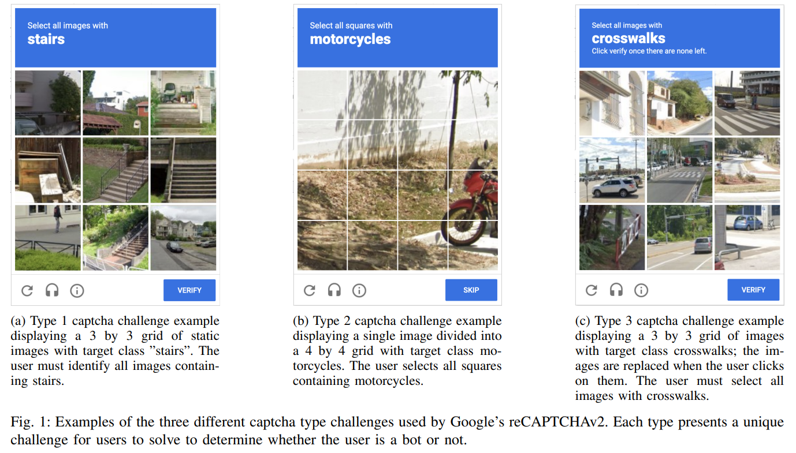
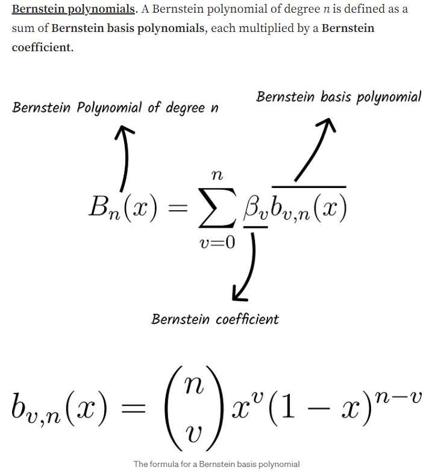
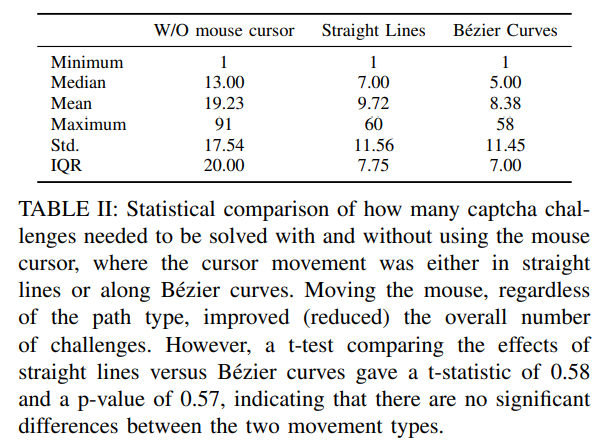

# Breaking reCAPTCHAv2

> "Breaking reCAPTCHAv2" COMPSAC, 2024 Sep 13
> [paper](http://arxiv.org/abs/2409.08831v1) [code](https://github.com/aplesner/Breaking-reCAPTCHAv2) [pdf](./2024_09_COMPSAC_Breaking-reCAPTCHAv2.pdf) [note](./2024_09_COMPSAC_Breaking-reCAPTCHAv2_Note.md)
> Authors: Andreas Plesner, Tobias Vontobel, Roger Wattenhofer (ETH)

## Key-point

- Task: 解决 Google’s reCAPTCHAv2 system
- Problems
- :label: Label:`YOLO`

此文章偏工程一些，因此有章节会介绍 evaluation environment，例如 python3.9&FireFox 等信息

## Contributions

- 效果好 Acc=68 -> 100%

> we can solve 100% of the solve captchas from Google’s reCAPTCHAv2 system

- 实验发现 ML 算法解决 image patch 的挑战和人去做差不多，**ML 有能力解决 local patch 识别的问题！！**

> our findings suggest that there is no significant difference in the number of challenges humans and bots must solve to pass the captchas in reCAPTCHAv2. This implies that current AI technologies can exploit advanced image-based captchas


## Introduction




### YoloV8

> https://docs.ultralytics.com/models/yolov8/#can-i-benchmark-yolov8-models-for-performance

```python
from ultralytics import YOLO

# Load a COCO-pretrained YOLOv8n model
model = YOLO("yolov8n.pt")

# Display model information (optional)
model.info()

# Train the model on the COCO8 example dataset for 100 epochs
results = model.train(data="coco8.yaml", epochs=100, imgsz=640)

# Run inference with the YOLOv8n model on the 'bus.jpg' image
results = model("path/to/bus.jpg")
```


### Bézier curve

> https://mmrndev.medium.com/understanding-b%C3%A9zier-curves-f6eaa0fa6c7d :star:

用于模拟真实鼠标轨迹


> Adobe 中使用 Bezier curve 实现自然拖拽

- Q：什么是 bezier curve？

给定几个点，**应用 Bernstein Polynomials 去逼近任意曲线**，模拟自然轨迹:star:

> Bernstein polynomials were first used as a way to approximate any real continuous functions within a closed interval



-  a few famous forms of Bézier curves （给定锚点，固定的几个 Bernstein Polynomials）


这里前后两个有联系的》》 Linear 公式的叠加


- 实际计算点的位置，看下下面这个动图 :star:


## methods


- Type1,3 每张图使用 YoloV8 单独做分类即可

>  For type 1 and type 3, the images in the grid are all classified, implying that the YOLO model predicts a class probability for each of the 13 classes, and if the target class has a probability of more than 0.2, then the model selects the image. For type 3 the process is repeated for all new images. To improve the model, we fine-tune the YOLO v8 classification model on the samples mentioned above in Section III-B.

- Type2 作为分割问题来做，**直接用 YoloV8 出分割图，去看和每个patch的重叠比例 **:star:

> When it comes to the segmentation task, type 2 represents a distinct challenge in contrast to classification. Precise identification of the individual segments that contain the target objects is necessary

> For type 2 the model segments the image and chooses any cell that overlaps with the segmentation. YOLO v8 for segmentation is only trained for 9 of the 13 possible classes, so if one of the 4 remaining classes appears, then the program will just skip the challenge.


### Evaluation environment

- VPN：系统会识别同一 IP 的多个请求，进行 block

> Our methodology acknowledges the advanced capabilities of captcha systems in identifying and reacting to multiple access attempts from a single IP address

- 使用 Bezier Curve 模拟鼠标的自然轨迹

> Mouse Movement: An essential element in emulating human interactions with captchas involves replicating natural mouse movements. **Our strategy utilizes Bezier curves,** a math- ´ ematical concept frequently employed in computer graphics to represent smooth and scalable curves, to accurately simulate the movement of a user’s mouse cursor. **By utilizing** Bezier ´ curves, our approach accurately replicates the natural and unpredictable movement of a human cursor.

- Q：一个公用的方法，看下如何写到文章里面？

直接写应用，稍微介绍下是啥 & 效果即可。


## setting

## Experiment

> ablation study 看那个模块有效，总结一下

此工作像实验报告一样分析一下 google capatchs :joy:

- 模拟鼠标自然轨迹，能够改变接收到的 Type2 or 3 的数量占比，减少测试次数




## Limitations


## Summary :star2:

> learn what

解决 google bot test 的实验报告，**学习下写一个用现有算法，怎么写成一篇文章还中了。。**

- 分析具体挑战种类，type123；花了很多篇幅介绍难度在哪
- 使用 Bezier Curve 模拟鼠标的自然轨迹

> Mouse Movement: An essential element in emulating human interactions with captchas involves replicating natural mouse movements. **Our strategy utilizes Bezier curves,** a math- ´ ematical concept frequently employed in computer graphics to represent smooth and scalable curves, to accurately simulate the movement of a user’s mouse cursor. **By utilizing** Bezier ´ curves, our approach accurately replicates the natural and unpredictable movement of a human cursor.

- 一个公用的方法，看下如何写到文章里面？直接写应用，稍微介绍下是啥 & 效果即可。


### how to apply to our task

- Q：一张图拆成多个 patch 如何识别每部分是啥？如何获得全局信息？
