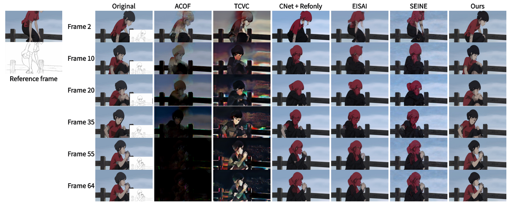
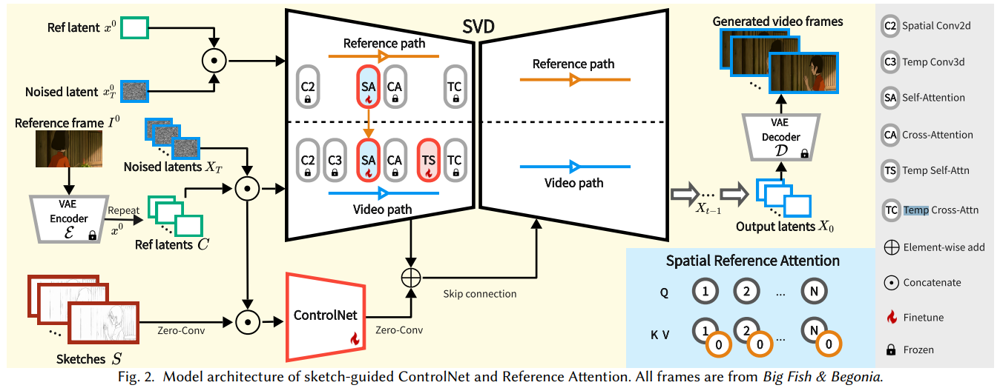
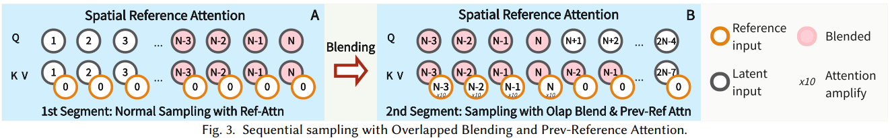

# LVCD: Reference-based Lineart Video Colorization with Diffusion Models

> "LVCD: Reference-based Lineart Video Colorization with Diffusion Models" SIGGRAPH, 2024 Sep 19
> [paper](http://arxiv.org/abs/2409.12960v1) [code](https://github.com/luckyhzt/LVCD) [pdf](./2024_09_SIGGRAPH_LVCD--Reference-based-Lineart-Video-Colorization-with-Diffusion-Models.pdf) [note](./2024_09_SIGGRAPH_LVCD--Reference-based-Lineart-Video-Colorization-with-Diffusion-Models_Note.md)
> Authors: Zhitong Huang, Mohan Zhang, Jing Liao

## Key-point

- Task: reference-based lineart video colorization

  > 给定一个 sketch 序列，一张上色好的参考图，生成 colorized video

- Problems

  - high-quality, long temporal-consistent animation videos

- :label: Label:

## Contributions

- We propose the **first video diffusion framework for reference-based lineart animation colorization**, harnessing the capabilities of a pretrained video diffusion model to generate long, temporally consistent animations of high quality
- 使用 Sketch ControlNet 保持结构 & 布局；设计一个 reference attention 代替 SVD 原始 self-attention

> To achieve this, we first extend the ControlNet [Zhang et al. 2023] to a video version, termed Sketch-guided ControlNet, incorporating additional lineart sketch control as a crucial guide for the animation’s layout and structure.
>
> we introduce **Reference Attention to replace the original spatial attention** layers in SVD, facilitating long-range spatial matching between the first reference frame and consecutive generated frames

- SVD 预训练模型一次只能出 14 帧，因此设计了一下推理策略

> we introduce a novel scheme for sequential sampling, including **Overlapped Blending Module and Prev-Reference Attention**, to enable the colorization of long animation.

## Introduction

- Q：动漫视频上色耗时。。

> However, the production of animation remains a labor-intensive and time-consuming endeavor. Traditionally, artists manually sketch and colorize keyframes, leaving the in-between frames to be completed in accordance with the style and color palette of the keyframes
>
> This filling process, while essential for preserving consistency and coherence in the animation, can be highly repetitive and tedious for the artists involved.

### lineart video colorization

- 之前工作逐帧上色，只考虑相邻帧之间的一致性，**距离差距 10 帧一致性较差**

> While previous works have attempted lineart video colorization, their frameworks typically rely on image generative models that process one frame at a time, focusing solely on the coherence between neighboring frames. 

使用前面生成好的帧作为 reference，存在超级严重的误差累积，看 Fig4 EISAI，SEINE 方法，拓展到 30 帧就没法看了！！

> To maintain temporal consistency in the generated video, most of these works employ the previously generated frame as the new reference frame to produce subsequent frames. Unfortunately, this propagation can lead to **significant error accumulation and artifacts,** even within 10 consecutive samplings (an example is provided in 2 𝑛𝑑 and 3 𝑟𝑑 rows of Fig. 4)

- 基于 GAN 的方法生成能力比 diffusion 弱，有伪影

> Another drawback of previous approaches is they all use frameworks based on Generative Adversarial Networks [Goodfellow et al. 2014] (GANs), which have limited generative ability compared to more recent architectures such as transformers [Vaswani et al. 2017] and diffusion models [Song et al. 2021]

### SVD as base

使用 SVD 作为基础模型

> Following extensive evaluation, we select Stable Video Diffusion [Blattmann et al. 2023] (SVD) as the base model for our framework.

1.  temporal video model facilitates the **generation of temporally consistent videos**, surpassing image generative models
2. the large amount of training data empowers SVD with robust generative capabilities to synthesize high-fidelity videos

SVD 应用到这个上色任务有挑战

> While SVD provides a robust foundation for our proposed task, we must address three significant challenges to adapt it accordingly

1. 需要映入 sketches frames 作为 condition，原始 SVD 是个 image2video 模型

   > only supports the conditioning from a reference image

2. 动画中细微的动作生成，SVD 生成的动作还是有些不自然

   > Adaptation to expansive motions: While SVD is limited to produce videos with subtle motions, animation clips often feature larger motions. Thus, modifications to the original SVD are necessary to accommodate expansive motions in animations

3. 超长视频，原始 SVD 只支持14/25 帧

   > Extension to long video: The original SVD is restricted to generating videos of fixed length, which does not meet the requirements for animation colorization

之后介绍 controbution

### Related

分为一下内容介绍：动画上色，基于参考图的上色，视频插帧，video diffusion

- "SEINE: Short-to-Long Video Diffusion Model for Generative Transition and Prediction" ICLR
- AnimeDiffusion 支持直接从 sketch 到 colorized video，但 temporal 一致性太烂
  - https://github.com/xq-meng/AnimeDiffusion

需要做成 reference-based 的形式

> The first diffusion-based framework for anime face lineart colorization, based on reference images, was proposed in [Cao et al. 2024]. Despite the advancements in lineart image colorization, these frameworks have limitations in producing videos without accounting for temporal coherence between colorized frames.

## methods

- 相比 SD 多了 Temporal CrossAttention

### Reference Attention

分析了 SVD 时序不支持大范围动作的原因

- ZT 和 noise 在 C 上 concat 限制了长范围 alignment
- temporal attention 只在 1D 上做，没对不同位置做 attn

> Firstly, the encoded reference latents are concatenated with the noised latents along the channel dimension to form the video input [𝑥 0 , 𝑥𝑖 𝑇 ],𝑖 = 1, ..., 𝑁, as shown in Fig. 2. This spatial alignment of the two inputs prevents effective long-range matching between them.

### Overlapped Blending Module.

所有timestep 的 zt 换为之前重叠部分的

## setting

## Experiment

> ablation study 看那个模块有效，总结一下

## Limitations

## Summary :star2:

> learn what

### how to apply to our task

- Q：reference image 如何使用？
- Q：时序一致性？
- Q：指标

