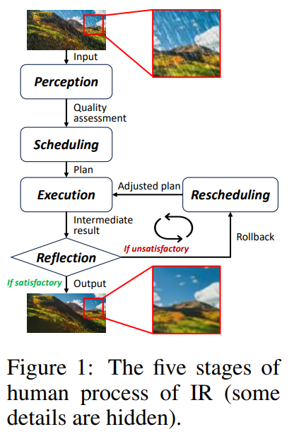
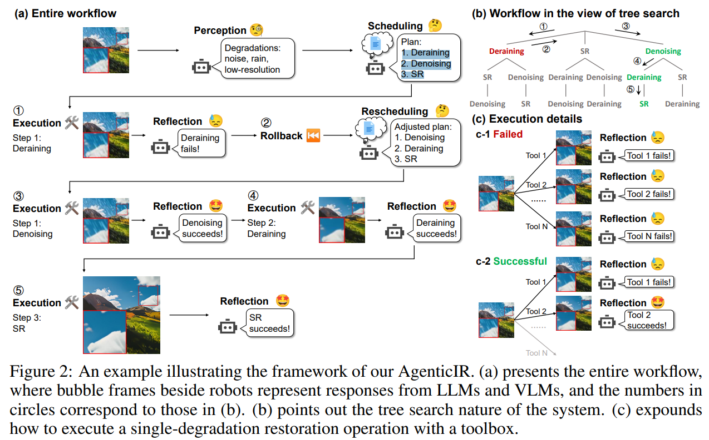
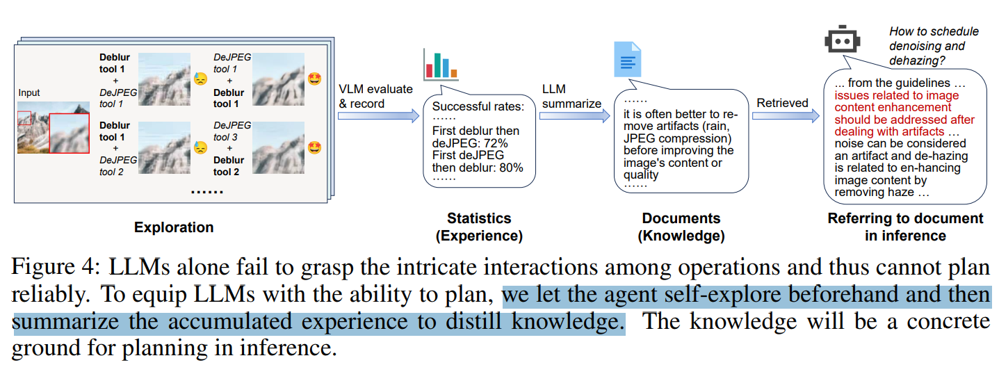
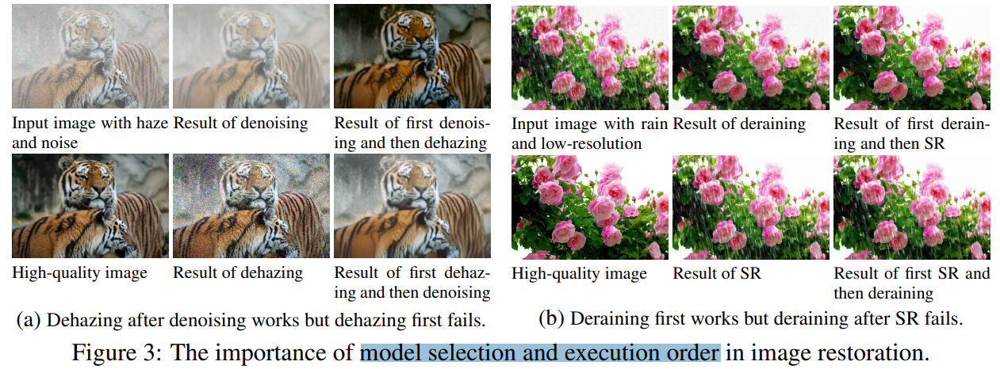
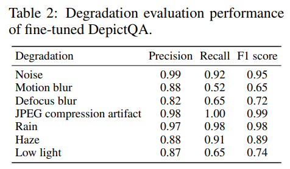
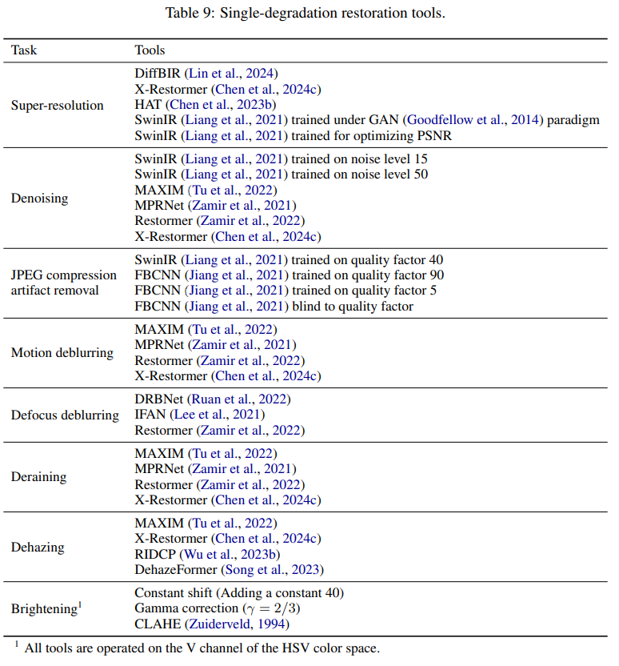
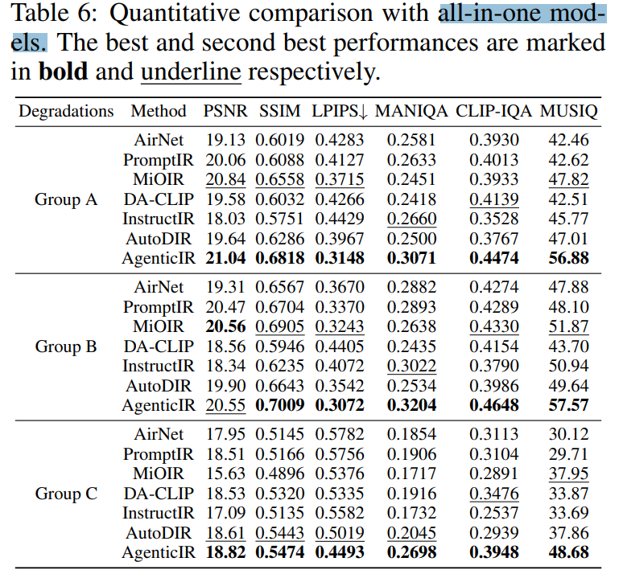
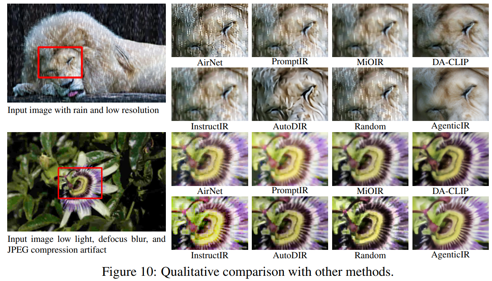
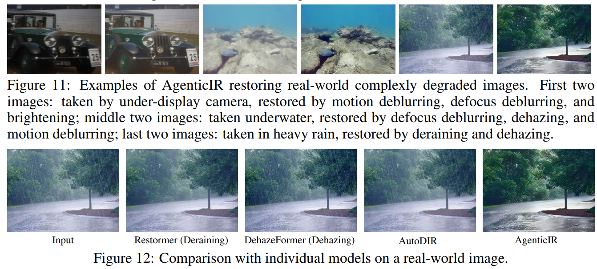
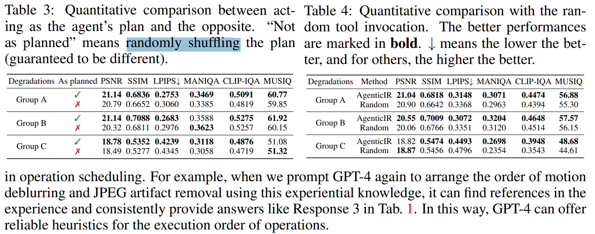

# An Intelligent Agentic System for Complex Image Restoration Problems

> "An Intelligent Agentic System for Complex Image Restoration Problems" Arxiv, 2024 Oct 23
> [paper](http://arxiv.org/abs/2410.17809v1) [code]() [pdf](./2024_10_Arxiv_An-Intelligent-Agentic-System-for-Complex-Image-Restoration-Problems.pdf) [note](./2024_10_Arxiv_An-Intelligent-Agentic-System-for-Complex-Image-Restoration-Problems_Note.md)
> Authors: Kaiwen Zhu, Jinjin Gu, Zhiyuan You, Yu Qiao, Chao Dong

## Key-point

- Task: Real-world image restoration (IR)

- Problems

  IR 修复效果不好就没后续了。。设计修复控制系统，搞一个反馈回路，使用不同方法再修复下

- :label: Label:

## Contributions

- 提出 Agentic System 5 个 stage 做 IR，模仿人类修复方式

>  Inspired by human problem-solving, we propose AgenticIR, an agentic system that mimics the human approach to image processing by following five key stages: Perception, Scheduling, Execution, Reflection, and Rescheduling. 

- finetune VLM 分析图像质量，LLM 做 reasoning, guiding the system step by step，但 LLM 缺少图像质量的知识；提出 self-exploration method

>  To compensate for LLMs’ lack of specific IR knowledge and experience, we introduce a self-exploration method, allowing the LLM to observe and summarize restoration results into referenceable documents.

- 显示有潜力做 general intelligence

>  potential in handling complex IR tasks, representing a promising path toward achieving general intelligence in visual processing

## Introduction

## methods

### PLATFORM

针对 8 类退化

> select eight types of degradation: low resolution, noise, motion blur, defocus blur, rain, haze, JPEG compression artifacts, and low light.

每种退化选 6-8 个效果较好的模型

>  For each degradation, we collect three to six advanced models to build the “toolbox” that the intelligent agent can use. 

### Workflow

把 Real-degradation 按退化类型逐个处理，**用 VLM 去识别退化类型，LLM 设计处理顺序**（去雨，去噪，SR），然后逐个调用模型处理。类似控制系统，**如果当前类型退化的修复效果不满意，feedback 重新规划修复流程；**

设计 5 个 stage

> Thus, we abstract the human process of using tools for IR into five stages: Perception, Scheduling, Execution, Reflection, and Rescheduling.

- Perception stage, 识别退化类型

> When faced with such an input image, human users may first analyze its quality and degradations (the Perception stage)

- Scheduling stage, 设计修复方式，先去雨 or 去噪

> devise a plan for using tools (the Scheduling stage) – for instance, applying

- Execution stage, 调用模型修复

> Following the plan, they sequentially apply these models to the image step by step (the Execution stage). 

- Reflection stage, 反思修复效果

> human users may re-analyze the image to assess whether the tool was effective (the Reflection stage)

- Rescheduling stage, 根据当前模型结果，看要不要 undo 重新设计修复顺序

> If the tool was ineffective or even worsened the image, they undo the operation and formulate a new plan to achieve better results (the Rescheduling stage).

- Q：咋用 LLM?

给 prompt，包含每一种退化类型，**问 LLM 设计一个修复路径**

#### **The Importance of Scheduling**

- Q：为什么要用 LLM 设计修复顺序，例如先去雨，再 denoise 而不是反过来？

发现**不同类型模型处理先后顺序，对于最终结果影响很大！**

#### DepictQA 识别退化类型 :star:

> Specifically, we extend DepictQA (You et al., 2024a) – a successful multi-modal image quality assessment model. 

用 LoRA 方式微调 DepictQA

> DepictQA, trained on a large dataset, can analyze image content and categorize types of quality issues, evaluate the quality of single images, and compare the quality of multiple images. 
>
>  It already possesses substantial knowledge and capabilities in image quality assessment, meeting the requirements of our perception stage. We further adapt DepictQA to the reflection stage of our system through LoRA fine-tuning (Hu et al., 2022)

训练细节

- DIV2K (Agustsson & Timofte, 2017) and Flickr2K (Timofte et al., 2017) datasets
- We randomly add two to four degradations on each image to obtain 15,000 complexly degraded images.
- We fine-tune DepictQA for one epoch with batch size 64 on 4 NVIDIA Tesla V100 GPUs, using learning rate 0.0005, weight decay 0.001, and Adam optimizer (β1 = 0.9, β2 = 0.95).

- 微调的 VLM DepictQA 识别退化类型准确率不稳定，会有误差累积

### 

## setting

### model toolbox

- LLM 设计的 Prompt
- 单个类型退化使用的模型

## Experiment

> ablation study 看那个模块有效，总结一下

对比 Real-reatoration 方法，之前方法 PromptIR 效果接近最好，**AgenticIR 模型集成下** PSNR 搞了 1

现在到了 cherry picking 时刻

- **agenticIR 集成模型对比单个模型。。不知道单个模型使用多次效果会咋样**

- fig11 模型自己的效果；fig12 对比几个单个模型的结果，色差有点明显

### ablation

对比 AgentIR **使用 LLM 设计修复顺序 vs 随机选择顺序修复**，客观指标没差多少。。LPIPS 降低了 0.02 左右也没差多少。。效果不显著

## Limitations

- 微调的 VLM DepictQA 识别退化类型准确率不稳定，会有误差累积

## Summary :star2:

> learn what

- 提出 Agentic System 5 个 stage 做 IR，**finetune VLM 分析有什么退化，LLM 设计修复模型的使用&顺序**；调用一个模型修复效果不行，**类似控制系统设计反馈回路，让 LLM 重新规划修复顺序**

- 效果
  - 对比 AgentIR **使用 LLM 设计修复顺序 vs 随机选择顺序修复**，客观指标没差多少。。LPIPS 降低了 0.02 左右也没差多少。。效果不显著
  - 对比 Real-reatoration 方法，之前方法 PromptIR 效果接近最好，**AgenticIR 模型集成下 PSNR 搞了 1，说明模型集成还是有点用的**

### how to apply to our task

- 可以参考 LLM 设计的 Prompt & 单个类型退化使用的 SOTA 模型
