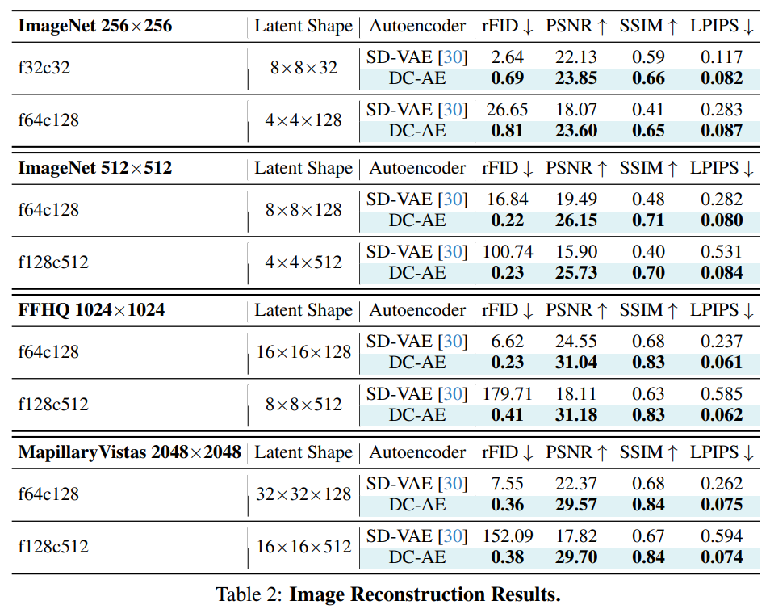

# Deep Compression Autoencoder for Efficient High-Resolution Diffusion Models

> "Deep Compression Autoencoder for Efficient High-Resolution Diffusion Models" ICLR-2025, 2024 Oct 14, `DC-AE`
> [paper](http://arxiv.org/abs/2410.10733v1) [code](https://github.com/mit-han-lab/efficientvit) [pdf](./2024_10_Arxiv_Deep-Compression-Autoencoder-for-Efficient-High-Resolution-Diffusion-Models.pdf) [note](./2024_10_Arxiv_Deep-Compression-Autoencoder-for-Efficient-High-Resolution-Diffusion-Models_Note.md)
> Authors: Junyu Chen, Han Cai, Junsong Chen, Enze Xie, Shang Yang, Haotian Tang, Muyang Li, Yao Lu, Song Han (MIT)

## Key-point

- Task: 更高压缩比的 VAE，加速 diffusion
- Problems
- :label: Label:

> We present Deep Compression Autoencoder (DC-AE), a new family of autoencoders for accelerating high-resolution diffusion models

## Contributions

- F64 VAE，FID 居然比 SD-F8 VAE 更低

- Residual Autoencoding

- Decoupled HighResolution Adaptation

  an efficient decoupled **three-phase training strategy** for mitigating the generalization penalty of high spatial-compression autoencoders.

- SOTA, 对比 SD-VAE-f8

  Applying our DC-AE to latent diffusion models, we **achieve significant speedup** without accuracy drop

## Introduction

- 提出的 VAE f64 效果比 SD-VAE-f8 好！降低显存！！！:star:

高压缩比的 VAE 很难训练

## methods

压缩比增加 -> 堆叠一些 VAE

> Each time the spatial compression ratio increases, we stack additional encoder and decoder stages upon the current autoencoder. In this way, high spatial-compression autoencoders contain low spatial-compression autoencoders as sub-networks and thus have higher learning capacity.

使用 VAE residual 提升 accuracy

> Then we introduce our Deep Compression Autoencoder (DC-AE) with Residual Autoencoding and Decoupled High-Resolution Adaptation to close the accuracy gap.

### Residual Autoencoding

在上 or 下采样的地方（信息丢失的源头）增加残差的信息让模型学习，这个残差利用的是 space2channel mapping

> The general idea is depicted in Figure 4. The core difference from the conventional design is that we explicitly let neural network modules learn the downsample residuals based on the space-to-channel operation to alleviate the optimization difficulty. Different from ResNet (He et al., 2016), **the residual here is not identity mapping, but space-to-channel mapping**

**channel averaging**

downsample 模块把 H, W 各自 /2，C *=2；现在**搞两份这个 downsampled 特征，取平均**

### Decoupled High-Resolution Adaptation

分为 3 个阶段训练 VAE

- 先训练 VAE
- 训练 Unet
- 微调 Decoder 最后一点点

#### GAN loss 训练

GAN Loss 可以消除瑕疵，展示图中出现网格状瑕疵

> GAN loss improves local details and removes local artifacts

## setting

- We profile the training and inference throughput on the H100 GPU

## Experiment

> ablation study 看那个模块有效，总结一下

压缩比 f32 FID 接近，很ok；但别高兴太早，后面 tb3 的 PSNR 就不太行了。。。

确实发现图像分辨率越低，VAE 重建越烂。。。

- SD VAE 扭曲太严重了。。。

f8C4 尺寸的 VAE 都不好搞啊。。。没差多少，看来提升 C 很有必要了

## Limitations

## Summary :star2:

> learn what

### how to apply to our task

