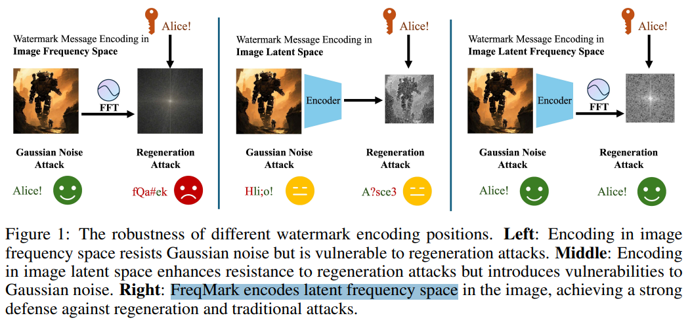
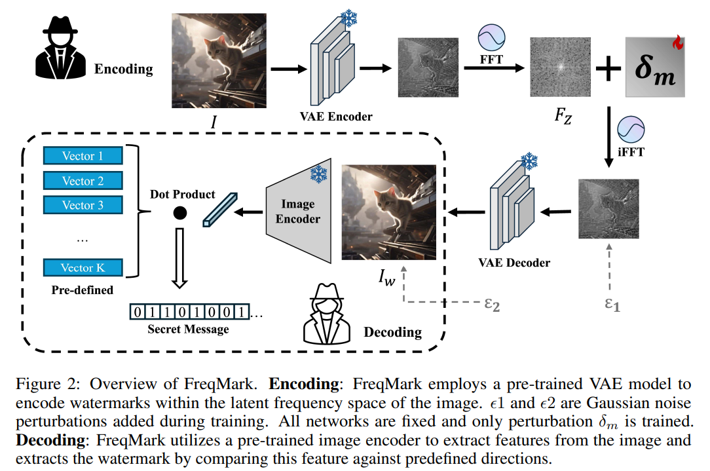
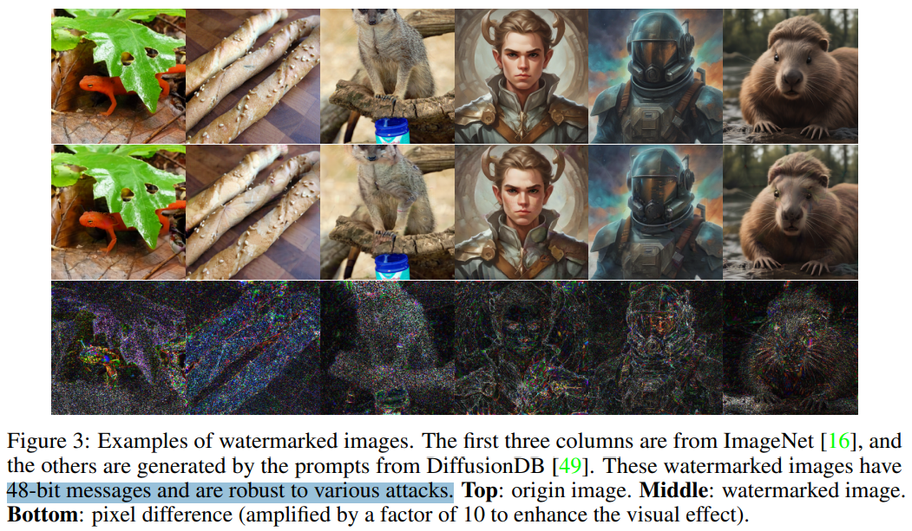
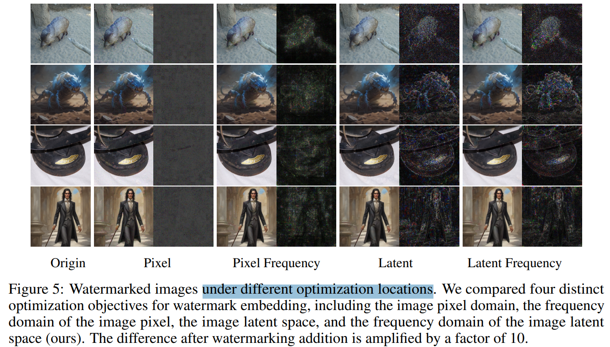

# FreqMark: Invisible Image Watermarking via Frequency Based Optimization in Latent Space

> "FreqMark: Invisible Image Watermarking via Frequency Based Optimization in Latent Space" Arxiv, 2024 Oct 28
> [paper](http://arxiv.org/abs/2410.20824v1) [code]() [pdf](./2024_10_Arxiv_FreqMark--Invisible-Image-Watermarking-via-Frequency-Based-Optimization-in-Latent-Space.pdf) [note](./2024_10_Arxiv_FreqMark--Invisible-Image-Watermarking-via-Frequency-Based-Optimization-in-Latent-Space_Note.md)
> Authors: Yiyang Guo, Ruizhe Li, Mude Hui, Hanzhong Guo, Chen Zhang, Chuangjian Cai, Le Wan, Shangfei Wang

## Key-point

- Task
- Problems
- :label: Label:

## Contributions

## Introduction

## methods

Latent Frequency Space 加扰动

## setting

## Experiment

> ablation study 看那个模块有效，总结一下

Latent FFT 仍然有语义哦！加密信息是加在主要物体上！

## Limitations

## Summary :star2:

> learn what

### how to apply to our task

