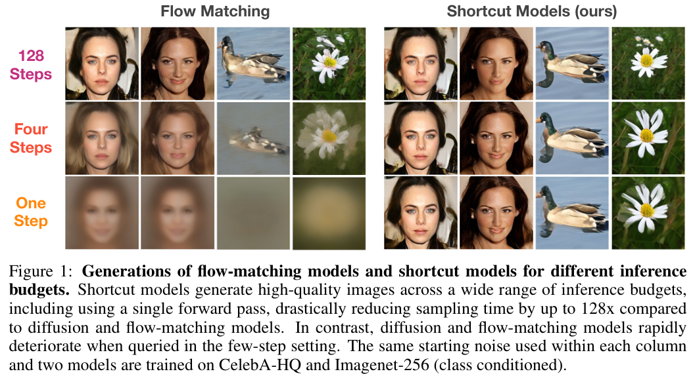

# One Step Diffusion via Shortcut Models

> "One Step Diffusion via Shortcut Models" Arxiv, 2024 Oct 16
> [paper](http://arxiv.org/abs/2410.12557v1) [code]() [pdf](./2024_10_Arxiv_One-Step-Diffusion-via-Shortcut-Models.pdf) [note](./2024_10_Arxiv_One-Step-Diffusion-via-Shortcut-Models_Note.md)
> Authors: Kevin Frans, Danijar Hafner, Sergey Levine, Pieter Abbeel

## Key-point

- Task: diffusion 加速

- Problems

  - 训练太复杂

    > Previous approaches for speeding up sampling require complex training regimes, such as multiple training phases, multiple networks, or fragile scheduling. 

- :label: Label:

## Contributions

- 提出 shortcut models

> We **introduce shortcut models**, a family of generative models that use a single network and training phase to produce high-quality samples in a single or multiple sampling steps.
>
>  Shortcut models **condition the network not only on the current noise level but also on the desired step size**, allowing the model to skip ahead in the generation process. 

- 效果 SOTA，相比蒸馏方法（SDXL-Turbo）训练更简单

> Across a wide range of sampling step budgets, shortcut models consistently produce higher quality samples than previous approaches, such as consistency models and reflow.
>
> Compared to distillation, shortcut models reduce complexity to a single network and training phase and additionally allow varying step budgets at inference time.

## Introduction

- Q：什么是 flow-matching？

仔细看下 shortcut models 人脸（鼻孔，嘴唇），鸭子头，**128 steps 瑕疵还是能看出来的！4steps 瑕疵就更明显了**

## methods

## setting

## Experiment

> ablation study 看那个模块有效，总结一下

## Limitations

- 仔细看下 shortcut models 人脸（鼻孔，嘴唇），鸭子头，**128 steps 瑕疵还是能看出来的！4steps 瑕疵就更明显了**

## Summary :star2:

> learn what

### how to apply to our task

