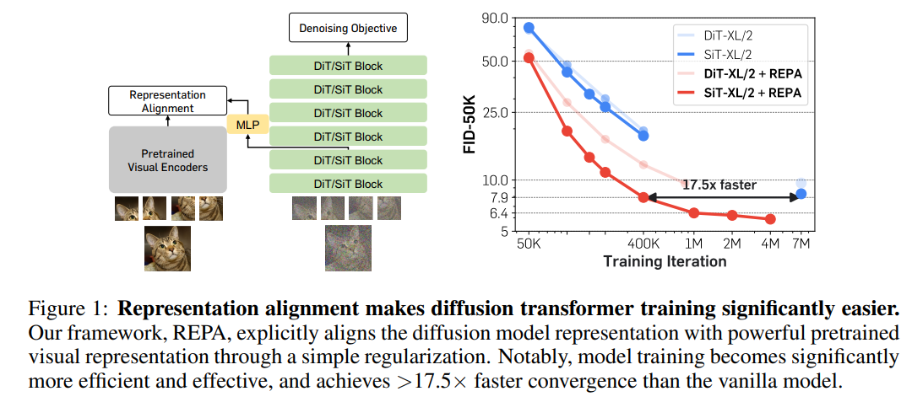
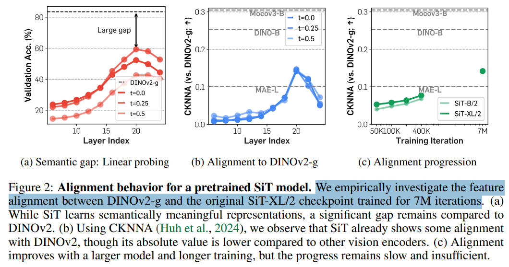
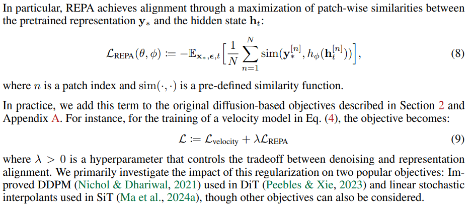
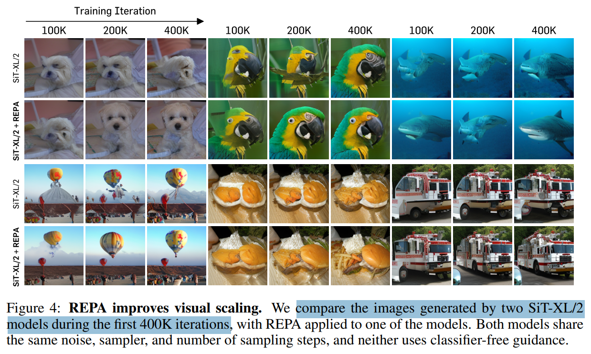
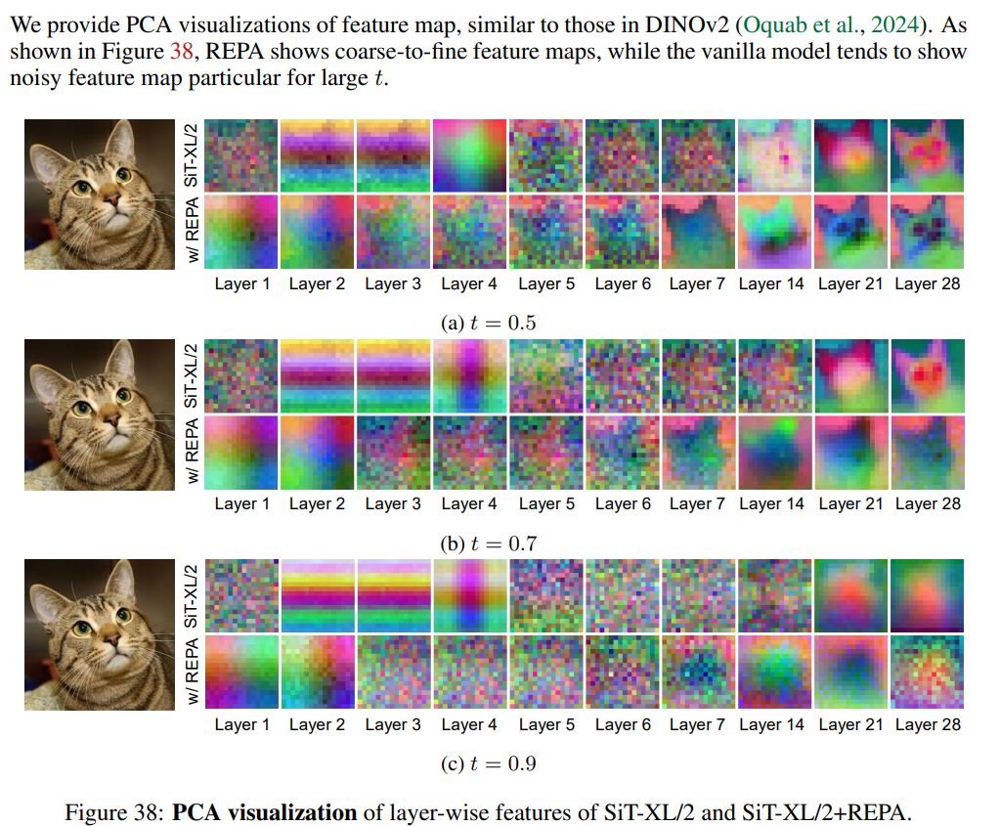

# Representation Alignment for Generation: Training Diffusion Transformers Is Easier Than You Think

> "Representation Alignment for Generation: Training Diffusion Transformers Is Easier Than You Think" ICLR, 2024 Oct 9
> [paper](http://arxiv.org/abs/2410.06940v3) [code]() [pdf](./2024_10_Arxiv_Representation-Alignment-for-Generation--Training-Diffusion-Transformers-Is-Easier-Than-You-Think.pdf) [note](./2024_10_Arxiv_Representation-Alignment-for-Generation--Training-Diffusion-Transformers-Is-Easier-Than-You-Think_Note.md)
> Authors: Sihyun Yu, Sangkyung Kwak, Huiwon Jang, Jongheon Jeong, Jonathan Huang, Jinwoo Shin, Saining Xie

## Key-point

- Task

- Problems

  - Diffusion 模型可以学习一个有意义的 latent space，但特征的精度太烂

  > the quality of these representations still lags behind those learned through recent self-supervised learning methods.

- :label: Label:

## Contributions

- 发现 diffusion loss 不够，引入 visual 表示去引导 diffusion model 学习有意义的 latent space，**提出 REPresentation Alignment (REPA)**

> We argue that one main bottleneck in training large-scale diffusion models for generation lies in effectively learning these representations. Moreover, training can be made easier by incorporating high-quality external visual representations, rather than relying solely on the diffusion models to learn them independently

- 发现提出的 REPA loss 能加速训练, 40w iteration 就 ok，训练加速 17x

> We study this by introducing a straightforward regularization called REPresentation Alignment (REPA), which aligns the projections of noisy input hidden states in denoising networks with clean image representations obtained from external, pretrained visual encoders. The results are striking: our simple strategy yields significant improvements in both training efficiency and generation quality when applied to popular diffusion and flow-based transformers, such as DiTs and SiTs. For instance, our method can speed up SiT training by over 17.5×, matching the performance (without classifier-free guidance) of a SiT-XL model trained for 7M steps in less than 400K steps. In terms of final generation quality, our approach achieves state-of-the-art results of FID=1.42 using classifier-free guidance with the guidance interval.

## Introduction

- Q：如何判断特征意义？

与 DINOv2 对标。训练 SiT 700w iteration 。。。这也太久了。。。

## methods

增加了一个 loss

## setting

- Computing resources. We use **8 NVIDIA H100 80GB GPUs** for experiments; our training speed is about **5.4 step/s with a batch size of 256.** 

## Experiment

> ablation study 看那个模块有效，总结一下

- Q：如何说明能加速？

在 256x256 上训练 40w iteration 看 RGB 生成效果。。。都很垃圾啊。。。但是看扭曲程度，发现 REPA 训练的在结构上还是更好一些

- Q：如何说明 latent space 更有意义？

PCA 可视化一下 latent，没在 RGB 还原看啊。。。

## Limitations

## Summary :star2:

> learn what

- 训练资源要求蛮高的。。

> Computing resources. We use **8 NVIDIA H100 80GB GPUs** for experiments; our training speed is about **5.4 step/s with a batch size of 256.** 

### how to apply to our task

- 在 256x256 上训练 40w iteration 看 RGB 生成效果。。。都很垃圾啊。。。但是看扭曲程度，**发现 REPA 训练的生成结果在结构上扭曲更少**；推断一下，能不能说训练的结构更好？但是对于修复来说大部分结构都在，效果有多少？细节不放大看不出来。。
