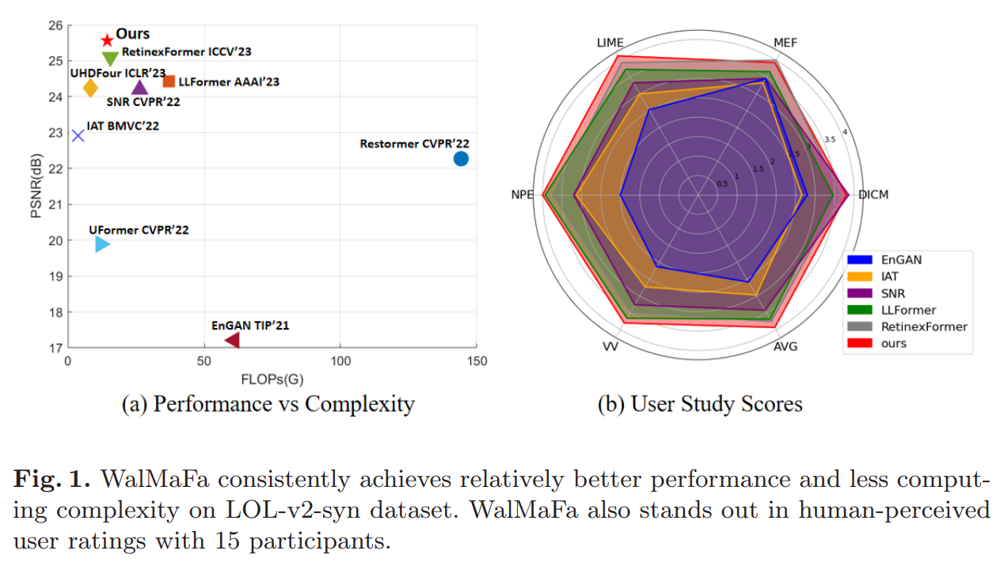
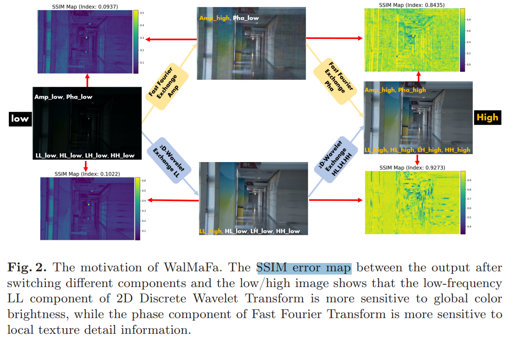
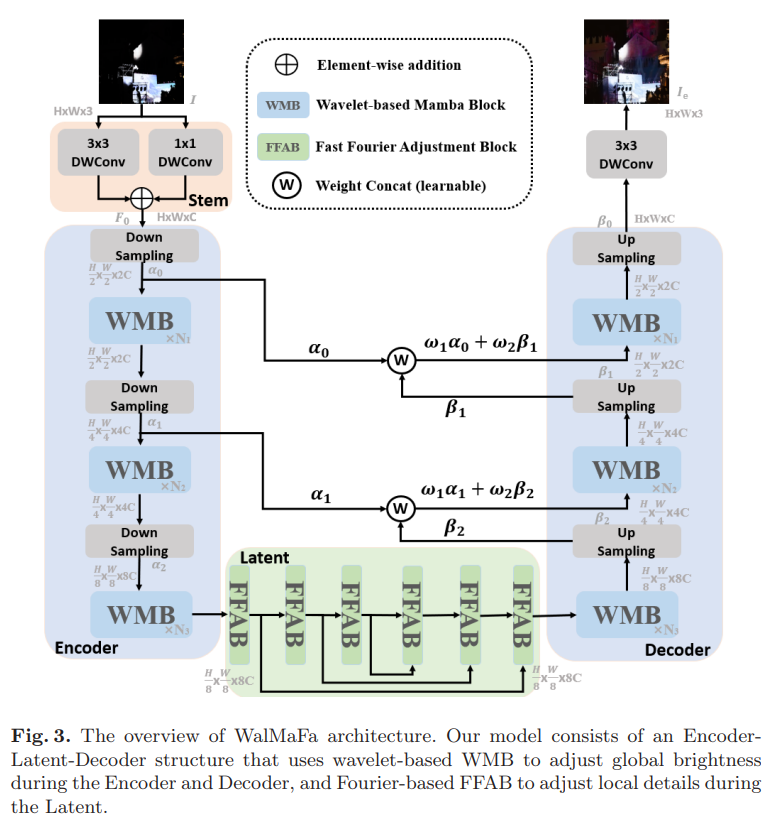
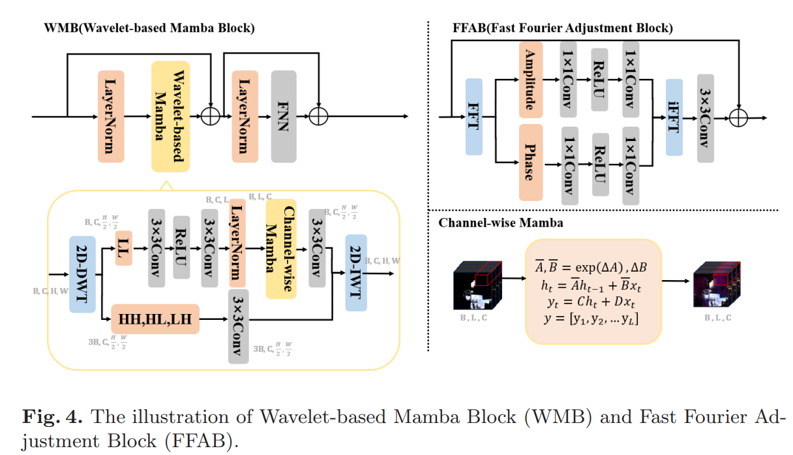

# Wavelet-based Mamba with Fourier Adjustment for Low-light Image Enhancement

> "Wavelet-based Mamba with Fourier Adjustment for Low-light Image Enhancement" Arxiv, 2024 Oct 27
> [paper](http://arxiv.org/abs/2410.20314v1) [code](https://github.com/mcpaulgeorge/WalMaFa.) [pdf](./2024_10_Arxiv_Wavelet-based-Mamba-with-Fourier-Adjustment-for-Low-light-Image-Enhancement.pdf) [note](./2024_10_Arxiv_Wavelet-based-Mamba-with-Fourier-Adjustment-for-Low-light-Image-Enhancement_Note.md)
> Authors: Junhao Tan, Songwen Pei, Wei Qin, Bo Fu, Ximing Li, Libo Huang

## Key-point

- Task: LLE
- Problems
- :label: Label:

## Contributions

## Introduction

## methods

## setting

## Experiment

> ablation study 看那个模块有效，总结一下

## Limitations

## Summary :star2:

> learn what

### how to apply to our task

