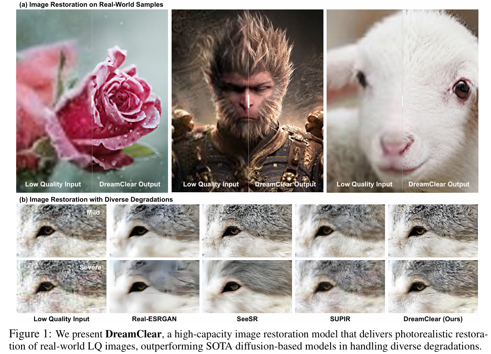
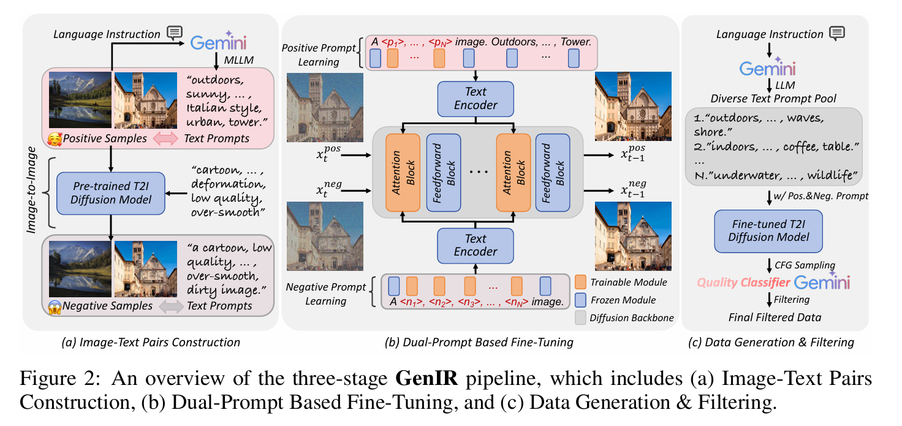
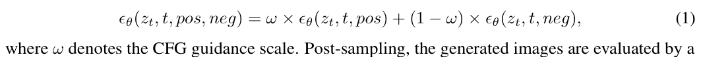
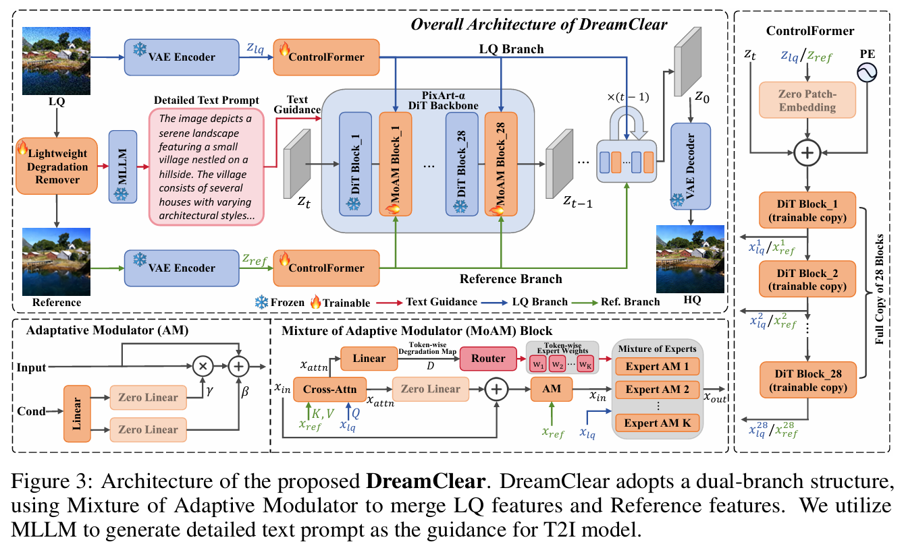
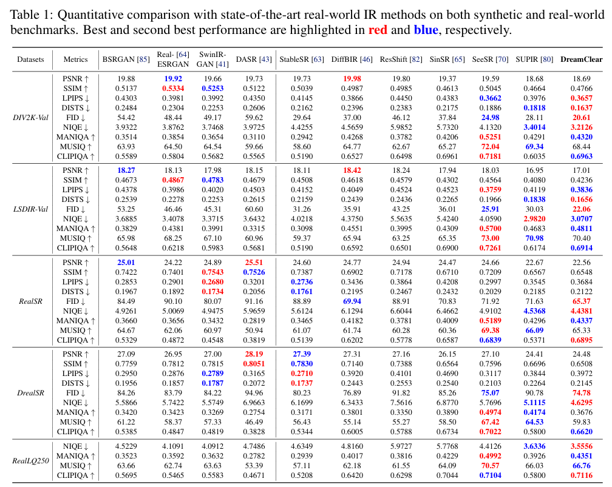
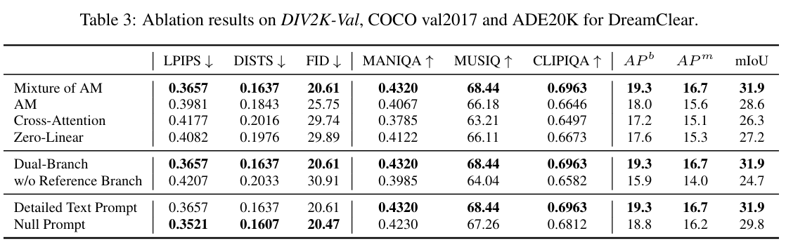

# DreamClear: High-Capacity Real-World Image Restoration with Privacy-Safe Dataset Curation

> "DreamClear: High-Capacity Real-World Image Restoration with Privacy-Safe Dataset Curation" NIPS, 2024 Oct 24
> [paper](http://arxiv.org/abs/2410.18666v2) [code](https://github.com/shallowdream204/DreamClear) [pdf](./2024_10_NIPS_DreamClear--High-Capacity-Real-World-Image-Restoration-with-Privacy-Safe-Dataset-Curation.pdf) [note](./2024_10_NIPS_DreamClear--High-Capacity-Real-World-Image-Restoration-with-Privacy-Safe-Dataset-Curation_Note.md)
> Authors: Yuang Ai, Xiaoqiang Zhou, Huaibo Huang, Xiaotian Han, Zhengyu Chen, Quanzeng You, Hongxia Yang (中科大 + 字节)

## Key-point

- Task: Blind restoration
- Problems
- :label: Label:

## Contributions

present a dual strategy

- IR dataset construction

  本文还是参考 Real-ESRGAN 类似的合成数据方式，但着重探索于 **HQ 数据的版权问题**

  **提出一个数据合成 pipeline**，去合成数据避免版权问题

  > GenIR is a dual-prompt learning pipeline
  >
  > a dual-prompt learning pipeline that overcomes the limitations of existing datasets, which typically comprise only a few thousand images and thus offer limited generalizability for larger models.

- DreamClear, is a DiT-based image restoration model.

- 提出 MoAM 模块，识别退化类型

  > To boost the model’s adaptability to diverse real-world degradations, we introduce the Mixture of Adaptive Modulator (MoAM). It employs token-wise degradation priors to **dynamically integrate various restoration experts**, thereby expanding the range of degradations the model can address.

- SOTA

## Introduction

- Q：训练合成数据 & 真实数据有差距

> The disconnect between training data and real-world scenarios is substantial, as existing datasets inadequately encapsulate the intricacies of real-world degradations.

当前工作，基于收集更多数据 & 合成。还是有 gap，作者认为没释放出 AIGC 潜力 

>  Efforts to bridge this gap include domain adaptation [5, 74, 23, 81], dataset collection [68, 8, 11, 91], and degradation simulation [64, 85, 49, 71].

$\to$ **提炼一下 2 个核心问题**，怎么搞呢？

1. 搞数据
2. 搞模型。。。P 话

> This leads us to two critical questions: how can we obtain a large-scale dataset that accurately represents real-world IR, and based on this, how can we construct powerful models tailored for real-world IR scenarios?

### curate IR data pipeline

有很多工作探索了合成数据的 pipeline, `Real-ESRGAN`

> these datasets are typically constructed by acquiring HQimages and then simulating degradations to generate corresponding LQ images.

本文还是参考 Real-ESRGAN 类似的合成数据方式，但着重探索于 **HQ 数据的版权问题**

>  this paper focuses on the acquisition of HQ images and the associated challenges of copyright and privacy protection.

- Q：列举当前为什么要搞数据，作为一个创新点？

Real IR 开源数据少

>  Current open-source IR datasets, such as DIV2K [44] and Flickr2K [2], contain only a few thousand images, insufficient for covering a broad spectrum of real-world scenarios

大数据量的又太耗费人力

> Larger collections like SUPIR [80], with 20 million images, highlight the labor-intensive nature of large-scale dataset curation.

HQ 数据有版权

> Moreover, images sourced from the internet often involve copyright issues and privacy concerns, particularly with identifiable human faces.

总结一下，urgent needs. `In response` 引出提出的观点

>  In response, we present an under-explored approach in the image restoration (IR) field: creating high-quality, non-existent images to enhance dataset curation efficiency, while evading copyright and privacy issues.

**提出一个数据合成 pipeline**，去合成数据避免版权问题

> We unveil GenIR, a privacy-conscious, automated data curation pipeline that repurposes the generative prior in pretrained text-to-image (T2I) models for IR tasks, and uses multimodal large language models (MLLMs) to generate text prompts, thereby improving data synthesis quality.

可以合成 1M 数据。。。

> Through GenIR, we generate a dataset of one million high-quality images, proving its efficacy in training a robust real-world IR model.

### DiT Model

基于 SD 的方法

> - "Pixel-aware stable diffusion for realistic image super-resolution and personalized stylization" `PASD`
> -  Seesr: Towards semantics-aware real-world image super-resolution. In CVPR, 2024
> - "Scaling Up to Excellence: Practicing Model Scaling for Photo-Realistic Image Restoration In the Wild" ` SUPIR`
>   [paper](https://arxiv.org/abs/2401.13627)
>
> Recent state-of-the art approaches [77, 70, 80] employ the generative priors in pretrained Stable Diffusion [59] (SD) for realistic image restoration, underlining the power of rich generative prior in SD

- Q：先前方法没有和 Blind IR 一样，在输入端引入退化类型信息

探索一下引入 退化类型信息 会咋样

> SD-based methods outperform GAN-based ones. However, these strategies often neglect the degradation priors in input low-quality images, a critical element in blind IR [72]
>
> This insight leads us to investigate the integration of degradation prior into diffusion-based IR models, and how to optimize its synergy with large models.

1. DiT 结构
2. ControlFormer 控制 image 信息
3. MoAM 处理退化类型信息

## methods

### IR data pipeline

- Prompt 使用 Gemini-1.5-Pro 提取

- 使用 T2I 模型，对 HQ 做下编辑，生成图像作为 negative 样本

  > "Sdedit: Guided image synthesis and editing with stochastic differential equations."

- 使用 CFG 方式，对 T2I 微调一下，生成更合理的样本对

>  Classifier-free guidance (CFG) [30] provides a mechanism to effectively utilize negative prompts, thereby mitigating the generation of undesired content. During the sampling phase, the denoising model ϵθ anticipates two outcomes: one associated with the positive prompt pos and the other with the negative prompt neg. The final CFG prediction is formulated as

- 高分辨率高质量数据

  > Ultimately, we gather one million high-resolution (2040 × 1356) images, each of superior quality.

### DiT

> DreamClear is built upon on PixArt-α [13], a pre-trained T2I diffusion model based on the Diffusion Transformer (DiT) [53] architecture, which has proven its powerful generative capabilities [93]
>
> we utilize the open-source MLLM, LLaVA [47], to generate detailed captions for training images using the prompt “Describe this image and its style in a very detailed manner”,

SwinIR 预处理，生成修复好一次的图像作为参考图。但发现有 detail loss，所以还是把 LQ 搞进来

> LQ images Ilq are processed by SwinIR [41], a lightweight degradation remover, resulting in smoother, albeit less detailed, reference images Iref.

搞了一个 DiT 的 ControlNet

## setting

> SDXL[55] and trained over 5days using16 NVIDIA A100GPUs

## Experiment

> ablation study 看那个模块有效，总结一下

- PSNR 才 24，效果也不是很好，挑出来的图

### ablation

reference 预先修好蛮重要的

## Limitations

## Summary :star2:

> learn what

### how to apply to our task

