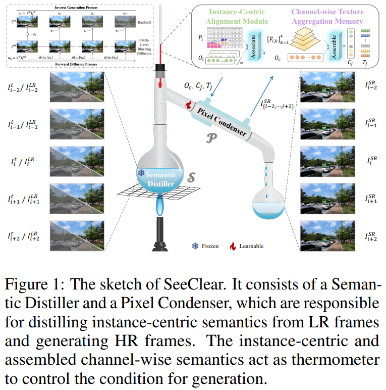
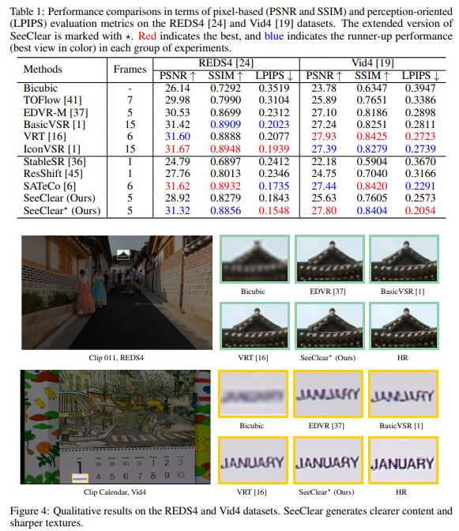

# SeeClear: Semantic Distillation Enhances Pixel Condensation for Video Super-Resolution

> "SeeClear: Semantic Distillation Enhances Pixel Condensation for Video Super-Resolution" NIPS, 2024 Oct 8
> [paper](http://arxiv.org/abs/2410.05799v4) [code](https://github.com/Tang1705/SeeClear-NeurIPS24.) [pdf](./2024_10_NIPS_SeeClear--Semantic-Distillation-Enhances-Pixel-Condensation-for-Video-Super-Resolution.pdf) [note](./2024_10_NIPS_SeeClear--Semantic-Distillation-Enhances-Pixel-Condensation-for-Video-Super-Resolution_Note.md)
> Authors: Qi Tang, Yao Zhao, Meiqin Liu, Chao Yao

## Key-point

- Task: VSR
- Problems
  - The **traditional approach of pixel-level alignment is ineffective for diffusion-processed** frames because of iterative disruptions.

- :label: Label:

## Contributions

- 改进 diffusion process，使用 residual-shifting & 在 wavelet spectra 提取特征

> 

## Introduction

## methods

## setting

## Experiment

> ablation study 看那个模块有效，总结一下

## Limitations

## Summary :star2:

> learn what

### how to apply to our task

