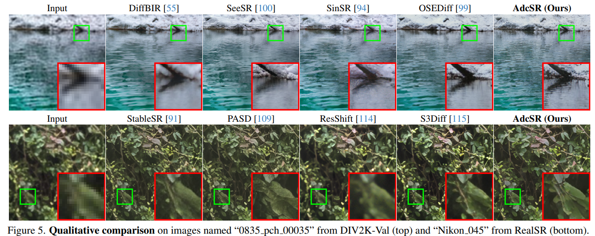

# Adversarial Diffusion Compression for Real-World Image Super-Resolution

> "Adversarial Diffusion Compression for Real-World Image Super-Resolution" CVPR-2025, 2024 Nov 20
> [paper](http://arxiv.org/abs/2411.13383v1) [code](https://github.com/Guaishou74851/AdcSR) [pdf](./2024_11_Arxiv_Adversarial-Diffusion-Compression-for-Real-World-Image-Super-Resolution.pdf) [note](./2024_11_Arxiv_Adversarial-Diffusion-Compression-for-Real-World-Image-Super-Resolution_Note.md)
> Authors: Bin Chen, Gehui Li, Rongyuan Wu, Xindong Zhang, Jie Chen, Jian Zhang, Lei Zhang

## Key-point

- Task
- Problems
- :label: Label:

## Contributions

## Introduction

推理时间加速！

## methods

## setting

- In both two stages, we employ the Adam [40] optimizer and a batch size of 96 for training on 8 NVIDIA A100 (80GB) GPUs.

## Experiment

> ablation study 看那个模块有效，总结一下

## Limitations

## Summary :star2:

> learn what

### how to apply to our task

