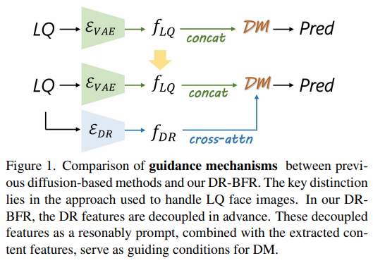

# DR-BFR: Degradation Representation with Diffusion Models for Blind Face Restoration

> "DR-BFR: Degradation Representation with Diffusion Models for Blind Face Restoration" Arxiv, 2024 Nov 15
> [paper](http://arxiv.org/abs/2411.10508v1) [code]() [pdf](./2024_11_Arxiv_DR-BFR--Degradation-Representation-with-Diffusion-Models-for-Blind-Face-Restoration.pdf) [note](./2024_11_Arxiv_DR-BFR--Degradation-Representation-with-Diffusion-Models-for-Blind-Face-Restoration_Note.md)
> Authors: Xinmin Qiu, Bonan Li, Zicheng Zhang, Congying Han, Tiande Guo

## Key-point

- Task: IR

- Problems

  - 如何有效提取 LQ 图像的特征，避免噪声

    > The key distinction lies in the approach used to **handle LQ face images**

- :label: Label:

**可以去用这里的特征 优化 DiffBIR 的 Conv Block**，优化 LQ 的特征提取。

DiffBIR 的 ConvBlocks 和 RGB 做 loss 我们实验发现对于修复几乎没效果，最多 1：1 还原 LQ，但还会降低质量，只能起到加速的目的

> Degradation Representation (DR) and content features from LQ images

先用 LQ 重建 + 对比学习方式学习描述退化的特征，提前训练好。这个退化特征作为额外的 condition 输入 diffusion cross-attn。

细节生成能力更好，就是**降低网络对于识别退化的负担**，用更多精力学习细节生成，**但细节的一致性都混在模型里面不一定能够很好。主观指标高**

## Contributions

- 提出去优化一个退化的特征，和内容无关的特征。以此来增强网络对于内容特征的学习

> Our novel restoration scheme, named DR-BFR, guides the denoising of Latent Diffusion Models (LDM) by incorporating **Degradation Representation (DR)** and content features from LQ images. DR-BFR comprises two modules: 1) Degradation Representation Module (DRM): This module extracts degradation representation with content-irrelevant features from LQ faces and estimates a reasonable distribution in the degradation space through contrastive learning and a specially designed LQ reconstruction

## Introduction

- Q：假设学习到了好的**描述退化的特征**，怎么用？

无脑用在 diffusion 的 cross-attn 作为额外的 condition，让模型自己学 :joy:

## methods

- 提取到的退化特征，用于模型学习到的 HQ 图像，加上退化信息，去重建 LQ 图像

- Q：怎么用到 diffusion 训练？

先单独训练好学习退化特征的模块，重建 LQ + 对比学习（和其他相似退化的距离接近）。最后直接用到 diffusion 训练 controlnet

## setting

## Experiment

> ablation study 看那个模块有效，总结一下

细节生成能力更好，就是**降低网络对于识别退化的负担**，用更多精力学习细节生成，**但细节的一致性都混在模型里面不一定能够很好。主观指标高**

> Our DR-BFR demonstrates strong performance in detail enhancement

## Limitations

## Summary :star2:

> learn what

### how to apply to our task

