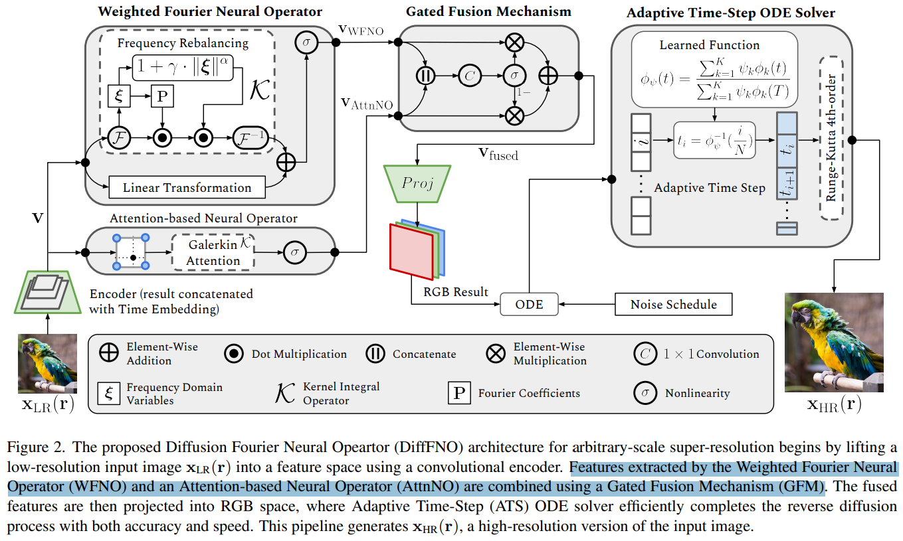

# DiffFNO: Diffusion Fourier Neural Operator

> "DiffFNO: Diffusion Fourier Neural Operator" Arxiv, 2024 Nov 15
> [paper](http://arxiv.org/abs/2411.09911v1) [code]() [pdf](./2024_11_Arxiv_DiffFNO--Diffusion-Fourier-Neural-Operator.pdf) [note](./2024_11_Arxiv_DiffFNO--Diffusion-Fourier-Neural-Operator_Note.md)
> Authors: Xiaoyi Liu, Hao Tang

## Key-point

- Task: arbitrary-scale super-resolution
- Problems
- :label: Label:

## Contributions

## Introduction

## methods

## setting

## Experiment

> ablation study 看那个模块有效，总结一下

## Limitations

## Summary :star2:

> learn what

### how to apply to our task

