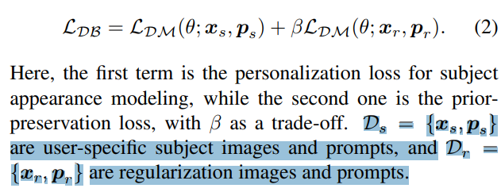
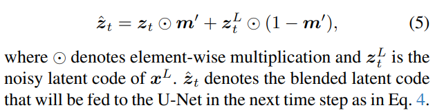
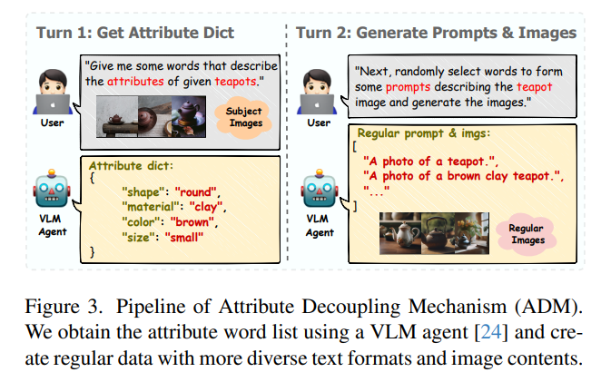
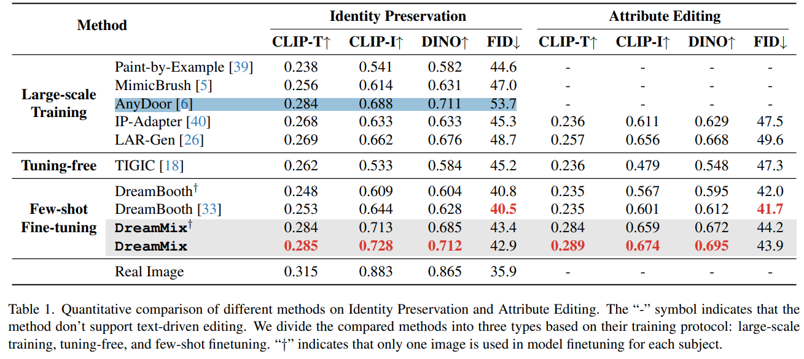

# DreamMix: Decoupling Object Attributes for Enhanced Editability in Customized Image Inpainting

> "DreamMix: Decoupling Object Attributes for Enhanced Editability in Customized Image Inpainting" Arxiv, 2024 Nov 26
> [paper](http://arxiv.org/abs/2411.17223v1) [code](https://github.com/mycfhs/DreamMix.) [pdf](./2024_11_Arxiv_DreamMix--Decoupling-Object-Attributes-for-Enhanced-Editability-in-Customized-Image-Inpainting.pdf) [note](./2024_11_Arxiv_DreamMix--Decoupling-Object-Attributes-for-Enhanced-Editability-in-Customized-Image-Inpainting_Note.md)
> Authors: Yicheng Yang, Pengxiang Li, Lu Zhang, Liqian Ma, Ping Hu, Siyu Du, Yunzhi Zhuge, Xu Jia, Huchuan Lu

## Key-point

- Task
- Problems
- :label: Label:

## Contributions

## Introduction

## methods

训练 DreamBooth，只要 20min；**在推理阶段**，提出局部优化 + 全局优化，把指定区域 VAE 替换掉，和新的图像特征加权

Xs, Ps 为用户输入的图像 & 文本，但不一定很准确，因此用模型去优化一下得到 Xr, Pr；

> Given a background image x, a binary mask m, and a text prompt p, DreamMix aims to inpaint the local region of x specified by m to produce an image $\hat{x}$

- Q：Additionally, in complex scenes**, background interference** can affect the editing control of text instructions, leading to imprecise synthesis of the fill-in areas.

在推理阶段，提出局部优化 + 全局优化

> we propose an effective disentangled inpainting framework, consisting of Local Content Generation (LCG) and Global Context Harmonization (GCH), 

局部优化 LCG 按 mask 区域，替换局部 VAE 为新物体的特征

VLM 去优化用户输入的文本

## setting

-  The total finetuning time for each subject is proximately 20 minutes on a single RTX 4090 GPU. 

## Experiment

> ablation study 看那个模块有效，总结一下

效果没有差很多吧

## Limitations

## Summary :star2:

> learn what

### how to apply to our task

