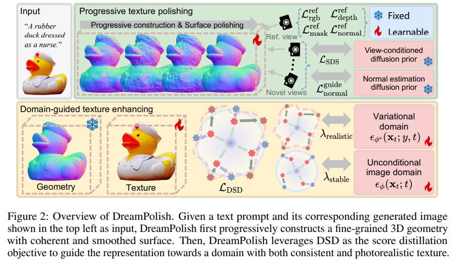

# DreamPolish: Domain Score Distillation With Progressive Geometry Generation

> "DreamPolish: Domain Score Distillation With Progressive Geometry Generation" Arxiv, 2024 Nov 3
> [paper](http://arxiv.org/abs/2411.01602v1) [code]() [pdf](./2024_11_Arxiv_DreamPolish--Domain-Score-Distillation-With-Progressive-Geometry-Generation.pdf) [note](./2024_11_Arxiv_DreamPolish--Domain-Score-Distillation-With-Progressive-Geometry-Generation_Note.md)
> Authors: Yean Cheng, Ziqi Cai, Ming Ding, Wendi Zheng, Shiyu Huang, Yuxiao Dong, Jie Tang, Boxin Shi (清华)

## Key-point

- Task
- Problems
- :label: Label:

## Contributions

## Introduction

## methods

## setting

## Experiment

> ablation study 看那个模块有效，总结一下

## Limitations

## Summary :star2:

> learn what

### how to apply to our task

