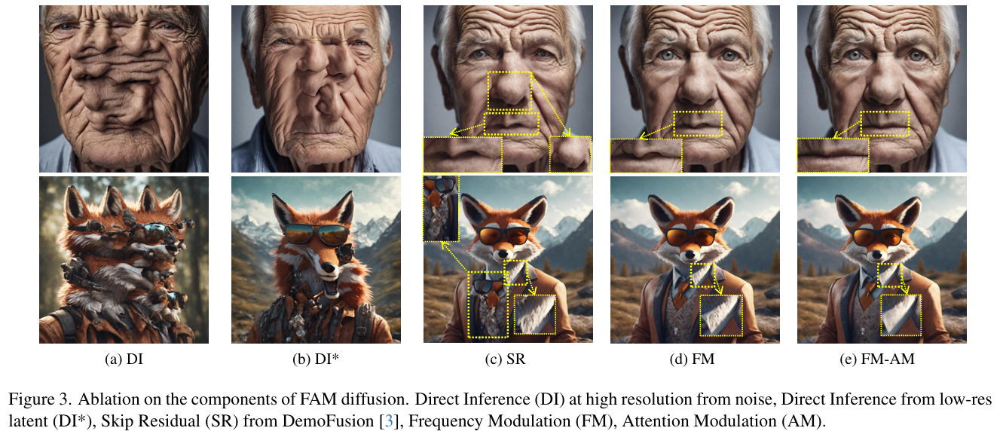

# FAM Diffusion: Frequency and Attention Modulation for High-Resolution Image Generation with Stable Diffusion

> "FAM Diffusion: Frequency and Attention Modulation for High-Resolution Image Generation with Stable Diffusion" Arxiv, 2024 Nov 27
> [paper](http://arxiv.org/abs/2411.18552v1) [code]() [pdf](./2024_11_Arxiv_FAM-Diffusion--Frequency-and-Attention-Modulation-for-High-Resolution-Image-Generation-with-Stable-Diffusion.pdf) [note](./2024_11_Arxiv_FAM-Diffusion--Frequency-and-Attention-Modulation-for-High-Resolution-Image-Generation-with-Stable-Diffusion_Note.md)
> Authors: Haosen Yang, Adrian Bulat, Isma Hadji, Hai X. Pham, Xiatian Zhu, Georgios Tzimiropoulos, Brais Martinez

## Key-point

- Task: addressing structural and local artifacts in Diffusion
- Problems
  - Inference at a scaled resolution leads to repetitive patterns and structural distortions.
  - Previous works suffer from **frequent artifacts** and often introduce large latency overheads.

- :label: Label:

## Contributions

- 引入频域模块，修复纹理

>  We introduce a Frequency Modulation (FM) module that leverages the Fourier domain to improve the global structure consistency, and an Attention Modulation (AM) module which improves the consistency of local texture patterns, a problem largely ignored in prior works. 

- 不需要训练

> Our method, coined FAM diffusion, can seamlessly integrate into any latent diffusion model and requires no additional training.

- 有效增强纹理一致性

> addressing structural and local artifacts

## Introduction

先介绍问题 & 背景，和 block based 一样的问题，**推理多个 patch 出现物体重复 & 纹理垃圾**

分类介绍一下目前已有方案 & 不足，**找一张图明显的指出来**

> Prior efforts addressing this important problem can be largely **categorized into two tracks.**

**Plan1: 参考 Block-based 方案**

> The first set of ap proaches, e.g. [3, 15], propose mechanisms that improve the global structure consistency by steering the high-resolution generation using the image generated at native (i.e. training) resolution. 
>
> - "DemoFusion: Democratising High-Resolution Image Generation With No" CVPR, 2023 Nov 24
>   [paper](http://arxiv.org/abs/2311.16973v2) [code](https://github.com/PRIS-CV/DemoFusion) [web](https://ruoyidu.github.io/demofusion/demofusion.html) [pdf](./2023_11_CVPR_DemoFusion--Democratising-High-Resolution-Image-Generation-With-No.pdf) [note](./2023_11_CVPR_DemoFusion--Democratising-High-Resolution-Image-Generation-With-No_Note.md)
>   Authors: Ruoyi Du, Dongliang Chang, Timothy Hospedales, Yi-Zhe Song, Zhanyu Ma
> - "AccDiffusion: An Accurate Method for Higher-Resolution Image Generation" ECCV, 2024 Jul 15
>   [paper](http://arxiv.org/abs/2407.10738v2) [code](https://github.com/lzhxmu/AccDiffusion) [web](https://lzhxmu.github.io/accdiffusion/accdiffusion.html) [pdf](./2024_07_ECCV_AccDiffusion--An-Accurate-Method-for-Higher-Resolution-Image-Generation.pdf) [note](./2024_07_ECCV_AccDiffusion--An-Accurate-Method-for-Higher-Resolution-Image-Generation_Note.md)
>   Authors: Zhihang Lin, Mingbao Lin, Meng Zhao, Rongrong Ji

一篇 ECCV 的频域文章相似度很高

> - "FouriScale: A Frequency Perspective on Training-Free High-Resolution Image Synthesis" ECCV, 2024 Mar 19
>   [paper](http://arxiv.org/abs/2403.12963v1) [code](https://github.com/LeonHLJ/FouriScale.) [pdf](./2024_03_ECCV_FouriScale--A-Frequency-Perspective-on-Training-Free-High-Resolution-Image-Synthesis.pdf) [note](./2024_03_ECCV_FouriScale--A-Frequency-Perspective-on-Training-Free-High-Resolution-Image-Synthesis_Note.md)
>   Authors: Linjiang Huang, Rongyao Fang, Aiping Zhang, Guanglu Song, Si Liu, Yu Liu, Hongsheng Li

- Q：DemoFusion 缺陷
  1. 类似方案的 patch 一致性好了一些，但纹理很垃圾！
  2. 分 patch 很冗余！推理很慢

> However, the effectiveness of such mechanisms is mixed, with trailing issues like poor detail quality, inconsistent local textures, and even persisting pattern repetitions as shown in Figure 1(b)
>
> Concretely, this means that these methods resort to redundant and overlapping forward passes

**Plan2: ScaleCrafter 和 HiDiffusion 一次出图，但纹理超级垃圾**

> The second group of approaches, e.g. [7, 11, 34], eschews patch-based generation in favor of a one-pass approach by directly altering the model architec ture. This leads to faster generation, but unfortunately, it comes at the cost of image quality, as shown in Fig. 1 (c).

概括自己如何融合上述两个方案的优点

> **To address the aforementioned limitations, we propose** a straightforward yet effective approach that takes the best of both worlds. Our method follows the single pass generation strategy for improved latency but, like patch-based approaches, leverages the native resolution generation to steer the high-resolution one.

虽然和分 patch 的很相似，**提出频域模块！:star:**

> However, instead of blindly steering the high-res image toward the low-res one as done elsewhere [3, 15], we propose a **Frequency Modulation (FM) module.**

`In particular` 引出模块具体细节

> In particular, we leverage the Fourier domain to selectively condition low-frequency components during the high-resolution

作者起初的目标是用频域获取低频，维持全局一致性。**但发现和我们遇到一样的问题，生成细节纹理出现了各个 patch 的不一致，直接无脑把多个 patch VAE 特征平均就模糊了，像蒙了一层雾一样！**

> While the FM module resolves artifacts related to global consistency, artifacts related to inconsistent local texture might still be present, i.e. finer texture generated on semantically related parts of the image might be inconsistent.

用原始分辨率的 attention map 引导高分辨率图像的生成 :star:

> To tackle this second issue, largely ignored in the literature, we propose an Attention Modulation (AM) mechanism that leverages attention maps from the denoising process at native resolution to condition the attention maps of the denoising process at high resolution.

### FFT

- "FreeInit: Bridging Initialization Gap in Video Diffusion Models" ECCV, 2023 Dec 12
  [paper](http://arxiv.org/abs/2312.07537v2) [code](https://github.com/TianxingWu/FreeInit/blob/master/freeinit_utils.py#L98) [pdf](./2023_12_ECCV_FreeInit--Bridging-Initialization-Gap-in-Video-Diffusion-Models.pdf) [note](./2023_12_ECCV_FreeInit--Bridging-Initialization-Gap-in-Video-Diffusion-Models_Note.md)
  Authors: Tianxing Wu, Chenyang Si, Yuming Jiang, Ziqi Huang, Ziwei Liu

## methods

> Our goal is to generate images at higher resolutions than during training, **without any additional finetuning** or model modification.
>
> 1.  In Sec. 3.2 we present our Frequency Modulated (FM) denoising approach, which is designed to **improve global consistency.**
> 2. Finally, we introduce our At tention Modulation (AM) mechanism, which is designed to improve the consistency of the local texture and high frequency detail, in Sec. 3.3.

在 VAE-space 做

> We operate in the realm of LDMs, which first convert image x0 to a latent representation z0 

- 上标 n，m 代表 LR，SR 图像分辨率
- $z^n_0$  LR 图像的 z0
- $\tilde{z}^m_0 = Upsample(z^n_0, scale)$  resize 后的 z0，再加噪到 $\tilde{z}^m_T$  （LR 图像 latent resize 过来的）
- 逐渐去噪 $z_0^m$

目标1. 维持全局一致性；2. 细节纹理

> More specif ically, the goal of the test-time diffuse-denoise process is to take the upsampled low-resolution image and to produce an output that 1) preserves the global structure, and 2) im proves the texture and high-frequency details.

### Frequency-Modulated Denoising

全局 resized 残差**能提升图像 LR->HR 全局一致性，但对于纹理的生成有损害！**

> The skip residual mechanism however steers the output towards the input indiscriminately, which serves the first objective but can negatively impact the latter.

目标：从全局残差获取 global structure，**细节生成交给 Diffusion 去噪阶段**

> It would be desirable to instead harness the global structure information from the diffused latents of the forward process, while allowing the denoising process to handle the generation of details.

频域去区分 structure 低频，细节高频特征

>  To this end, we appeal to the frequency domain, where global structure and finer details are captured by low- and high frequency, respectively [17, 28, 31]
>
>  - "Learning in the frequency domain" CVPR, 2020
>  - "BA Wandell. Foundations of vision, 1995"

取 $\tilde{z}^m_t$ 为 resized 的 LR 特征的低频；取 $z^m_t$ 为去噪阶段特征的高频。

进一步改写，使用卷积实现 low-pass filter，**不足就去补充一下，加上当前去噪的低频信息和 resize LR 特征的低频特征的差距** :star::star:

> Eq. 4 can be further reformulated in the time domain as below:

 low-pass filter 使用 UNet 自带的 Conv 层，不用训练

> Further more, the circular convolution κ(t) in Eq. 5 can be inter preted as an **additional (non-learnable) convolutional layer** of the UNet, effectively providing it with a global recep tive field and helping generate consistent structure without modifying the UNet architecture [11, 34] or using dilated sampling [3]

### Attention Modulation

- Q：看 fig3d **全局的结构一致性好了一丢丢**，**细节结构 or 纹理还是有不一致**

> While the FM module successfully maintains global struc ture and solves the issue of object duplication as shown in Fig. 3d, we note that local structures can be inconsis tently generated due to the discrepancy between training time native resolution and the target inference-time high resolutions. 

举几个细节结构不一致的例子，凑字数。**现象，带入猜测的原因再改写一下**

> For example, the top image in Fig. 3d shows a distorted mouth compared to the one at native resolution. Similarly, in the bottom example, fur texture is incorrectly generated on the shirt collar.

猜测是 attention map 坏了，**讲一下类似的 idea 得到启发**

> We hypothesize this stems from incorrect attention maps during the high-res denoising stage. This motivates us to propose our Attention Modulation (AM) approach.
>
> We take inspiration from attention swapping, a recent method to combine information from two diffusion processes in a more localized manner [4, 5, 13], and extend the idea to transfer local structural information from the denoising pro cess at native resolution to the one at target resolution.
>
> - "MultiDiffusion: fusing diffusion paths for controlled image generation" ICML
> - "SwapAnything: Enabling arbitrary ob ject swapping in personalized image editing" ECCV
> - "Visual style prompting with swapping self attention" arxiv

**将 LR 生成时候的 attention map（QK 的那个矩阵）拿过来，和最后 HR 生成的那个 map 加权一下**

> In our case, we modify the self-attention at specific lay ers of the UNet of the high-resolution denoising process to incorporate information from the attention maps of the na tive resolution

对每一层 atten 都替换，出现了模糊

> Applying our AM module at all layers of the UNet can **lead to suboptimal performance due to over-regularization.**

只对 **UNet 的 Up-blocks 替换 attention map，先前工作说含有大部分结构信息  layout information**

> We apply it instead only for layers in up-blocks of the UNet, as they are known to preserve layout information bet ter [13]. 
>
> - Visual style prompting with swapping self attention

**发现对于 up_block_0 效果最显著**

> Furthermore, we experimented with AM at various stages and found the highest benefit to be at up block 0

看下 attention map，验证了缺失能够从 attention map 对应到哪些区域生成的烂

###  Time-varying high-pass filter definition

- Q：直接对于所有去噪 timestep 用一个不行？？

想要越接近 T=0 guidance 越强 :star:

> Our frequency modulation is de signed such that the guidance from the denoised latent ˜ zt becomes more significant as t → 0

- 做 FFT 时候如果不考虑 Timestep，resized 的低频都拿过来会造成模糊！！！！:star:

> However, this approach results in images that appear noticeably blurrier and **lose finer details associated with high-frequency information**, highlighting the importance of the dynamic nature of the FM module throughout the denoising process.

**搞了一个与 timestep 相关的权重，去调整下 FFT。。。**

> The high-pass filters K(t) have time-varying cut-off fre quencies
>
> 超参 In our experiments, we set c = 0.5.

### Code

> - https://cloud.tencent.com/developer/article/1701712
>
>   https://www.cnblogs.com/yutou2016/p/11171903.html
>
> - [Using fftn to filter 4D image (3D video)](https://ww2.mathworks.cn/matlabcentral/answers/1615050-using-fftn-to-filter-4d-image-3d-video)
>
> - https://github.com/apachecn/pyimagesearch-blog-zh/blob/master/docs/opencv-fast-fourier-transform-fft-for-blur-detection-in-images-and-video-streams.md
>
> 逐帧做 FFT
>
> - https://github.com/slhck/video-fft/blob/d7b9631b144d6136426d272bc52a81445107e97e/video_fft/video_fft_calculator.py#L218
>
> 
>
> - https://pytorch.org/blog/the-torch.fft-module-accelerated-fast-fourier-transforms-with-autograd-in-pyTorch/

- Q：4D video ？？

> https://login.mathworks.com/embedded-login/v2/status/redirect?origin=https%3A%2F%2Fww2.mathworks.cn&forward=https%3A%2F%2Fww2.mathworks.cn%2Fmatlabcentral%2Fanswers%2F1660985-how-to-obtain-the-fft-of-a-4d-image

- "FreeInit: Bridging Initialization Gap in Video Diffusion Models" ECCV, 2023 Dec 12
  [paper](http://arxiv.org/abs/2312.07537v2) [code](https://github.com/TianxingWu/FreeInit/blob/master/freeinit_utils.py#L98) [pdf](./2023_12_ECCV_FreeInit--Bridging-Initialization-Gap-in-Video-Diffusion-Models.pdf) [note](./2023_12_ECCV_FreeInit--Bridging-Initialization-Gap-in-Video-Diffusion-Models_Note.md)
  Authors: Tianxing Wu, Chenyang Si, Yuming Jiang, Ziqi Huang, Ziwei Liu

## setting

- To measure the efficiency of each method, we compute latencies **on a single A40 GPU (48G)**

- 支持模型

  - SDXL 实验用的方法 1024×1024
  - HiDiffusion [34]
  - SD 1.5，SD 2.1 512×512 and 768×768

  > To demonstrate the effectiveness of our approach, we pair it with a well-performing diffusion model like SDXL [19].

- SR x2,3,4

  > We experiment with three un seen higher resolutions such that the model generate**s 2×2, 3 ×3, and 4×4 times more pixels** than the training setup.

- 多个长宽比

  >  In the supplementary, we also include results with various aspect ratios

数据 Laion-5B ，**全部用计算量太大，随机用一部分**

> we evaluate performance on a subset of the Laion-5B dataset [24]
>
> we **randomly sample 10K images from Laion-5b** which we use as our real images set, and we sample 1K captions, which we use as text prompts for the models.

Metrics

- FID requires **resizing images to 299 × 299**, which negatively impacts the assessment

  >  FID requires resizing images to 299 × 299, which negatively impacts the assessment, it is typical to **adopt their patch-level variants [3, 11, 15, 34]**

- Kernel Incep tion Distance (KID) [2], computed between the generated and real images.

原始 FID, KID 需要 resize 很小，指标不准。**因此随机取 10 个 crop 取计算 FIDc, KIDc**

> we extract 10 random crops from each image before calculating FID and KID, referring to these metrics as FIDc and KIDc.

- 语义相似度

> To further evaluate the semantic similar ity between image features and text prompts, we report the CLIP score [21].

- latencyoverheads，加了模块增加多少延迟

## Experiment

> ablation study 看那个模块有效，总结一下

1. 比直接用 SDXL 好？？怎么比的是一张图？？说明分多个 stage 逐步提升比较好
2. 指标比 AccDiffusion 好了一些

### **对比用 SR 方法**

高频还是有噪声，出来和原始 upsample 的结果，**细节的不一致性增加了很多！！！！**

对于一些修复任务要求一致性需要很高！！**修的不好算了，但不能改变超级多**

### 对比 related work

- 没和 AccDiffusion 比较
- 细节纹理还是有差距。。。看老头眉毛上方的皱纹，现在只是像，但结构完全不一样了。。。。
- 其他几个方法一致性太烂了。。。
- DemoFusion 还有物体重复的问题

### Ablation

- 全局残差有噪声，纹理不行

  > while the Skip Residuals of DemoFu sion helps maintain the global structure of the image, it still produces artifacts and poor local patterns. 

- FM module 对全局残差提取低频信息，但是不训练，**结构不一致的问题，细看还是很明显**

- attention map 能对应到生成内容区域，可以从 attention map 分析纹理的缺陷

> This analysis provides visual insights into how AM repairs inconsistencies in local patterns, contributing to more coherent global structures.

## Limitations

高频还是有噪声，出来和原始 upsample 的结果，**细节的不一致性增加了很多！！！！**

对于一些修复任务要求一致性需要很高！！**修的不好算了，但不能改变超级多**

## Summary :star2:

> learn what

- 使用卷积实现 low-pass filter，**不足就去补充一下，加上当前去噪的低频信息和 resize LR 特征的低频特征的差距** :star::star:

  

- 高频还是有噪声，出来和原始 upsample 的结果，**细节的不一致性增加了很多！！！！**

  对于一些修复任务要求一致性需要很高！！**修的不好算了，但不能改变超级多**

  

- 做 FFT 时候如果不考虑 Timestep，resized 的低频都拿过来会造成模糊！！！！

  

  > However, this approach results in images that appear noticeably blurrier and **lose finer details associated with high-frequency information**, highlighting the importance of the dynamic nature of the FM module throughout the denoising process.

  **搞了一个与 timestep 相关的权重，去调整下 FFT。。。**

  > The high-pass filters K(t) have time-varying cut-off fre quencies
  >
  > 超参 In our experiments, we set c = 0.5.

  

### how to apply to our task

- Introduction 写作

对应到我们的场景 :question:

- Q：频域能否搞一个阈值去区分划痕 & 纹理？

从几帧来看，对于划痕超级频繁的情况，划痕的频率 >> 纹理的频率 > 背景；为什么这么猜测？从 T 的角度来看，同一物体的纹理没改变啊！相机运动，像素位移也不是很大

- Q：能否从频域角度，区分划痕的严重程度？？

