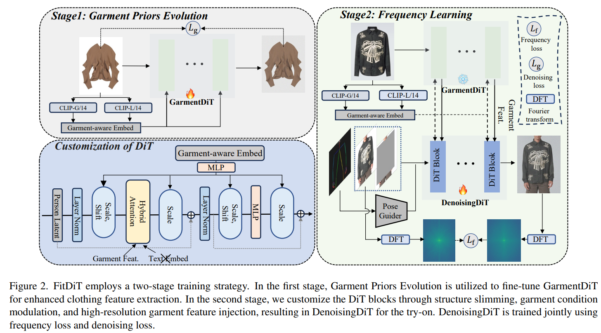
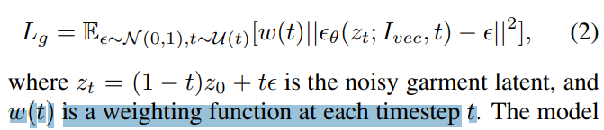
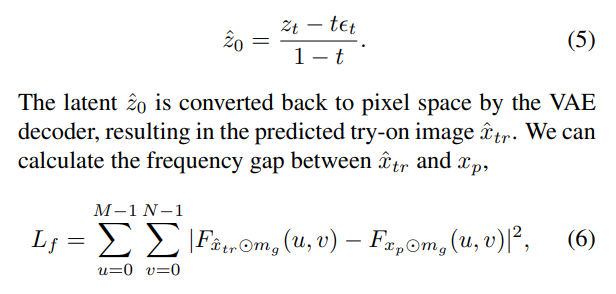
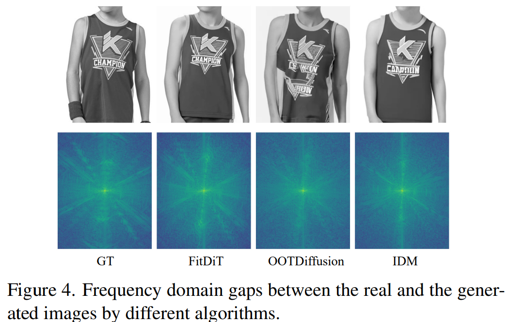

# FitDiT: Advancing the Authentic Garment Details for High-fidelity Virtual Try-on

> "FitDiT: Advancing the Authentic Garment Details for High-fidelity Virtual Try-on" Arxiv, 2024 Nov 15
> [paper](http://arxiv.org/abs/2411.10499v2) [web](https://byjiang.com/FitDiT/) [code](https://github.com/BoyuanJiang/FitDiT) [pdf](./2024_11_Arxiv_FitDiT--Advancing-the-Authentic-Garment-Details-for-High-fidelity-Virtual-Try-on.pdf) [note](./2024_11_Arxiv_FitDiT--Advancing-the-Authentic-Garment-Details-for-High-fidelity-Virtual-Try-on_Note.md)
> Authors: Boyuan Jiang, Xiaobin Hu, Donghao Luo, Qingdong He, Chengming Xu, Jinlong Peng, Jiangning Zhang, Chengjie Wang, Yunsheng Wu, Yanwei Fu

## Key-point

- Task
- Problems
- :label: Label:

## Contributions

## Introduction

## methods

第一阶段去微调生成衣服的 DiT

> Garment Priors Evolution is utilized to fine-tune GarmentDiT for enhanced clothing feature extraction

重新搞了一个 ControlNet

> In the second stage, we customize the DiT blocks through structure slimming, garment condition modulation, and high-resolution garment feature injection, resulting in DenoisingDiT for the try-on.

Diffusion 生成 try-on 的结果，加了一个 frequency loss

> DenoisingDiT is trained jointly using frequency loss and denoising loss.

### texture

为了提升衣服纹理，先 stage1 先去微调一个专门生成衣服的 diffusion, **GarmentDiT**, 自己搞一个先验。。。

> To maintain rich texture during try-on, we propose a twostage training strategy. First, we conduct a garment priors evolution stage to fine-tune the GarmentDiT using rich garment data, enabling it to render with exceptional detail

用预训练的效果垃圾

> However, due to the discrepancy between text-to-image and try-on tasks, directly applying text-to-image models as feature extractors for the tryon task may lead to suboptimal performance. 

### freq

> It is evident that significant discrepancies in the details of the generated images, such as text and patterns, compared to the real images result in noticeable gaps in their spectral representations.

提出 diffusion 训练时候加一个 FFT frequency Loss

> To this end, we propose a frequency-spectra distance loss in pixel space, which enables the model to focus more on the components with significant gaps in the frequency domain during optimization. 

## setting

## Experiment

> ablation study 看那个模块有效，总结一下

## Limitations

## Summary :star2:

> learn what

### how to apply to our task

- 为了提升衣服纹理，先 stage1 先去微调一个专门生成衣服的 diffusion
