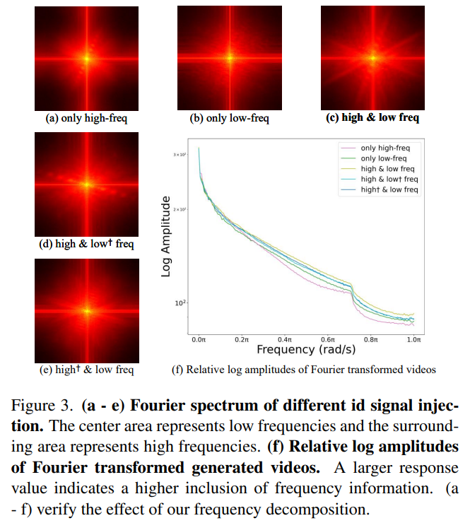
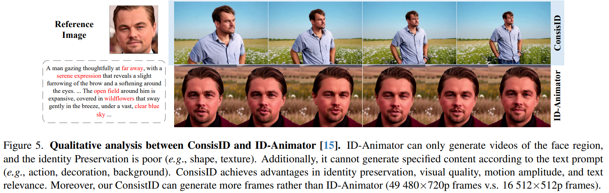

# Identity-Preserving Text-to-Video Generation by Frequency Decomposition

> "Identity-Preserving Text-to-Video Generation by Frequency Decomposition" Arxiv, 2024 Nov 26
> [paper](http://arxiv.org/abs/2411.17440v1) [code](https://github.com/PKU-YuanGroup/ConsisID) [web](https://pku-yuangroup.github.io/ConsisID/) [pdf](./2024_11_Arxiv_Identity-Preserving-Text-to-Video-Generation-by-Frequency-Decomposition.pdf) [note](./2024_11_Arxiv_Identity-Preserving-Text-to-Video-Generation-by-Frequency-Decomposition_Note.md)
> Authors: Shenghai Yuan, Jinfa Huang, Xianyi He, Yunyuan Ge, Yujun Shi, Liuhan Chen, Jiebo Luo, Li Yuan

## Key-point

- Task
- Problems
- :label: Label:

## Contributions

## Introduction

> Drawing from prior analyses of Diffusion and Transformer from a frequency domain perspective [2–4, 42, 48, 53], we conclude that:
>
> - "Improving vision transformers by revisiting high-frequency components" ECCV, 2022
> - "Freeu: Free lunch in diffusion u-net."
> - "U-dits: Downsample tokens in u-shaped diffusion transformers"
> - "Rethinking video deblurring with wavelet-aware dynamic transformer and diffusion mode" 2024 Aug

- Pixel-prediction 任务中，低频特征对于可加速 diffusion 训练

> Low-level (e.g., shallow-layer) features are essential for pixel-level prediction tasks in diffusion models, which helps facilitate model training; 

- Transformer 对于高频信息不是很敏感

> Transformers have limited perception for high-frequency information, which is important for controllable generation

## IPT2V

> To easily adapt a pre-trained model for the IPT2V task, the most direct approach is concatenating the reference face with the noise input latent [5].

直接把高频信息丢给 Transformer 效率很低

> However, the reference face contains both high-frequency details (e.g., eye and lip textures) and low-frequency information (e.g., facial proportions and contours). From Finding 2, prematurely injecting high-frequency information into the Transformer is inefficient and may hinder the model’s processing of lowfrequency information, as the Transformer focuses primarily on low-frequency features.

## methods

- Q：直接把高频信息丢给 Transformer 效率很低

> However, the reference face contains both high-frequency details (e.g., eye and lip textures) and low-frequency information (e.g., facial proportions and contours). From Finding 2, prematurely injecting high-frequency information into the Transformer is inefficient and may hinder the model’s processing of lowfrequency information, as the Transformer focuses primarily on low-frequency features.

Plan1：检测人脸关键点（低频）让模型关注于低频特征

> To mitigate this, we extract facial key points, convert them to an RGB image, and then concatenate it with the reference image, as shown in Figure 2. This strategy focuses the model’s attention on the low-frequency signals in the face, while minimizing the impact of extraneous features. 

不用低频特征，训练容易崩

> We found that when this component is discarded, the model has a gradient explosion. 

### High-frequency

先前方法发现 Transformer 对于高频特征利用率很低，猜测目前 ID 信息弱是因为主要用低频去生成个大概，并且要做的还涉及年龄，皮肤皱纹的编辑

> It can be concluded that relying solely on global facial features is insufficient for IPT2V generation, as global facial features primarily consist of low-frequency information and lack the intrinsic features necessary for editing.

定义人脸 ID 的高频特征，表情、动作、身体形状

> Achieving this requires the extraction of facial features that are unaffected by non-ID attributes (e.g., expression, posture, and shape), since age and makeup do not alter a person’s core identity. We define these features as intrinsic identity features (e.g., high-frequency).

- Q：CLIP 不是专门对 ID 做的，会提取大量无关信息

> Previous research [14–16] use local features from the CLIP image encoder [39] as intrinsic features to improve editing capabilities. However, since CLIP is not specifically trained on face datasets, the extracted features contain harmful non-face information [29, 54, 63]

使用 Arcface 人脸特征，用倒数第二层，说是含有更多的 spatial 特征

> - "Arcface: Additive angular margin loss for deep face recognition"
>
> Therefore, we choose to use a face recognition backbone [10] to extract intrinsic identity features. Instead of using the output of the backbone as the intrinsic identity feature, we use the penultimate layer, which retains more spatial information related to identity

- Q：Arcface 特征缺乏语言的控制能力

和 CLIP image encoder 一起用

> To address these issues, we first use a facial recognition backbone to extract features that are strong in the intrinsic identity representation, and a CLIP image encoder to capture features that are strong in semantics.

用 Q-former 把这两个伪高频特征（关于 ID 的特征）融合

> We then use the Q-former [27, 28, 61] to fuse these two features, producing intrinsic identity features enriched with high-frequency semantic information. 

仍然使用 Cross-attn 融入 DiT，但是 KV 是高频特征

> After extracting the intrinsic id features, we apply cross-attention to interact with the visual tokens produced by each attention block of the pre-trained model, effectively enhancing the high-frequency information in DiT:

Log 幅值图的值越高，表面涵盖的频率信息越多 :star:

> - The center area represents low frequencies and the surrounding area represents high frequencies. 
> - A larger response value indicates a higher inclusion of frequency information.

## setting

## Experiment

> ablation study 看那个模块有效，总结一下

没有骨骼信息，一换视角看起来就露馅了，换了一个人的感觉

## Limitations

## Summary :star2:

> learn what

### how to apply to our task

- Transformer 对于高频利用率很低，单独搞高频特征，还是用 cross-attn 融入 DiT

- 验证高频特征是否加入，Log 幅值图的值越高，表面涵盖的频率信息越多 :star:

  > - The center area represents low frequencies and the surrounding area represents high frequencies. 
  > - A larger response value indicates a higher inclusion of frequency information.

  
