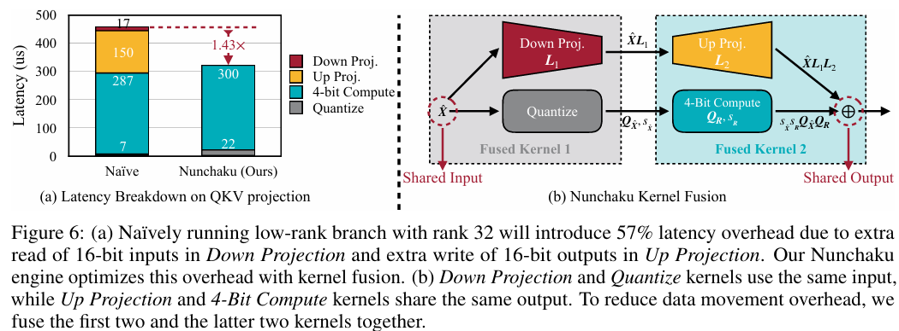

# SVDQuant: Absorbing Outliers by Low-Rank Components for 4-Bit Diffusion Models

> "SVDQuant: Absorbing Outliers by Low-Rank Components for 4-Bit Diffusion Models" Arxiv, 2024 Nov 7
> [paper](http://arxiv.org/abs/2411.05007v2) [code](https://github.com/mit-han-lab/nunchaku.git) [DecomposeCode](https://github.com/mit-han-lab/deepcompressor.git) [pdf](./2024_11_Arxiv_SVDQuant--Absorbing-Outliers-by-Low-Rank-Components-for-4-Bit-Diffusion-Models.pdf) [note](./2024_11_Arxiv_SVDQuant--Absorbing-Outliers-by-Low-Rank-Components-for-4-Bit-Diffusion-Models_Note.md)
> Authors: Muyang Li, Yujun Lin, Zhekai Zhang, Tianle Cai, Xiuyu Li, Junxian Guo, Enze Xie, Chenlin Meng, Jun-Yan Zhu, Song Han

## Key-point

- Task: Diffusion 4bit 轻量化

- Problems

  - 显存爆炸

    > However, as these models grow larger, they require significantly more memory and suffer from higher latency, posing substantial challenges for deployment. 

- :label: Label:

这个 SVD 是 Singular Value Decomposition (SVD) 奇异值分解 :joy:

## Contributions

- 提出使用奇异值分解（SVD）方法去**吸收权重由于 4bit 量化后出现的离群点**

- 写了一个 inference engine

  > To address this, we co-design an inference engine Nunchaku that fuses the kernels of the low-rank branch into those of the low-bit branch to cut off redundant memory access.

- 支持 16G 跑 16B 模型

  > Extensive experiments on SDXL, PixArt-Σ, and FLUX.1 validate the effectiveness of SVDQuant in preserving image quality. Wereduce the memory usage for the 12B FLUX.1 models by 3.5×, achieving 3.0× speedup over the 4-bit weight-only quantized baseline on the 16GB laptop 4090 GPU, paving the way for more interactive applications on PCs.

## Introduction

想看看压缩到 4bit ！

> In this work, we aim to accelerate diffusion models by quantizing their weights and activations to 4 bits.

- Q：使用 4bit 后激活值 & 权重会有很多离群点，使用传统量化方法去平滑不足够

outliers between the weights and activations，两个维度都有 outliers，**平滑方法效率很低**

>  In this work, we focus on quantizing both the weights and activations of diffusion models to 4 bits. This challenging and aggressive scheme is often prone to severe quality degradation. Existing methods like smoothing (Xiao et al., 2023; Lin et al., 2024a), which attempt to transfer the outliers between the weights and activations, are less effective since both sides are highly vulnerable to outliers. 

提出使用奇异值分解（SVD）方法去**吸收权重由于 4bit 量化后出现的离群点**，实现**推理加速**

>  At such an aggressive level, **both weights and activations are highly sensitive,** where conventional post-training quantization methods for large language models like smoothing become insufficient. To over come this limitation, we propose SVDQuant, a new 4-bit quantization paradigm. Different from smoothing which **redistributes outliers between weights and activations,** our approach absorbs these outliers using a low-rank branch.

看这张图容易理解一些

- 先把 activations 的离群点，迁移到权重上。导致权重的离群点，更难量化了
- 使用 SVD 去分解为两个 low-rank 分量，和 $W-L_1L_2$ 残差

> Thus, the quantization difficulty is alleviated by the low-rank branch, which runs at 16-bit precision.

- Q：为什么需要设计一个 inference engine?

大部分模型训练 LoRA 

> Computational cost is measured by number of Multiply-Accumulate operations (MACs). 1 MAC=2 FLOPs

- Q：FLOPs 是啥？

> https://www.techtarget.com/whatis/definition/FLOPS-floating-point-operations-per-second
>
> Floating-point operations per second (FLOPS) is a measure of a computer's performance based on the **number of floating-point arithmetic calculations** that the processor can **perform within a second**. 

### quantization

为了加速一般 $Q_X, Q_W$ 使用同 bit 数

> To speed up computation, modern arithmetic logic units require both $Q_X$ and $Q_W$ using the same bit width. Otherwise, the low-bit side needs to be upcast to match the higher bit width, negating the speed advantage. 

本文关注 W4A4 量化

> Following the notation in QServe (Lin et al., 2024b), we denote **x-bit weight, y-bit activation as $W_xA_y$.**  
>
> In this work, we focus on W4A4 quantization for acceleration, where outliers in both weights and activations place substantial obstacles.

## methods

The quantization error

Kernel Fusion

## setting

## Experiment

> ablation study 看那个模块有效，总结一下

GPU 显存降低接近 4 倍

压缩完效果很接近！

SVD 主分量个数

## Limitations

## Summary :star2:

> learn what

diffusion 模型轻量化部署

> Nunchaku further achieves a 3.5× reduction in memory usage over the original 16-bit model and 3.0× speedup over the weight-only quan tization on an NVIDIA RTX-4090 laptop. This advancement enables the efficient deployment of large scale diffusion models on edge devices, unlocking broader potential for interactive AI applications.

### how to apply to our task

