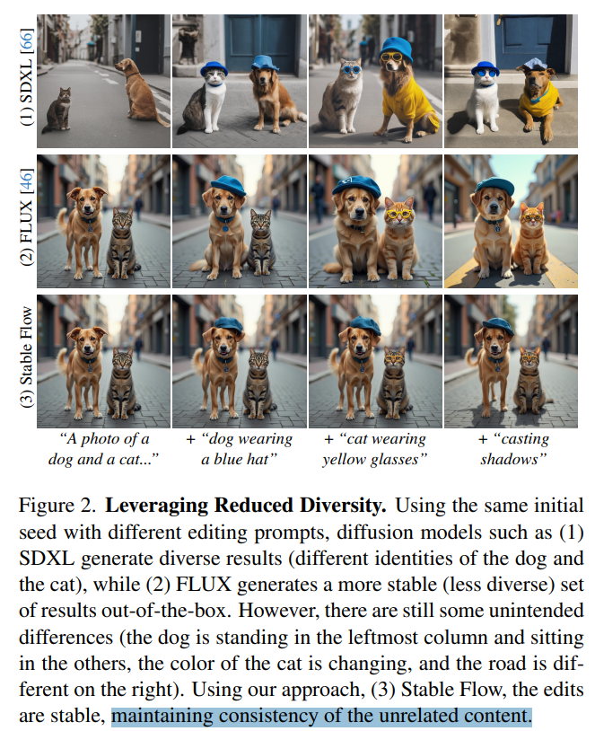

# Stable Flow: Vital Layers for Training-Free Image Editing

> "Stable Flow: Vital Layers for Training-Free Image Editing" Arxiv, 2024 Nov 21
> [paper](http://arxiv.org/abs/2411.14430v1) [code](https://github.com/snap-research/stable-flow) [web](https://omriavrahami.com/stable-flow) [pdf](./2024_11_Arxiv_Stable-Flow--Vital-Layers-for-Training-Free-Image-Editing.pdf) [note](./2024_11_Arxiv_Stable-Flow--Vital-Layers-for-Training-Free-Image-Editing_Note.md)
> Authors: Omri Avrahami, Or Patashnik, Ohad Fried, Egor Nemchinov, Kfir Aberman, Dani Lischinski, Daniel Cohen-Or

## Key-point

- Task: image edit

- Problems

  - 生成多样性不好

  > Recent models have replaced the traditional UNet architecture with the Diffusion Transformer (DiT), and employed flow-matching for improved training and sampling. However, they exhibit limited generation diversity

  - 对 DiT attn 注入 attn feature 不知道哪层好，有没有像 Unet rescale 的性质？

  > In this work, we leverage this limitation to perform consistent image edits via selective injection of attention features. The main challenge is that, unlike the UNetbased models, DiT lacks a coarse-to-fine synthesis structure, making it unclear in which layers to perform the injection

- :label: Label:

## Contributions

- 提出自动找 DiT 哪层重要的方法

> we propose an **automatic method to identify “vital layers” within DiT,** crucial for image formation, and demonstrate how these layers facilitate a range of controlled stable edits, from non-rigid modifications to object addition, using the same mechanism

- image inversion 方法

>  to enable real-image editing, we introduce an improved image inversion method for flow models.

- SOTA

## Introduction

多种编辑方式

## methods

能够**保证不需要编辑物体的一致性**

尝试把 DiT 某些层删掉，保留 residual。

### Measuring the Importance of DiT Layers

发现初始层学习低频，深层学习高频

>  In **discriminative tasks**, early layers detect simple features like edges, while deeper layers capture higher-level semantic concepts [77, 96].
>
> - "Deep inside convolutional networks: Visualising image classification models and saliency maps" CVPR-2013
> - "Visualizing and understanding convolutional networks. " CVPR-2013

>  Similarly, in generative models, **early-middle layers determine shape and color, while deeper layers control finer details** [43].
>
> - "A style-based generator architecture for generative adversarial networks." CVPR

DiT 结构 SOTA 去掉了 Convlayer

> In contrast, state-of-the-art text-to-image DiT [63] models (FLUX [46] and SD3 [25]) employ a fundamentally different architecture, as shown in Figure 3(left). These models consist of consecutive layers connected through residual connections [33], without convolutions.

- Q：DiT 没下采样，每一层的性质不明确

> Unlike in UNets, the roles of the different layers are not yet intuitively clear, making it challenging to determine which layers are best suited for image editing.

删掉一些层，去看和完整网络生成出来的 **RGB 图像，计算感知相似度，来看看那些层有用**

> To assess the impact of each layer, we measured the perceptual similarity between Gref and Gℓ and using DINOv2 [57] (see Figure 3).

**看下指定层删掉后，如果和原始生成的图差别超级大，说明这一层的特征影响很大 :star:**

确实有点用哈，有几层，能不能删掉几层降低不一致性？？

> bypassing vital layers leads to significant changes: complete noise generation (G0), global structure and identity changes (G18), and alterations in texture and fine details (G56).

不重要的层，对于需要加入的物体，也能在 ref 图中找到很强的信号 -> 不合理编辑；**重要的层，编辑物体只对于 token 有很强的信号**

**表明对于"重要的层"，进行编辑，对于主体的改动会更小** (学习下用 `suggest, hypothesize` hahah) :star:

> This suggests that injecting features into vital layers strikes a good multimodal attention balance between preserving source content and incorporating text-guided modifications.

### distort -> Latent Nudging

**先看下图前两列的重建结果**，发现 Euler ODE 对真实图像进行重建会有很大扭曲，编辑后存在很大扭曲

> when inverting a real image, (a) a simple inverse Euler ODE solver leads to corrupted image reconstructions and unintended modifications during editing

至少能看出来用这篇论文的 nudging technique 能降低扭曲 :star:

> using our latent nudging technique significantly reduces reconstruction errors and better constrains edits to the intended regions.

- Q：怎么改的？

改了一下加噪公式，用

> To edit real images, we must first invert them into the latent space, transforming samples from p1 to p0. We initially implemented an inverse Euler ODE solver for FLUX by reversing the vector field prediction. Given the forward Euler step:

但对 FLUX 没用。。。出来下面第一行的重建结果

> However, as Figure 7(a) demonstrates, this approach proves insufficient for FLUX, resulting in corrupted image reconstructions and unintended modifications during editing

猜测是提出方法中假设不成立

> We hypothesize that the assumption u(zt) ≈ u(zt−1) does not hold, which causes the model to significantly alter the image during the forward process.

**对 z0 乘一个系数增强一下，出来 fig7b 的重建结果，发现这个系数对结果影响不是很明显。。。。**

> To address this, **we introduce latent nudging**: multiplying the initial latent z0 by a small scalar λ = 1.15 to slightly offset it from the training distribution. While this modification is visually imperceptible (Figure 7(b)), it significantly reduces reconstruction errors and constrains edits to the intended regions. See the supplementary material for more details

## setting

## Experiment

> ablation study 看那个模块有效，总结一下

发现提出的方法对于 image 一致性更好！

- 不知道物体整体偏移的问题存不存在
- 存在色偏

### ablation

## Limitations

前面的图都是挑出来好的。。。

## Summary :star2:

> learn what

### how to apply to our task

- 能否看一下生成质量，删掉几层对物体扭曲有影响的层，提升一致性？？:star:
- 不重要的层，对于需要加入的物体，也能在 ref 图中找到很强的信号 -> 不合理编辑；**重要的层，编辑物体只对于 token 有很强的信号**；**表明对于"重要的层"，进行编辑，对于主体的改动会更小** (学习下用 `suggest` hahah):star:

- 至少能看出来用这篇论文的 nudging technique 能降低扭曲 :star:
- **对真实图像 inversion 的 z0 乘一个系数增强一下，出来 fig7b 的重建结果，发现这个系数对结果影响不是很明显。。。再用改进的加噪公式，能降低重建的扭曲**
- 一致性挑了几个看下确实可以啊，地板纹理不看 difference 看不太出来。。。但不知道物体整体偏移的问题存不存在

