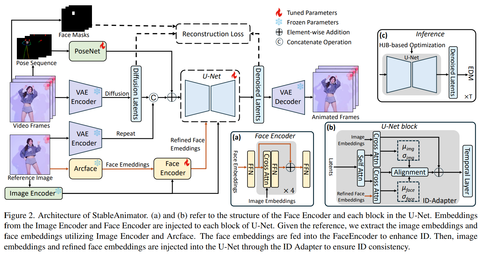
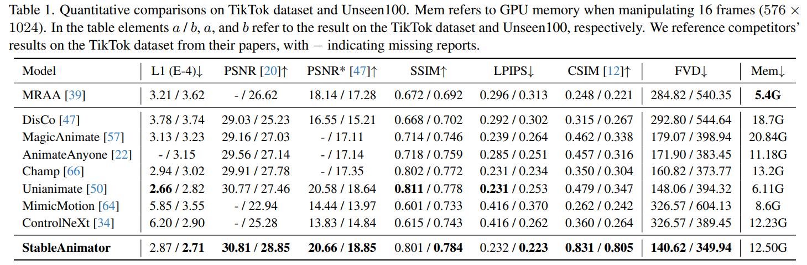
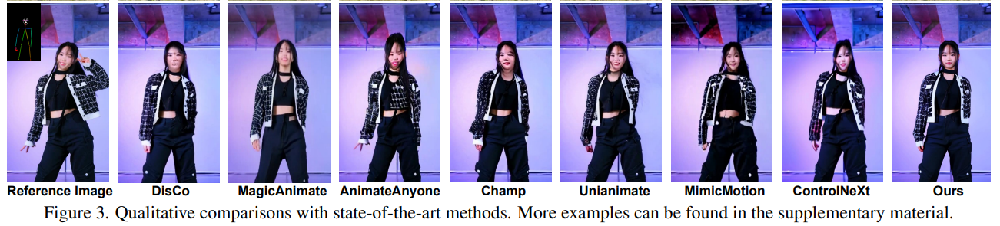

# StableAnimator: High-Quality Identity-Preserving Human Image Animation

> "StableAnimator: High-Quality Identity-Preserving Human Image Animation" Arxiv, 2024 Nov 26
> [paper](http://arxiv.org/abs/2411.17697v2) [code]() [pdf](./2024_11_Arxiv_StableAnimator--High-Quality-Identity-Preserving-Human-Image-Animation.pdf) [note](./2024_11_Arxiv_StableAnimator--High-Quality-Identity-Preserving-Human-Image-Animation_Note.md)
> Authors: Shuyuan Tu, Zhen Xing, Xintong Han, Zhi-Qi Cheng, Qi Dai, Chong Luo, Zuxuan Wu (MSRA + Fudan)

## Key-point

- Task
- Problems
- :label: Label:

## Contributions

- 全部一起训练

  > the first end-to-end ID-preserving video diffusion framework, which synthesizes high-quality videos without any post-processing, conditioned on a reference image and a sequence of poses

- ID 一致性的设计

  > contains carefully designed modules for both training and inference striving for identity consistency.

- 保持分布一致，加入 ID 特征，**避免 temporal layer 干扰 ID 一致性**

- 提出 HJB **在推理过程中，保持 ID 一致性** :star:

  > During inference, we propose a novel Hamilton-Jacobi-Bellman (HJB) equation-based optimization to further enhance the face quality.

## Introduction

## methods

## setting

## Experiment

> ablation study 看那个模块有效，总结一下

PSNR, SSIM 差不多；主观指标

ID 一致性比之前好，但是还是有差距

## Limitations

## Summary :star2:

> learn what

### how to apply to our task

- ID 一致性比之前好，但是还是有差距

