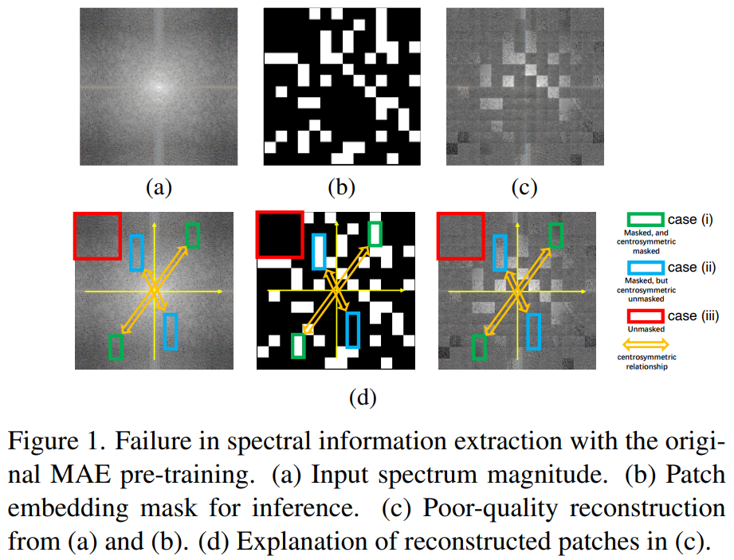
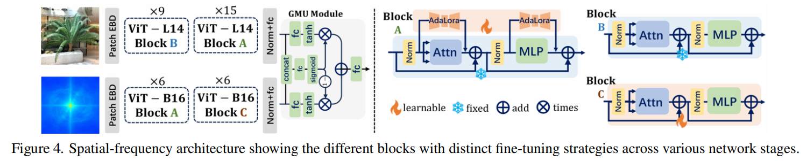

# Towards More Accurate Fake Detection on Images Generated from Advanced Generative and Neural Rendering Models

> "Towards More Accurate Fake Detection on Images Generated from Advanced Generative and Neural Rendering Models" Arxiv, 2024 Nov 13, `FFiT` 
> [paper](http://arxiv.org/abs/2411.08642v1) [code]() [pdf](./2024_11_Arxiv_Towards-More-Accurate-Fake-Detection-on-Images-Generated-from-Advanced-Generative-and-Neural-Rendering-Models.pdf) [note](./2024_11_Arxiv_Towards-More-Accurate-Fake-Detection-on-Images-Generated-from-Advanced-Generative-and-Neural-Rendering-Models_Note.md)
> Authors: Chengdong Dong, Vijayakumar Bhagavatula, Zhenyu Zhou, Ajay Kumar(CMU)

## Key-point

- Task
- Problems
  - In response, an unsupervised training technique is proposed that enables the model to extract comprehensive features from the **Fourier spectrum’s magnitude,** thereby overcoming the challenges of **reconstructing the spectrum** due to its centrosymmetric properties.

- :label: Label:

## Contributions

-  By leveraging the spectral domain and dynamically combining it with spatial domain information, we create a robust multimodal detector that demonstrates superior generalization capabilities in identifying challenging synthetic images generated by the latest image synthesis techniques.

- we present FFiT, a framework that utilizes large vision models to extract spectral domain information for detecting fake images.

## Introduction

## methods

MAE 方式训练，提取特征在频域的损失很大！

## setting

## Experiment

> ablation study 看那个模块有效，总结一下

## Limitations

## Summary :star2:

> learn what

### how to apply to our task

