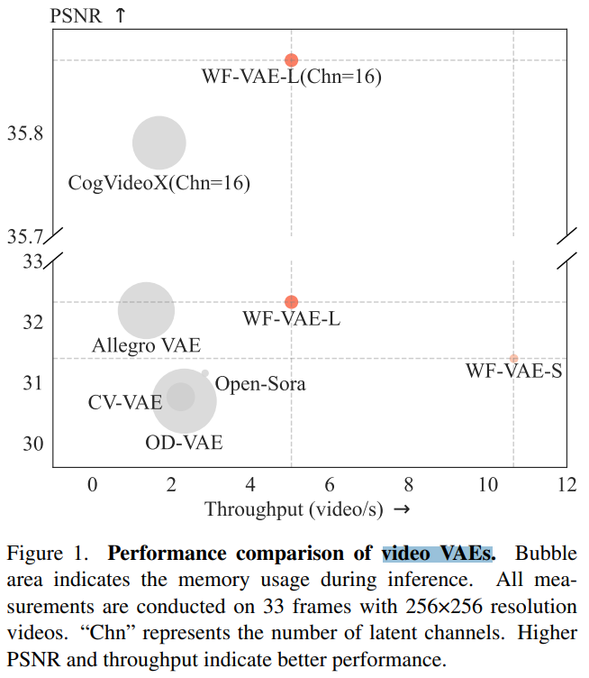
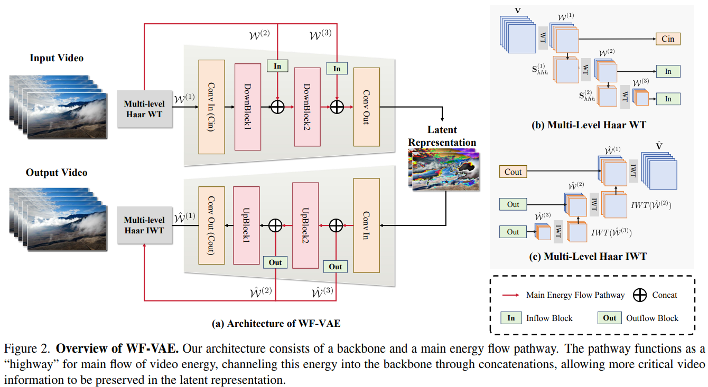
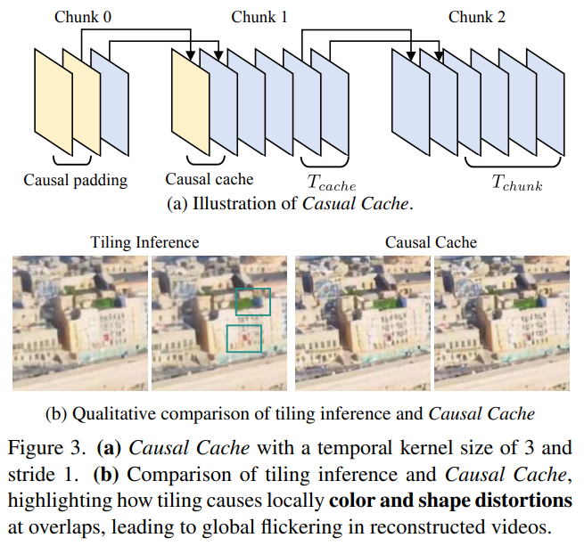
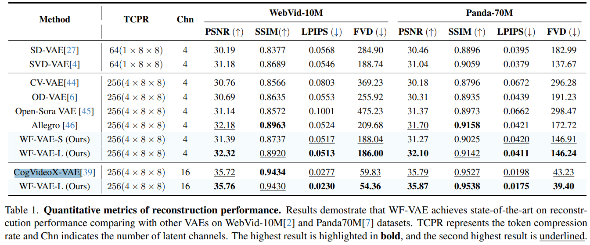

# WF-VAE: Enhancing Video VAE by Wavelet-Driven Energy Flow for Latent Video Diffusion Model

> "WF-VAE: Enhancing Video VAE by Wavelet-Driven Energy Flow for Latent Video Diffusion Model" Arxiv, 2024 Nov 26
> [paper](http://arxiv.org/abs/2411.17459v2) [code](https://github.com/PKU-YuanGroup/WF-VAE) [pdf](./2024_11_Arxiv_WF-VAE--Enhancing-Video-VAE-by-Wavelet-Driven-Energy-Flow-for-Latent-Video-Diffusion-Model.pdf) [note](./2024_11_Arxiv_WF-VAE--Enhancing-Video-VAE-by-Wavelet-Driven-Energy-Flow-for-Latent-Video-Diffusion-Model_Note.md)
> Authors: Zongjian Li, Bin Lin, Yang Ye, Liuhan Chen, Xinhua Cheng, Shenghai Yuan, Li Yuan (Peng Chen)

## Key-point

- Task: video VAE

- Problems

  - VAE 压缩的特征成了训练 LVDM 的瓶颈

    > However, as the resolution and duration of generated videos increase, the encoding cost of Video VAEs becomes a limiting bottleneck in training LVDMs.

  - 为了降低显存，分块推理造成不一致！

    > Moreover, the block-wise inference method adopted by most LVDMs can lead to discontinuities of latent space when processing long-duration videos

- :label: Label:

## Contributions

- 使用**小波变换**来从多个 scale 压缩 VAE 的特征

  > Wavelet transform can decompose videos into multiple frequency-domain components and improve the efficiency significantly, we thus propose Wavelet Flow VAE (WF-VAE), an autoencoder that leverages multi-level wavelet transform to facilitate lowfrequency energy flow into latent representation.

- 提出 Causal Cache 维持 Patch 一致性，**降低分块推理的不一致纹理** :star:

> we introduce a method called Causal Cache, which maintains the integrity of latent space during block-wise inference

- SOTA

## Introduction

## methods

### Causal Cache

## setting

## Experiment

> ablation study 看那个模块有效，总结一下

效果和 SOTA CogVideoX 接近

## Limitations

## Summary :star2:

> learn what

### how to apply to our task

