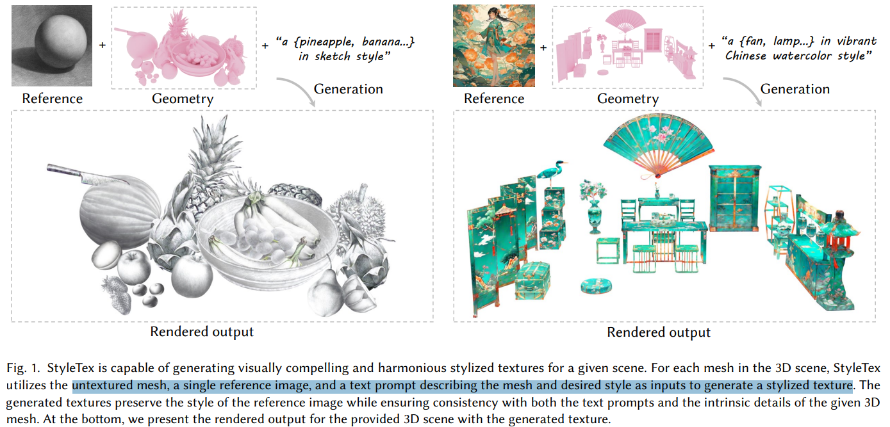
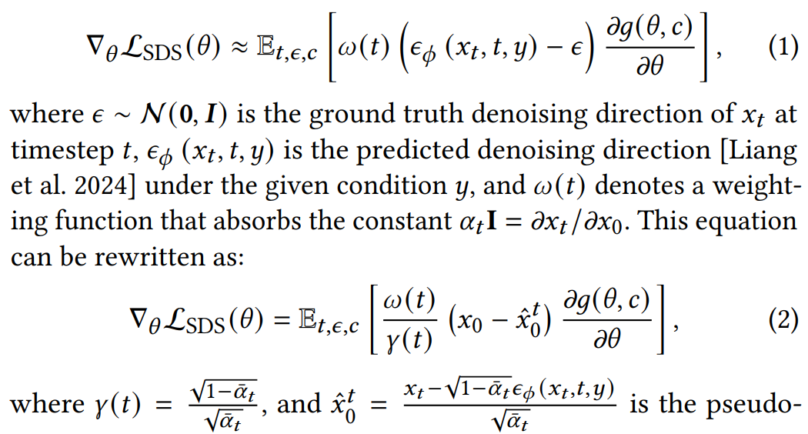
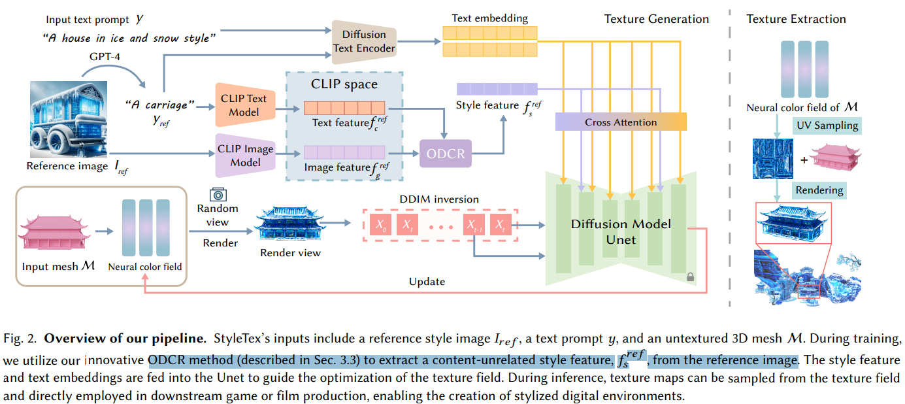
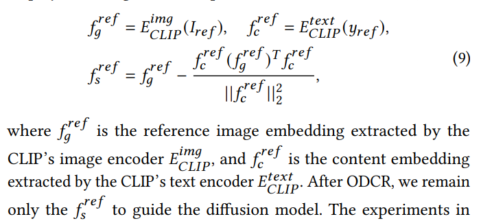
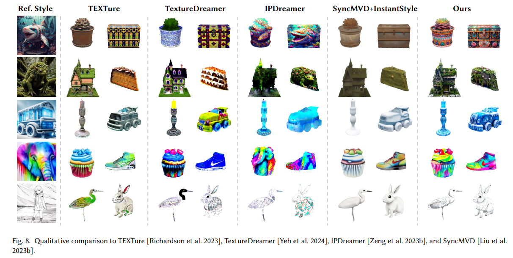

# StyleTex: Style Image-Guided Texture Generation for 3D Models

> "StyleTex: Style Image-Guided Texture Generation for 3D Models" SIGGRAPH, 2024 Nov 1
> [paper](http://arxiv.org/abs/2411.00399v1) [code]() [pdf](./2024_11_SIGGRAPH_StyleTex--Style-Image-Guided-Texture-Generation-for-3D-Models.pdf) [note](./2024_11_SIGGRAPH_StyleTex--Style-Image-Guided-Texture-Generation-for-3D-Models_Note.md)
> Authors: Zhiyu Xie, Yuqing Zhang, Xiangjun Tang, Yiqian Wu, Dehan Chen, Gongsheng Li, Xaogang Jin

## Key-point

- Task
- Problems
- :label: Label:

## Contributions

## Introduction

### Text/Image-guided Texture Generation

使用 SDS Loss 蒸馏 2D diffusion prior

> When it comes to text-to-3D, numerous approaches have been developed to optimize 3D representations by distilling 2D diffusion models, using techniques like score distillation sampling (SDS) [Poole et al. 2022]. 

> At each iteration, the differentiable rendering function 𝑔 renders the trainable paramaters 𝜃 from camera 𝑐, getting the rendered image 𝑥0.

## methods

设计 ODCR 模块，从 reference image 提取 style 特征

### Style Score Distribution

> To achieve the style distribution for 𝜖𝑠𝑡 𝑦𝑙𝑒 , a possible way is to train a style-conditioned diffusion model, but it is time-consuming. 

之前工作发现 UNet Cross-attn layer 不同层负责不同特征的生成 :star:

> Existing 2D style image generation studies [Wang et al. 2024; Ye et al. 2023] have explored that the cross-attention mechanism in different transformer layers of a diffusion model exerts different effects on the content and style. Therefore, the stylized result can be achieved by injecting the features of the reference image into the layers that are responsible for style effects.
>
> - "InstantStyle: Free Lunch towards Style-Preserving in Text-to-Image Generation" Arxiv, 2024 Apr 3
>   [paper](http://arxiv.org/abs/2404.02733v2) [code](https://github.com/InstantStyle/InstantStyle.) [pdf](./2024_04_Arxiv_InstantStyle--Free-Lunch-towards-Style-Preserving-in-Text-to-Image-Generation.pdf) [note](./2024_04_Arxiv_InstantStyle--Free-Lunch-towards-Style-Preserving-in-Text-to-Image-Generation_Note.md)
>   Authors: Haofan Wang, Matteo Spinelli, Qixun Wang, Xu Bai, Zekui Qin, Anthony Chen

因此对于负责 style 的 cross-attn layer，把 reference 图的特征注入

> Leveraging such a layer to inject the reference image feature may introduce unintended content, while ignoring it may result in inaccuracies in style expressiveness, such as color tone shifting. To address this, we aim to incorporate as many layers that are responsible for style effects as possible to maintain style expressiveness. 

设计一个正交分解把 content 给去掉，提取 style 特征 :star:

> Specifically, we employ an orthogonal decomposition for content removal (ODCR)

## setting

- **An NVIDIA RTX 4090 GPU** is used for the optimization process, which takes about 15 minutes to synthesize a texture map for each mesh

## Experiment

> ablation study 看那个模块有效，总结一下

看生成的纹理是否 content-free 只有风格

## Limitations

## Summary :star2:

> learn what

### how to apply to our task

