# ASGDiffusion: Parallel High-Resolution Generation with Asynchronous Structure Guidance

> "ASGDiffusion: Parallel High-Resolution Generation with Asynchronous Structure Guidance" Arxiv, 2024 Dec 9
> [paper](http://arxiv.org/abs/2412.06163v1) [code]() [pdf](./2024_12_Arxiv_ASGDiffusion--Parallel-High-Resolution-Generation-with-Asynchronous-Structure-Guidance.pdf) [note](./2024_12_Arxiv_ASGDiffusion--Parallel-High-Resolution-Generation-with-Asynchronous-Structure-Guidance_Note.md)
> Authors: Yuming Li, Peidong Jia, Daiwei Hong, Yueru Jia, Qi She, Rui Zhao, Ming Lu, Shanghang Zhang (Peking University)

## Key-point

- Task: Training-free high-resolution (HR) image generation
- Problems
  - Most existing methods begin by reconstructing the overall structure and then proceed to refine the local details. Despite their advancements, they still face issues with repetitive patterns in HR image generation
  - 计算量大

- :label: Label:

## Contributions

- ASGDiffusion leverages the **low-resolution (LR) noise weighted by the attention mask as the structure guidance** for the denoising step to ensure semantic consistency. The proposed structure guidance can significantly alleviate the pattern repetition problem. 
- 提出一个多卡并行推理方式，降低显存 + 加速

> To enable parallel generation, we further propose a parallelism strategy, which calculates the patch noises and structure guidance asynchronously. By leveraging multi-GPU parallel acceleration, we significantly accelerate generation speed and reduce memory usage per GPU. 

- 改成 SD3 的 SR，Framework 支持不同版本 SD

- SOTA

## Introduction

比 DemoFusion 快了 x4 倍，显存接近 1/2

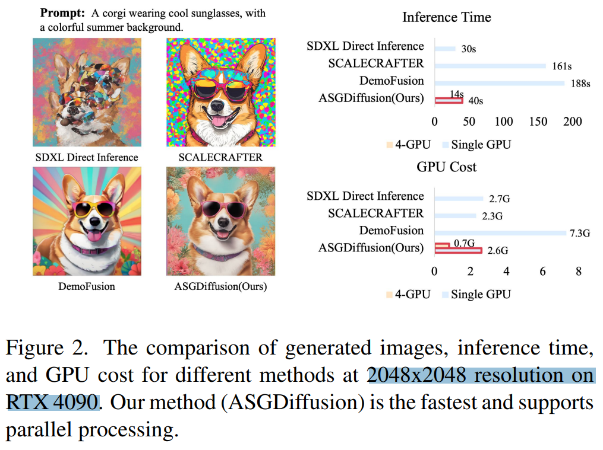

> While SD3 can synthesize images up to 1024x1024, our method enhances SD3’s capability to generate images at resolutions exceeding 1024x1024

## methods

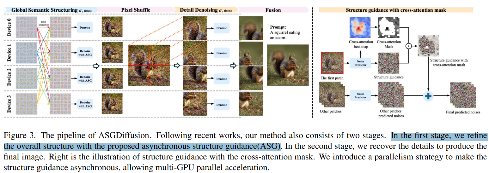

- Q：motivation？

> Recent studies [16] indicate that diffusion models prioritize constructing the semantic structure during the initial phases of denoising while they focus on refining fine details in the later stages. Following recent works [16], our method is divided into two stages.
>
> - "CutDiffusion: A Simple, Fast, Cheap, and Strong Diffusion Extrapolation Method" Arxiv, 2024 Apr 23
>   [paper](http://arxiv.org/abs/2404.15141v1) [code]() [pdf](./2024_04_Arxiv_CutDiffusion--A-Simple--Fast--Cheap--and-Strong-Diffusion-Extrapolation-Method.pdf) [note](./2024_04_Arxiv_CutDiffusion--A-Simple--Fast--Cheap--and-Strong-Diffusion-Extrapolation-Method_Note.md)
>   Authors: Mingbao Lin, Zhihang Lin, Wengyi Zhan, Liujuan Cao, Rongrong Ji

CutDiffusion 发现去噪初期（T=1000 -> 0) 生成结构，后面再是细节。**基于 CutDiffusion 改进**

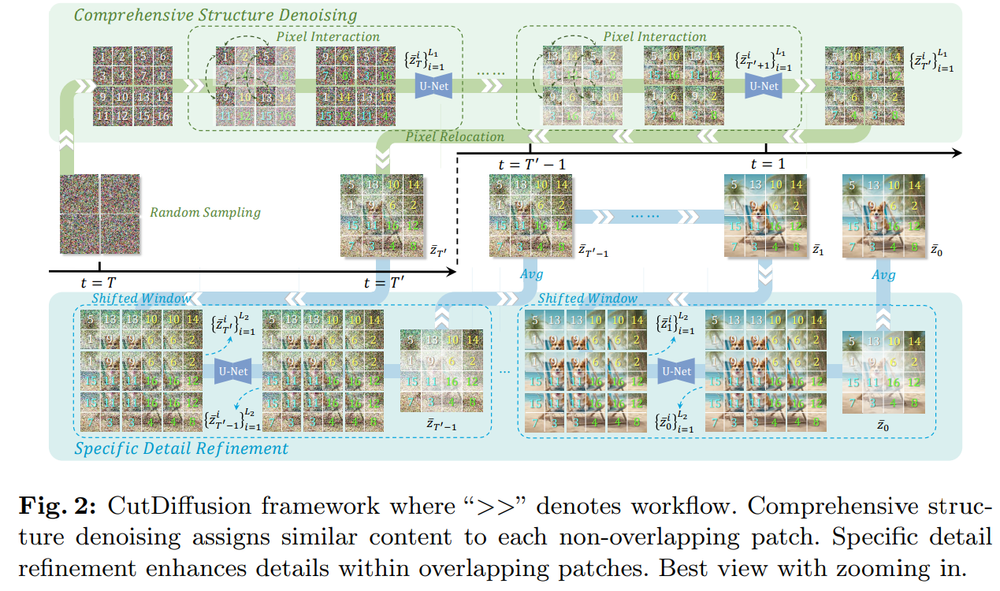

参考 CutDiffusion 分成 2 阶段，分析 CutDiffusion 第一阶段 RGB 不同 patch 交互，发现还是有重复。。提出使用 cross-attn map mask 作为结构引导

> In the first stage, we aim to construct a consistent overall structure. CutDiffusion employs a **pixel interaction operation** where pixels in the same positions across different patches are randomly exchanged to maintain the overall structure. 
>
> Although pixel interaction enables patches to share information, which reduces the issue of pattern repetition while preserving the Gaussian distribution of each patch, we find the pixel interaction may still contain obvious pattern repetition. 
>
> To address this, we introduce structure guidance with cross-attention mask to further refine the semantic structure in Sec. 4.2

第二阶段优化细节

> In the second stage, we also refine the details to produce the final image.

在 VAE space 切 patch

> For both stages, directly denoising the HR latent noises would be computationally expensive. Dividing the HR latent noises into multiple LR patch noises enables parallel generation. However, the LR patch noise must await structure guidance before denoising at each timestep, which limits parallel capacity. Therefore, we propose asynchronous structure guidance that enables each patch to perform denoising independently without waiting for the most recent structure guidance in Sec. 4.3

### Structure guidance

认为 CutDiffusion 只是做不同 patch 交互，每个 patch 内部的结构信息仍然不足

> As mentioned above, the pixel interaction of CutDiffusion [16] still suffers from pattern repetition problems, as shown in Fig. 7. We hypothesized that this issue resulted from insufficient global semantic guidance during the initial stage of denoising.

想搞一张小图 + resize，vae 全局残差加上去

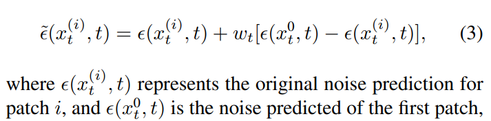

>  The parameter wt regulates the influence of structure guidance, ensuring that other patch noises are modified to align with the global structure provided by the first patch.

### 多卡并行

工程味道有点重。。。**只是每个 patch 放到不同卡上面。。。最后再合起来**

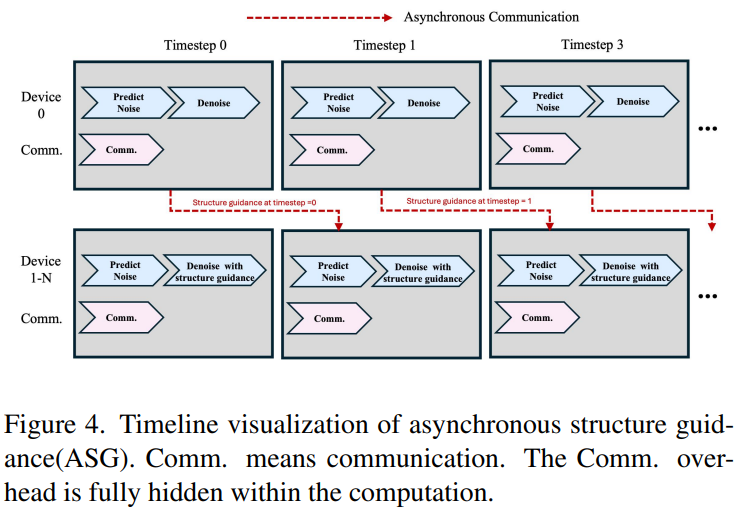

Fig7 b) 发现加了全局残差好了很多，但背景出现了模糊。。。物体也模糊啊怎么不说。。。

> However, a new issue has arisen: the background areas are showing signs of blurriness and deterioration. We hypothesized that this discrepancy might be attributed to a mismatch in attention: while the object regions received significant attention from the cross-attention mechanism, background regions were relatively overlooked. 

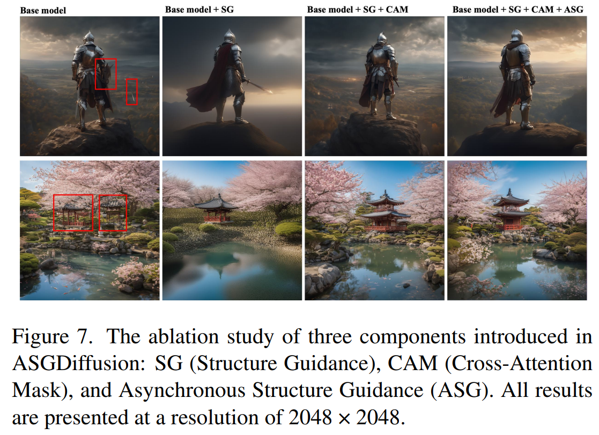

- Q：如何验证假设 "是 cross-attn 过多关注物体，忽略了背景" ？

可视化一下去噪过程，随着去噪步数增加，cross-attn map 更多关注物体部分

> To further investigate, **we visualize the cross-attention maps during different stages of denoising.** As shown in Fig. 6, the cross-attention maps indicated that during the early stages of denoising, the cross-attention was dispersed and lacked sharp focus, as the semantic structure of the image had not yet fully developed.

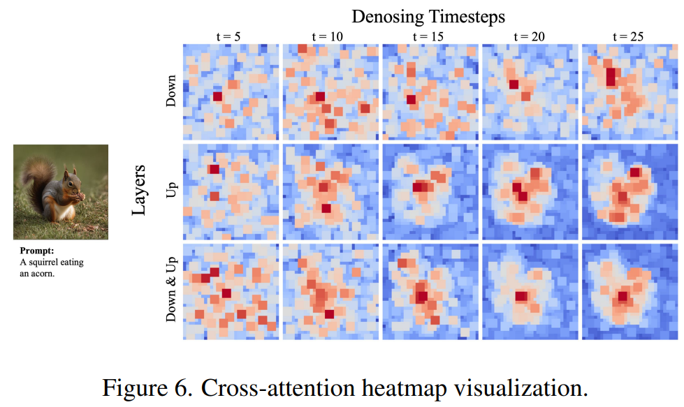

UNet 不同层也看一下，现象差不多

> We also visualized the cross-attention across different layers of the U-Net model to gain deeper insight, specifically comparing the downsampling layers and the upsampling layers.

UNet upsample 层更多关注 cross-attn map，认为是用来合成细节；

> The results indicated that the **upsampling layers of the UNet demonstrated more focused cross-attention** compared to the downsampling layers. This is because the upsampling layers refine image details and align semantic information during reconstruction, resulting in greater attention to key objects. In contrast, **downsampling layers mainly focus on feature extraction and capturing broader contextual information, which results in a more distributed attention distribution.** Thus, the cross-attention in upsampling layers is more effective as a mask, as it highlights significant objects while preserving semantic coherence.

- Q：怎么改？

把 cross-attn map mask 拿过来 normalize 一下作为权重，反应物体位置权重。

> Considering these findings, we propose using the crossattention heat map as a mask to filter the structural guidance, especially in areas with low attention

原先全局残差

**使用 cross-attn map 作为每个 patch 的权重，维持不同 patch 之间的一致性**：前提使用了不同 patch VAE 拼成一个大的 VAE feature。 每个 patch 用自己的一个 cross-attn map 表示当前 patch 的结构信息的重要程度。**cross-attn map 改进一下每个 patch 去噪特征的权重**。

> the cross-attention mask M adjusts how the structure affects the noise from other patches

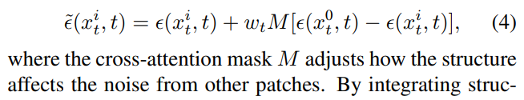

加了以后 Fig7 c) 细节好了很多

## setting

- 只推理 1 个 4090
- 2 stage 一共 50 step，全局残差 25steps，stage2 25steps....

> For all methods, we used a denoising schedule consisting of 50 steps, with both the first and second stages requiring 25 steps each.

- eval exp
  - 使用 SDXL，方法适用多种 SD
  - SDXL Direct Inference
  - SDXL+BSRGAN
  - ScaleCrafter [5]
  - MultiDiffusion [1]
  - CutDiffusion [16]
  - DemoFusion

>  We conducted the evaluation experiments on the text-toimage model, Stable Diffusion (SD) XL 1.0 [19], generating multiple higher resolutions beyond the training resolution. 
>
> Our method can also be easily integrated into other versions of Stable Diffusion, including SD 1.5, SD 2.1, and SD 3.

## Experiment

> ablation study 看那个模块有效，总结一下

### inference time

- Q：对比下 baseline 推理时间?

> 2048 x 2048 分辨率。。。。

SDXL 直接推理作为 SOTA. 

ScaleCrafter 适用分离卷积，直接生成大图速度慢。。。

> ScaleCrafter experiences considerable time overhead due to its use of dilated convolutions and direct denoising of highresolution noise.

MultiDiffusion 去噪 patch 数量更多？？？？

> For patch-wise inference approaches, MultiDiffusion requires more time because it needs to denoise a larger number of patches.

Demofusion 逐步生成，也可以一步到位啊。。。也可以多卡啊。。。。

> Demofusion, with its **progressive upscaling strategy**, increases inference time due to the additional steps required for denoising.

CutDiffusion 速度更快，但有物体重复

> CutDiffusion is faster than our method without multi-GPU parallelism because it does not require the computation of cross-attention mask. However, CutDiffusion still suffers from the pattern repetition problem, as shown in Fig. 5.

ASGDiffusion 用 4 卡推理比 DemoFusion 单卡快 2 倍。。。。

> ASGDiffusion operates 13.4 times faster than Demofusion at a resolution of 2048 × 2048 (14 seconds compared to 188 seconds). Furthermore, our method achieves a 2.4× speedup on 4 GPUs compared to a single GPU, processing the same resolution in 14 seconds instead of 34 seconds.

### visual + metrics

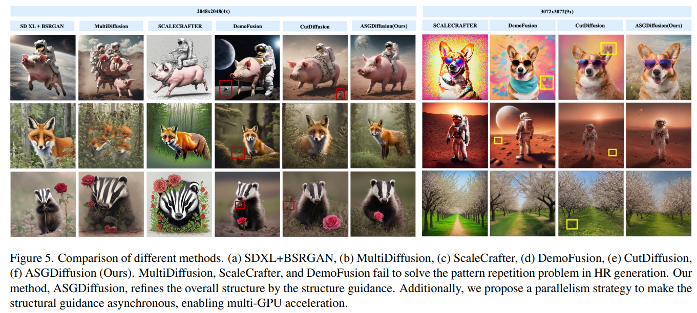

**看 crop 的几个指标 ok，Demofusion 也差不多啊，有些分辨率效果还好。。。。**

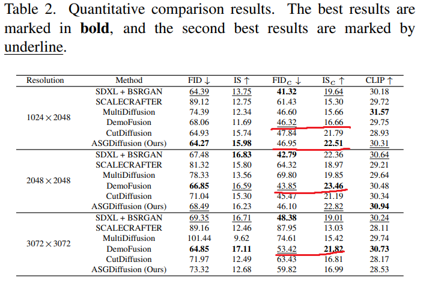

### Ablation

确实同样有直接加全局残差出现模糊的问题，认为每个 patch 的权重不好，用 cross-attn map 代替

Key Patch Guidance Scale

不加 Cross-attn map，**发现 CFG scale 太高，会造成模糊**！Cross-attn map 可以作为权重来使用，显著降低模糊的程度！

注意这里全局残差是直接加过来的！**处理一下选一下要不要呢？**

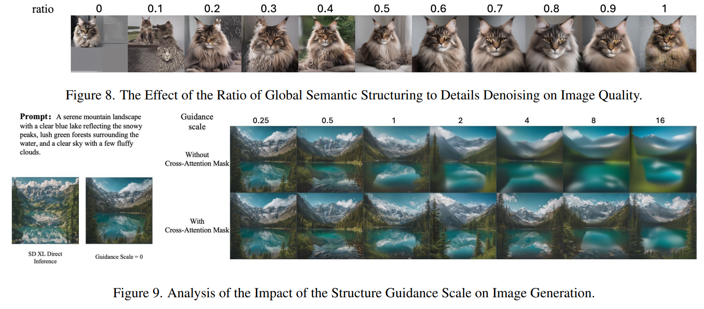

## Limitations

1024 x16 SR 就失效了，**也有 SR 太高效果越来越烂的问题！**

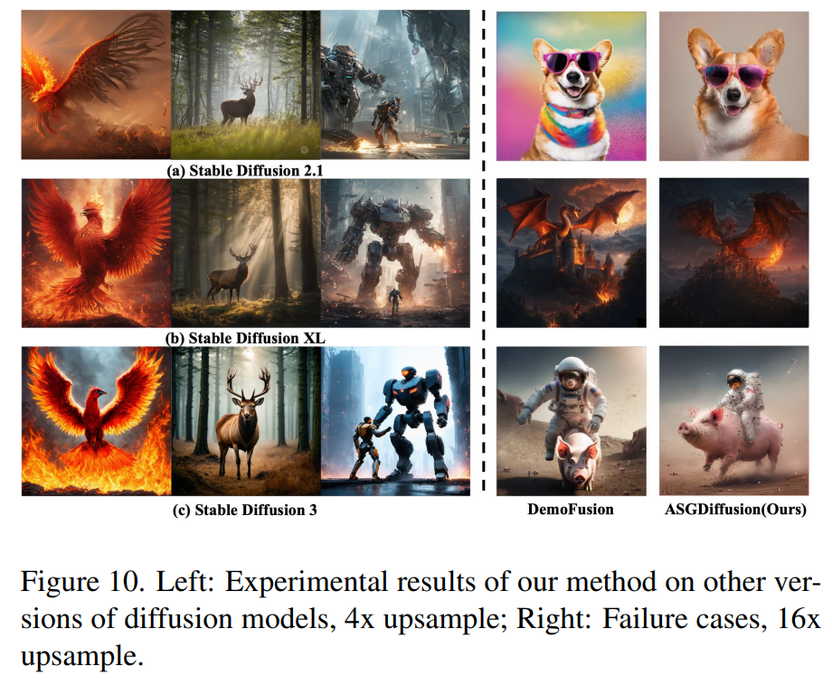

## Summary :star2:

> learn what

- 看 crop 的几个指标 ok，和 Demofusion 也差不多啊，DemoFusion 对于有些分辨率效果还好。。。。

- 1024 x16 SR 就失效了，**也有 SR 太高效果越来越烂的问题！效果还没 DemoFusion 好，Demofusion 只是重复，本文方法是直接跪了细节垃圾的不行**

### how to apply to our task

- **使用 cross-attn map 作为每个 patch 的权重，可以作为维持不同 patch 之间的一致性的一种手段，但效果也不是完全好，只适用于一部分分辨率，分辨率太大，patch 信息太小，cross-attn map 信息也很乱**：前提使用了不同 patch VAE 拼成一个大的 VAE feature。 每个 patch 用自己的一个 cross-attn map 表示当前 patch 的结构信息的重要程度。**cross-attn map 改进一下每个 patch 去噪特征的权重**。

- 不加 Cross-attn map，**发现 CFG scale 太高，会造成模糊**！Cross-attn map 可以作为权重来使用，显著降低模糊的程度！

  注意这里全局残差是直接加过来的！**处理一下选一下要不要呢？**
