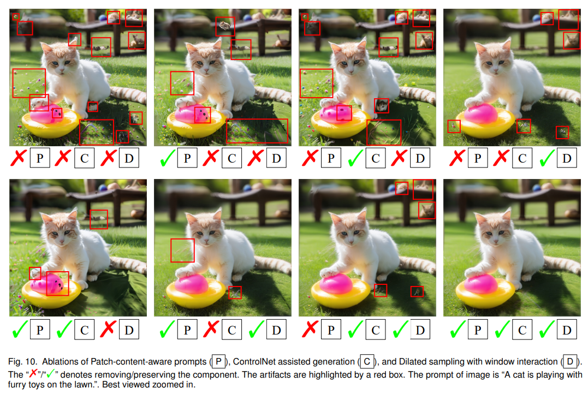

# AccDiffusion v2: Towards More Accurate Higher-Resolution Diffusion Extrapolation

> "AccDiffusion v2: Towards More Accurate Higher-Resolution Diffusion Extrapolation" Arxiv, 2024 Dec 3
> [paper](http://arxiv.org/abs/2412.02099v1) [code](https://github.com/lzhxmu/AccDiffusion_v2) [pdf](./2024_12_Arxiv_AccDiffusion-v2--Towards-More-Accurate-Higher-Resolution-Diffusion-Extrapolation.pdf) [note](./2024_12_Arxiv_AccDiffusion-v2--Towards-More-Accurate-Higher-Resolution-Diffusion-Extrapolation_Note.md)
> Authors: Zhihang Lin, Mingbao Lin, Wengyi Zhan, Rongrong Ji

## Key-point

- Task: patch-wise higher-resolution diffusion extrapolation without training
- Problems
  - Our in-depth analysis in this paper shows that using an identical text prompt for different patches leads to repetitive generation, while the absence of a prompt undermines image details.

- :label: Label:

## Contributions

- CrossAttn map loss 优化文本

>  our AccDiffusion v2 novelly decouples the vanilla image-content-aware prompt into a set of patch-content-aware prompts, each of which serves as a more precise description of a patch

- AccDiffusion v1 生成的物体存在扭曲，加了一个 controlnet 约束一下边缘

> Further analysis reveals that local distortion arises from inaccurate descriptions in prompts about the local structure of higher-resolution images.
>
> AccDiffusion v2, for the first time, introduces an auxiliary local structural information through ControlNet during higher-resolution diffusion extrapolation aiming to mitigate the local distortions. 

- dilated sampling

> our analysis indicates that global semantic information is conducive to suppressing both repetitive generation and local distortion. Hence, our AccDiffusion v2 further proposes dilated sampling with window interaction for better global semantic information during higher-resolution diffusion extrapolation.

- SOTA


## Introduction

- "AccDiffusion: An Accurate Method for Higher-Resolution Image Generation" ECCV, 2024 Jul 15
  [paper](http://arxiv.org/abs/2407.10738v2) [code](https://github.com/lzhxmu/AccDiffusion) [web](https://lzhxmu.github.io/accdiffusion/accdiffusion.html) [pdf](./2024_07_ECCV_AccDiffusion--An-Accurate-Method-for-Higher-Resolution-Image-Generation.pdf) [note](./2024_07_ECCV_AccDiffusion--An-Accurate-Method-for-Higher-Resolution-Image-Generation_Note.md)
  Authors: Zhihang Lin, Mingbao Lin, Meng Zhao, Rongrong Ji


## methods


搞了一个 controlnet 加入 canny 边缘


### window interation


> Finally, recent works show that accurate global semantic information is conducive to suppressing repetitive generation and local distortion simultaneously. Previous work (Demofusion) uses dilated sampling to provide global semantic information for higher-resolution generation. However, we observe that the conventional dilated sampling generates globally inconsistent and noisy information, disrupting the generation of higher-resolution images. Such inconsistency stems from the independent denoising of dilation samples without interaction. In response, we employ a position-wise bijection function to enable interaction between the noise from different dilation samples.


```shell
python accdiffusion_plus.py --experiment_name="AccDiffusionv2" \
    --model_ckpt="stabilityai/stable-diffusion-xl-base-1.0" \ # your sdxl model ckpt path
    --prompt="a cat and a dog are playing on the lawn." \
    --num_inference_steps=50 \
    --seed=2 \
    --resolution="4096,4096" \
    --upscale_mode="bicubic_latent" \
    --stride=64 \
    --c=0.3 \ # c can be adjusted based on the degree of repetition and quality of the generated image
    --use_progressive_upscaling  --use_skip_residual --use_multidiffusion --use_dilated_sampling --use_guassian \
    --use_md_prompt    --shuffle   --use_controlnet  --controlnet_conditioning_scale 0.6
```


### **preparation**

预训练的 canny controlnet

```python
    controlnet = ControlNetModel.from_pretrained("diffusers/controlnet-canny-sdxl-1.0", torch_dtype=torch.float16)
    vae = AutoencoderKL.from_pretrained("madebyollin/sdxl-vae-fp16-fix", torch_dtype=torch.float16)
    pipe = AccDiffusionv2SDXLPipeline.from_pretrained(args.model_ckpt, controlnet=controlnet, vae=vae, torch_dtype=torch.float16).to("cuda")
```

controller 获取 atten map

> https://github.com/lzhxmu/AccDiffusion_v2/blob/9b8e2f8a955e360bf243e43ec69a9d6465b75ea7/utils.py#L136

```python
        cross_attention_kwargs = {"edit_type": "visualize",
                                  "n_self_replace": 0.4,
                                  "n_cross_replace": {"default_": 1.0, "confetti": 0.8},
                                  }
        self.controller = create_controller(
            prompt, cross_attention_kwargs, num_inference_steps, tokenizer=self.tokenizer, device=attention_map_device, attn_res=self.attn_res
        )
```


**init LR img**

> https://github.com/lzhxmu/AccDiffusion_v2/blob/9b8e2f8a955e360bf243e43ec69a9d6465b75ea7/accdiffusion_plus.py#L1238

先迭代生成一个小图

> https://github.com/lzhxmu/AccDiffusion_v2/blob/9b8e2f8a955e360bf243e43ec69a9d6465b75ea7/accdiffusion_plus.py#L1167

`randn_tensor` 初始化一个 512x512 的 latent

```python
        # 5. Prepare latent variables
        num_channels_latents = self.unet.config.in_channels
        latents = self.prepare_latents(
            batch_size * num_images_per_prompt,
            num_channels_latents,
            height // scale_num,  # 4096 // 8 == 512
            width // scale_num,
            prompt_embeds.dtype,
            device,
            generator,
            latents,
        )
```


`get_multidiffusion_prompts` 

指定了 `use_md_prompt=True`， 得到最后一步的 VAE 特征，**提取每个 window 的 prompt**

> https://github.com/lzhxmu/AccDiffusion_v2/blob/9b8e2f8a955e360bf243e43ec69a9d6465b75ea7/accdiffusion_plus.py#L1282

```python
if t == 1 and use_md_prompt:
    md_prompts, views_attention = get_multidiffusion_prompts(tokenizer=self.tokenizer, prompts=[prompt], 
                                                             threthod=c,attention_store=self.controller, 
                                                             height=height//scale_num, width =width//scale_num, 
                                                             from_where=["up","down"], random_jitter=True, 
                                                             scale_num=scale_num)
```

> https://github.com/lzhxmu/AccDiffusion_v2/blob/9b8e2f8a955e360bf243e43ec69a9d6465b75ea7/utils.py#L783

每一个 token 保存 cross-attn map，按均值转为 01 mask

 ```python
         mask = torch.where(attention_map > attention_map.mean(), 1, 0).numpy().astype(np.uint8)
         mask = mask * 255
         # process mask
         kernel = np.ones((3, 3), np.uint8)
         eroded_mask = cv2.erode(mask, kernel, iterations=mask.shape[0]//16)
         dilated_mask = cv2.dilate(eroded_mask, kernel, iterations=mask.shape[0]//16)
         masks.append(dilated_mask)
 ```

参考 multi-diffusion 打成多个 window

> https://github.com/lzhxmu/AccDiffusion_v2/blob/9b8e2f8a955e360bf243e43ec69a9d6465b75ea7/utils.py#L39

```
            views.append((int(h_start), int(h_end), int(w_start), int(w_end)))
        return views
```


#### upscale vae

> https://github.com/lzhxmu/AccDiffusion_v2/blob/9b8e2f8a955e360bf243e43ec69a9d6465b75ea7/accdiffusion_plus.py#L1371

计算 canny image 作为 condition_image

> https://github.com/lzhxmu/AccDiffusion_v2/blob/9b8e2f8a955e360bf243e43ec69a9d6465b75ea7/accdiffusion_plus.py#L1340

```python
    if use_controlnet:
        canny_image = np.array(image[0])

        canny_image = auto_canny(canny_image, sigma=canny_sigma)

        canny_image = canny_image[:, :, None]
        canny_image = np.concatenate([canny_image, canny_image, canny_image], axis=2)
        canny_image = Image.fromarray(canny_image)
        canny_image.save(f'{result_path}/AccDiffusion_cany.png')
        condition_image = self.prepare_image(  # canny
            image=canny_image,
            width=width // scale_num,
            height=height // scale_num,
            batch_size=batch_size * num_images_per_prompt,
            num_images_per_prompt=num_images_per_prompt,
            device=device,
            dtype=controlnet.dtype,
            do_classifier_free_guidance=do_classifier_free_guidance,
            guess_mode=False,
        )
```


把 LR image 的 vae 特征 bicubic 升一下

```python
        if upscale_mode == "bicubic_latent" or debug:
            latents = F.interpolate(latents.to(device), size=(int(current_height / self.vae_scale_factor), int(current_width / self.vae_scale_factor)), mode='bicubic')
        else:
            raise NotImplementedError
```

noise inverse 重新加噪，获取每个 timestep 的全局残差

> https://github.com/lzhxmu/AccDiffusion_v2/blob/9b8e2f8a955e360bf243e43ec69a9d6465b75ea7/accdiffusion_plus.py#L1396C59-L1396C72


每个 timestep 的流程，**使用 multi-diffusion 的局部特征 & dilated_sampling  的全局特征，加权相加更新整张图的 value**

1. 当前 timetep 开始的 latent，先按 t 搞一个权重加上全局残差 vae，更新 latent，**作为后续 multi-diffusion 和 window-interation 的输入**
   - **设计全局残差的权重 c1**，t 越大，用全局残差越多。
   - t=T **用 resized vae 全局残差作为 latent 开始** :star:
2. **multi-diffusion 认为是局部特征处理 value_local**，类似 RVRT，把加上全局残差的 latent 分 patch 过 unet，再拼起来，多了一个一开始 pad 的操作，更新 value
   - value_local * 权重 `1-c2` 加到整张图的 value 上，t 越大，`1-c2` 越小
   - t=T 等于不用 multi-diffusion 更新的 value_local
3. **dilated_sampling 认为是全局特征 value_global**；把最初加上全局残差的 latent，用一个 gaussian 卷积核平滑一下，然后对 patch 打乱顺序送入 unet 计算 noise，把 noise再还原位置更新 vae
   - value_global * 权重 `c2` 加到整张图的 value 上，t 越大，`c2` 越大
   - t=T 只用 dilated sampling 的特征
4. 在做完所有去噪之后，最后用小图的均值方差，更新一波 SR vae 的均值+方差 :star:

> https://github.com/lzhxmu/AccDiffusion_v2/blob/9b8e2f8a955e360bf243e43ec69a9d6465b75ea7/accdiffusion_plus.py#L1405

### global residual

把小图 vae resize 到目标尺寸后，逐个 t 加噪，存为全局残差。

搞了一个 cosine_factor 权重融合当前 unet 输出的 vae & 全局残差。
$$
\text{cosine factor} = (\frac{1}{2} (1 + cos(\frac{T - t}{T} \pi))) ^ {3}
$$

1. $t=T \to c1=1$， 完全使用全局残差
2. $t=0 \to c1=0$，完全用 unet 的结果

```python
	cosine_scale_1 = 3
    cosine_factor = 0.5 * (1 + torch.cos(torch.pi * (self.scheduler.config.num_train_timesteps - t) / self.scheduler.config.num_train_timesteps)).cpu()
    if use_skip_residual:
        c1 = cosine_factor ** cosine_scale_1
        latents = latents * (1 - c1) + noise_latents[i] * c1
```

这里 denoise 结束把 LR VAE 特征的均值和方差拿过来，归一化一下 :star:

> https://github.com/lzhxmu/AccDiffusion_v2/blob/9b8e2f8a955e360bf243e43ec69a9d6465b75ea7/accdiffusion_plus.py#L1728C17-L1728C96

```python
        anchor_mean = latents.mean()
        anchor_std = latents.std()
        latents = (latents - latents.mean()) / latents.std() * anchor_std + anchor_mean
```

后面看下 denoise 具体步骤，先 use_multidiffusion, 再 use_dilated_sampling


> `use_multidiffusion=True; use_dilated_sampling=True`

### multidiffusion :star:

先把 latent pad 一下，分 patch 过 vae 拼起来，得到整张图的 value_local 作为局部特征。再 decrop 一下，**和 RVRT 分 patch 处理差不多，只是 pad 了一下。**

注意这里 value_local 认为是局部特征，乘以一个权重加到整张图的 vae value 上


**每个 window 过 Unet**，获取多个 views，就是每个 window 的 bbox 四点坐标

> https://github.com/lzhxmu/AccDiffusion_v2/blob/9b8e2f8a955e360bf243e43ec69a9d6465b75ea7/accdiffusion_plus.py#L1443

这里再把 latent 按每个 window crop 一下

> https://github.com/lzhxmu/AccDiffusion_v2/blob/9b8e2f8a955e360bf243e43ec69a9d6465b75ea7/accdiffusion_plus.py#L1467C25-L1468C50

```python
                            latents_for_view = torch.cat(
                                [
                                    latents_[:, :, h_start:h_end, w_start:w_end]
                                    for h_start, h_end, w_start, w_end in batch_view
                                ]
                            )
```

再加噪到 timestep，CFG 处理下维度

> https://github.com/lzhxmu/AccDiffusion_v2/blob/9b8e2f8a955e360bf243e43ec69a9d6465b75ea7/accdiffusion_plus.py#L1477

前面用了 cross-attn map 提取**每个 window 的 prompt 和 canny 图，过 controlnet + Unet**

> https://github.com/lzhxmu/AccDiffusion_v2/blob/9b8e2f8a955e360bf243e43ec69a9d6465b75ea7/accdiffusion_plus.py#L1524


每个 window 单独去噪，全部 window 的 VAE 特征得到后，**拼起来搞成一个大的 VAE 特征** -> value_local

> https://github.com/lzhxmu/AccDiffusion_v2/blob/9b8e2f8a955e360bf243e43ec69a9d6465b75ea7/accdiffusion_plus.py#L1585

```python
                            count_local = torch.zeros_like(latents_)
                            value_local = torch.zeros_like(latents_)
                            # extract value from batch
                            for latents_view_denoised, (h_start, h_end, w_start, w_end) in zip(
                                latents_denoised_batch.chunk(vb_size), batch_view
                            ):
                                value_local[:, :, h_start:h_end, w_start:w_end] += latents_view_denoised
                                count_local[:, :, h_start:h_end, w_start:w_end] += 1

                            if random_jitter:
                                value_local = value_local[: ,:, jitter_range: jitter_range + current_height // self.vae_scale_factor, jitter_range: jitter_range + current_width // self.vae_scale_factor]
                                count_local = count_local[: ,:, jitter_range: jitter_range + current_height // self.vae_scale_factor, jitter_range: jitter_range + current_width // self.vae_scale_factor]
                            if i != (len(timesteps) - 1):
                                noise_index = i + 1
                            else:
                                noise_index = i
```

> 注意这里 random_jitter, 实际 `jitter_range=0`
>
> ```python
>                         if random_jitter:
>                             jitter_range = int((self.unet.config.sample_size - stride) // 4)  # 0
>                             latents_ = F.pad(latents, (jitter_range, jitter_range, jitter_range, jitter_range), 'constant', 0)
>                             if use_controlnet:
>                                 condition_image_ = F.pad(condition_image, (jitter_range * self.vae_scale_factor, jitter_range * self.vae_scale_factor, jitter_range * self.vae_scale_factor, jitter_range * self.vae_scale_factor), 'constant', 0)
>                         else:
>                             latents_ = latents
> ```


关注一下怎么拼起来 :star: :star:

> https://github.com/lzhxmu/AccDiffusion_v2/blob/9b8e2f8a955e360bf243e43ec69a9d6465b75ea7/accdiffusion_plus.py#L1602

因为 jitter 了，**推理到的 patches 重叠就用 denoise 的取平均**；**没推理到的区域，就用全局残差的 vae**；

还要乘一个权重 $c2$，$t=T\to 0$  ，$c2= 0\to 1$。**后面还要 dilated smaple 继续更新 value**

```python
                        value_local = torch.where(count_local == 0, noise_latents[noise_index], value_local)
                        count_local = torch.where(count_local == 0, torch.ones_like(count_local), count_local)
                        if use_dilated_sampling:
                            c2 = cosine_factor ** cosine_scale_2
                            value += value_local / count_local * (1 - c2)
                            count += torch.ones_like(value_local) * (1 - c2)
                        else:
                            value += value_local / count_local
                            count += torch.ones_like(value_local) 
```

 这里 value 是每个 timestep 开头初始化的一个大的 VAE 特征

```python
            ############################################# denoise #############################################
            with self.progress_bar(total=num_inference_steps) as progress_bar:
                for i, t in enumerate(timesteps):
                    count = torch.zeros_like(latents)
                    value = torch.zeros_like(latents)
                    cosine_factor = 0.5 * (1 + torch.cos(torch.pi * (self.scheduler.config.num_train_timesteps - t) / self.scheduler.config.num_train_timesteps)).cpu()
```

到这里就是按 multidiffusion 方式融合多个 window 特征为一个大的 VAE 特征 `value` 了


### dilated_sampling

> https://github.com/lzhxmu/AccDiffusion_v2/blob/9b8e2f8a955e360bf243e43ec69a9d6465b75ea7/accdiffusion_plus.py#L1610

1. 最初加上全局残差的 latent，用一个 gaussian 卷积核平滑一下，multidiffusion 没有更新 latent 哦，用15x15 卷积核平滑一下
2. window interaction，把平滑的 latent 分 patch 打乱顺序过 unet，再还原位置，**得到 value_global 特征认为是全局特征，乘以权重 c2 加到 value 上**


#### filter

latents 为 multidiffusion 里面分 patch 再合并的 vae。**先 pad 一下**

> `current_scale_num=8` 为一边 SR 的倍数；`window_size=self.unet.config.sample_size=64` `latents_` 是当前 timestep 初始加上全局残差的大的 VAE 特征

```
                        h_pad = (current_scale_num - (latents.size(2) % current_scale_num)) % current_scale_num
                        w_pad = (current_scale_num - (latents.size(3) % current_scale_num)) % current_scale_num
                        latents_ = F.pad(latents, (w_pad, 0, h_pad, 0), 'constant', 0)
                        
                        count_global = torch.zeros_like(latents_)
                        value_global = torch.zeros_like(latents_)
```

**搞了一个 15x15 的高斯卷积核卷一下，得到一个平滑的 VAE 特征，然后用原来的 latent 的均值和方差，标准化一下**；

> https://github.com/lzhxmu/AccDiffusion_v2/blob/9b8e2f8a955e360bf243e43ec69a9d6465b75ea7/accdiffusion_plus.py#L1622

`latents_gaussian` 的均值，还是用加了全局残差的那个 VAE 特征。颜色信息（低频）依靠 resized LR VAE 的低频，所以色差不那么明显

$t = T\to0 ; c3= 1\to 0$。`use_guassian=True`

```python
                        if use_guassian:
                            c3 = 0.99 * cosine_factor ** cosine_scale_3 + 1e-2
                            std_, mean_ = latents_.std(), latents_.mean()
                            latents_gaussian = gaussian_filter(latents_, kernel_size=(2*current_scale_num-1), sigma=sigma*c3)
                            latents_gaussian = (latents_gaussian - latents_gaussian.mean()) / latents_gaussian.std() * std_ + mean_
                        else:
                            latents_gaussian = latents_
```

卷积核的实现

```python
def gaussian_kernel(kernel_size=3, sigma=1.0, channels=3):
    x_coord = torch.arange(kernel_size)
    gaussian_1d = torch.exp(-(x_coord - (kernel_size - 1) / 2) ** 2 / (2 * sigma ** 2))
    gaussian_1d = gaussian_1d / gaussian_1d.sum()
    gaussian_2d = gaussian_1d[:, None] * gaussian_1d[None, :]
    kernel = gaussian_2d[None, None, :, :].repeat(channels, 1, 1, 1)
    
    return kernel

def gaussian_filter(latents, kernel_size=3, sigma=1.0):
    channels = latents.shape[1]
    kernel = gaussian_kernel(kernel_size, sigma, channels).to(latents.device, latents.dtype)
    blurred_latents = F.conv2d(latents, kernel, padding=kernel_size//2, groups=channels)
    return blurred_latents
```


#### window interation

> https://vscode.dev/github/lzhxmu/AccDiffusion_v2/blob/main/accdiffusion_plus.py#L1646

把 timestep 开始加上全局残差的 latent，用 filter 平滑后，在这里打乱，**给 Unet 得到 noise，先还原位置，再转为 vae** ，按 patch 存入 value_global


随机取 window，先按步长取特征点，在打乱

```python
                        for j, batch_view in enumerate(views_batch):
                            
                            latents_for_view = torch.cat(
                                [
                                    latents_[:, :, h::current_scale_num, w::current_scale_num]
                                    for h, w in batch_view
                                ]
                            )

                            latents_for_view_gaussian = torch.cat(
                                [
                                    latents_gaussian[:, :, h::current_scale_num, w::current_scale_num]
                                    for h, w in batch_view
                                ]
                            )
```

> https://github.com/lzhxmu/AccDiffusion_v2/blob/9b8e2f8a955e360bf243e43ec69a9d6465b75ea7/accdiffusion_plus.py#L1646
>
> `torch.randperm`函数是用于生成一个从0到n-1的随机排列的整数序列
>
> ```
> >>> torch.randperm(4)
> tensor([2, 1, 0, 3])
> ```

```python
                            if shuffle:
                                ######## window interaction ########
                                shape = latents_for_view.shape
                                shuffle_index = torch.stack([torch.randperm(shape[0]) for _ in range(latents_for_view.reshape(-1).shape[0]//shape[0])])

                                shuffle_index = shuffle_index.view(shape[1],shape[2],shape[3],shape[0])
                                original_index = torch.zeros_like(shuffle_index).scatter_(3, shuffle_index, torch.arange(shape[0]).repeat(shape[1], shape[2], shape[3], 1))

                                shuffle_index = shuffle_index.permute(3,0,1,2).to(device)
                                original_index = original_index.permute(3,0,1,2).to(device)
                                latents_for_view_gaussian = latents_for_view_gaussian.gather(0, shuffle_index)
```


**把 latents_for_view_gaussian 过 Unet，还原到原来像素位置**。这里 vae 认为是 global 的 vae

> https://github.com/lzhxmu/AccDiffusion_v2/blob/9b8e2f8a955e360bf243e43ec69a9d6465b75ea7/accdiffusion_plus.py#L1692

```python
                            if shuffle:
                                ## recover
                                noise_pred = noise_pred.gather(0, original_index)

                            # compute the previous noisy sample x_t -> x_t-1
                            self.scheduler._init_step_index(t)
                            latents_denoised_batch = self.scheduler.step(noise_pred, t, latents_for_view, **extra_step_kwargs, return_dict=False)[0]

                            # extract value from batch
                            for latents_view_denoised, (h, w) in zip(
                                latents_denoised_batch.chunk(vb_size), batch_view
                            ):
                                value_global[:, :, h::current_scale_num, w::current_scale_num] += latents_view_denoised
                                count_global[:, :, h::current_scale_num, w::current_scale_num] += 1

                        value_global = value_global[: ,:, h_pad:, w_pad:]
```


c2 权重随着 t 减小，c2 从 1 -> 0，更新 value；

至此，整张图的 vae value 已经加上了 multidiffusion 里面每个 patch 的 vae （c1 = c2 ** 3)，和当前 dilated sampled 的 vae (c2)

```python
                        value_global = value_global[: ,:, h_pad:, w_pad:]

                        if use_multidiffusion:
                            c2 = cosine_factor ** cosine_scale_2
                            value += value_global * c2
                            count += torch.ones_like(value_global) * c2
                        else:
                            value += value_global
                            count += torch.ones_like(value_global)
                                
                    latents = torch.where(count > 0, value / count, value)
```


### rechange mean&var

在一开始生成完小图之后，保存了一个 mean var

> https://vscode.dev/github/lzhxmu/AccDiffusion_v2/blob/main/accdiffusion_plus.py#L1305

```
        else:
            print("### Encoding Real Image ###")
            latents = self.vae.encode(image_lr)
            latents = latents.latent_dist.sample() * self.vae.config.scaling_factor

        anchor_mean = latents.mean()
        anchor_std = latents.std()
```

在做完所有去噪之后，最后用小图的均值方差，更新一波 SR vae 的均值+方差

> https://vscode.dev/github/lzhxmu/AccDiffusion_v2/blob/main/accdiffusion_plus.py#L1728

```
                latents = (latents - latents.mean()) / latents.std() * anchor_std + anchor_mean
                if self.lowvram:
                    latents = latents.cpu()
                    torch.cuda.empty_cache()
```


### VAE Tiled Decode

> `model/video_diffusion/autoencoder_kl.py`
>
> config
>
> ```json
> {
>   "_class_name": "UNet2DConditionModel",
>   "_diffusers_version": "0.6.0",
>   "act_fn": "silu",
>   "attention_head_dim": 8,
>   "block_out_channels": [
>     320,
>     640,
>     1280,
>     1280
>   ],
>   "center_input_sample": false,
>   "cross_attention_dim": 768,
>   "down_block_types": [
>     "CrossAttnDownBlock2D",
>     "CrossAttnDownBlock2D",
>     "CrossAttnDownBlock2D",
>     "DownBlock2D"
>   ],
>   "downsample_padding": 1,
>   "flip_sin_to_cos": true,
>   "freq_shift": 0,
>   "in_channels": 4,
>   "layers_per_block": 2,
>   "mid_block_scale_factor": 1,
>   "norm_eps": 1e-05,
>   "norm_num_groups": 32,
>   "out_channels": 4,
>   "sample_size": 64,
>   "up_block_types": [
>     "UpBlock2D",
>     "CrossAttnUpBlock2D",
>     "CrossAttnUpBlock2D",
>     "CrossAttnUpBlock2D"
>   ]
> }
> 
> ```
>
> 
>
> ```yaml
> model:
>   base_learning_rate: 1.0e-04
>   target: ldm.models.diffusion.ddpm.LatentDiffusion
>   params:
>     linear_start: 0.00085
>     linear_end: 0.0120
>     num_timesteps_cond: 1
>     log_every_t: 200
>     timesteps: 1000
>     first_stage_key: "jpg"
>     cond_stage_key: "txt"
>     image_size: 64
>     channels: 4
>     cond_stage_trainable: false   # Note: different from the one we trained before
>     conditioning_key: crossattn
>     monitor: val/loss_simple_ema
>     scale_factor: 0.18215
>     use_ema: False
> 
>     scheduler_config: # 10000 warmup steps
>       target: ldm.lr_scheduler.LambdaLinearScheduler
>       params:
>         warm_up_steps: [ 10000 ]
>         cycle_lengths: [ 10000000000000 ] # incredibly large number to prevent corner cases
>         f_start: [ 1.e-6 ]
>         f_max: [ 1. ]
>         f_min: [ 1. ]
> 
>     unet_config:
>       target: ldm.modules.diffusionmodules.openaimodel.UNetModel
>       params:
>         image_size: 32 # unused
>         in_channels: 4
>         out_channels: 4
>         model_channels: 320
>         attention_resolutions: [ 4, 2, 1 ]
>         num_res_blocks: 2
>         channel_mult: [ 1, 2, 4, 4 ]
>         num_heads: 8
>         use_spatial_transformer: True
>         transformer_depth: 1
>         context_dim: 768
>         use_checkpoint: True
>         legacy: False
> 
>     first_stage_config:
>       target: ldm.models.autoencoder.AutoencoderKL
>       params:
>         embed_dim: 4
>         monitor: val/rec_loss
>         ddconfig:
>           double_z: true
>           z_channels: 4
>           resolution: 256
>           in_channels: 3
>           out_ch: 3
>           ch: 128
>           ch_mult:
>           - 1
>           - 2
>           - 4
>           - 4
>           num_res_blocks: 2
>           attn_resolutions: []
>           dropout: 0.0
>         lossconfig:
>           target: torch.nn.Identity
> 
>     cond_stage_config:
>       target: ldm.modules.encoders.modules.FrozenCLIPEmbedder
> ```

直接在 VAE 上，相邻 patch 例如重叠 2 个位置。**重叠区域分一半，等于切一刀，舍弃了各自 patch 最外面一圈**，第一个给左边，剩下一半给右边

```python
    def tiled_decode(self, z: torch.FloatTensor, return_dict: bool = True) -> Union[DecoderOutput, torch.FloatTensor]:
        r"""
        Decode a batch of images using a tiled decoder.

        Args:
            z (`torch.FloatTensor`): Input batch of latent vectors.
            return_dict (`bool`, *optional*, defaults to `True`):
                Whether or not to return a [`~models.vae.DecoderOutput`] instead of a plain tuple.

        Returns:
            [`~models.vae.DecoderOutput`] or `tuple`:
                If return_dict is True, a [`~models.vae.DecoderOutput`] is returned, otherwise a plain `tuple` is
                returned.
        """
        overlap_size = int(self.tile_latent_min_size * (1 - self.tile_overlap_factor))  # 64 * 0.75 == 48
        blend_extent = int(self.tile_sample_min_size * self.tile_overlap_factor)  # 64 / 8 * 0.25  == 2
        row_limit = self.tile_sample_min_size - blend_extent

        # Split z into overlapping 64x64 tiles and decode them separately.
        # The tiles have an overlap to avoid seams between tiles.
        rows = []
        for i in range(0, z.shape[2], overlap_size):
            row = []
            for j in range(0, z.shape[3], overlap_size):
                tile = z[:, :, i : i + self.tile_latent_min_size, j : j + self.tile_latent_min_size]
                tile = self.post_quant_conv(tile)
                decoded, _ = self.decoder(tile)  # WARNING
                row.append(decoded)
            rows.append(row)
        
        result_rows = []
        for i, row in enumerate(rows):
            result_row = []
            for j, tile in enumerate(row):
                # blend the above tile and the left tile
                # to the current tile and add the current tile to the result row
                if i > 0:
                    tile = self.blend_v(rows[i - 1][j], tile, blend_extent)
                if j > 0:
                    tile = self.blend_h(row[j - 1], tile, blend_extent)
                result_row.append(tile[:, :, :row_limit, :row_limit])
            result_rows.append(torch.cat(result_row, dim=3))

        dec = torch.cat(result_rows, dim=2)
        if not return_dict:
            return (dec,)

        return DecoderOutput(sample=dec, vae_mid_feas=[])
```

- Q：看下相邻 patch vae 怎么融合

相邻 patch vae 重叠 2 个位置。

```
    def blend_v(self, a, b, blend_extent):
        blend_extent = min(a.shape[2], b.shape[2], blend_extent)
        for y in range(blend_extent):
            b[:, :, y, :] = a[:, :, -blend_extent + y, :] * (1 - y / blend_extent) + b[:, :, y, :] * (y / blend_extent)
        return b
```


## setting

## Experiment

> ablation study 看那个模块有效，总结一下




## Limitations

## Summary :star2:

> learn what

### how to apply to our task

- 全局残差搞了一个 cosine 权重
- denoise 结束把 LR VAE 特征的均值和方差拿过来，归一化一下 :star:
- 搞了一个 15x15 的高斯卷积核卷一下，**得到一个平滑的 VAE 特征**，然后标准化一下；用平滑的 VAE 更新一下方差，均值不动。
  **大 VAE 特征的均值，还是用加了全局残差的那个 VAE 特征。颜色信息（低频）依靠 resized LR VAE 的低频，所以色差不那么明显**
