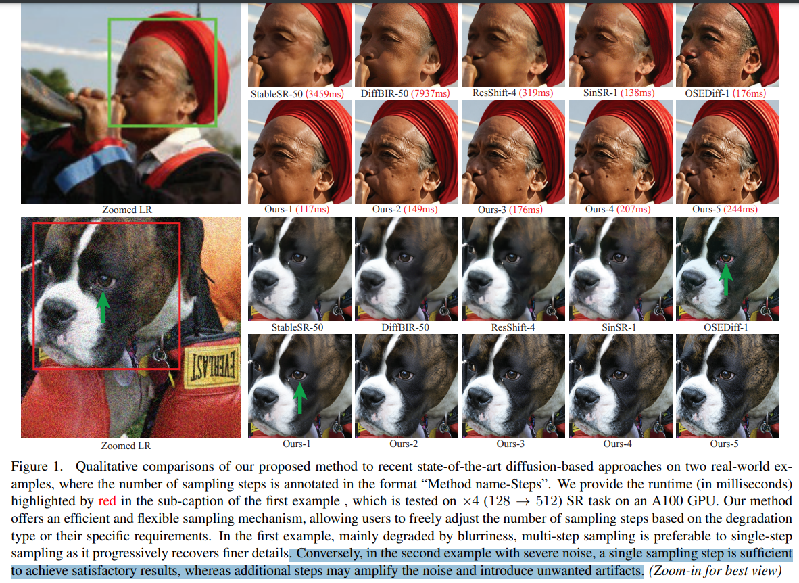
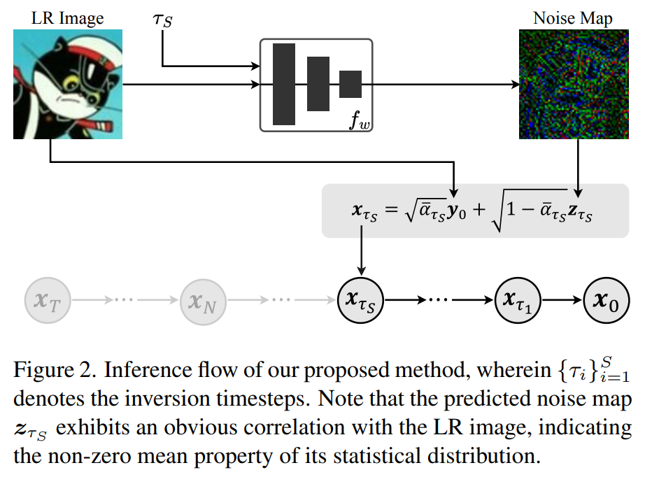
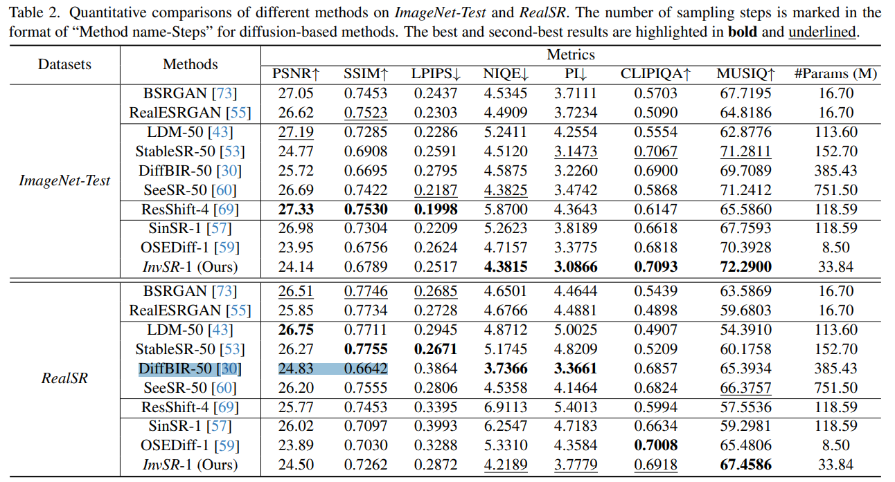

# Arbitrary-steps Image Super-resolution via Diffusion Inversion

> "Arbitrary-steps Image Super-resolution via Diffusion Inversion" Arxiv, 2024 Dec 12
> [paper](http://arxiv.org/abs/2412.09013v1) [code](https://github.com/zsyOAOA/InvSR) [pdf](./2024_12_Arxiv_Arbitrary-steps-Image-Super-resolution-via-Diffusion-Inversion.pdf) [note](./2024_12_Arxiv_Arbitrary-steps-Image-Super-resolution-via-Diffusion-Inversion_Note.md)
> Authors: Zongsheng Yue, Kang Liao, Chen Change Loy

## Key-point

- Task
- Problems
- :label: Label:

## Contributions

- We design a Partial noise Prediction strategy to construct an intermediate state of the diffusion model, which serves as the starting sampling point
- 去噪阶段预测多个方向的最优

> deep noise predictor to estimate the optimal noise maps for the forward diffusion process.

- 只需要去噪 <= 5 步

>  Compared to existing approaches, our method offers a flexible and efficient sampling mechanism that supports an arbitrary number of sampling steps, ranging from one to five.

## Introduction

BlindSR 做加速；发现 degradation 去噪步数太多出现很多 artifacts，增强了 noise

区别于先前方法，本文提出去优化 diffusion model 的输入，对输入找最优解

> In this work, we propose a new technique based on diffusion inversion to harness diffusion priors. Unlike existing approaches, it attempts to find an optimal noise map as the input of the diffusion model, without any modification to the diffusion network itself, thereby maximizing the utility of diffusion prior.

**根据 model 的前向过程去在 LR 上加噪**，而不是直接加随机噪声

>  In addition, a Partial noise Prediction (PnP) strategy is devised to construct an intermediate state for the diffusion model, serving as the starting point for sampling. This is made possible by **adding noise onto the LR image according to the diffusion model’s forward process**, where the noise predictor predicts the added noise instead of random sampling

- ImageSR 本文任务中 LR, HR 差距在于细节
- 设计 PnP 简化去噪过程中预测的噪声，去噪加速

>  Rather than predicting noise maps for all diffusion steps, the PnP strategy simplifies the inversion task by limiting predictions to the starting step

- 根据图像退化程度，加合适的步数

> The starting steps during training are carefully selected to have a high signal-to-noise ratio (SNR), ensuring robust fidelity preservation for SR. In practice, we enforce an SNR threshold greater than 1.44, corresponding to the timestep of 250 in Stable Diffusion [43]

## methods

预测噪声，对于不同噪声程度的图像，加噪不同步数！

## setting

## Experiment

> ablation study 看那个模块有效，总结一下

客观指标没有 DiffBIR 好啊。。难以信服；主观指标更好

## Limitations

## Summary :star2:

> learn what

### how to apply to our task

- 细节生成比 DiffBIR 好，优化一些 DiffBIR 垃圾一样的 ConvBlocks

