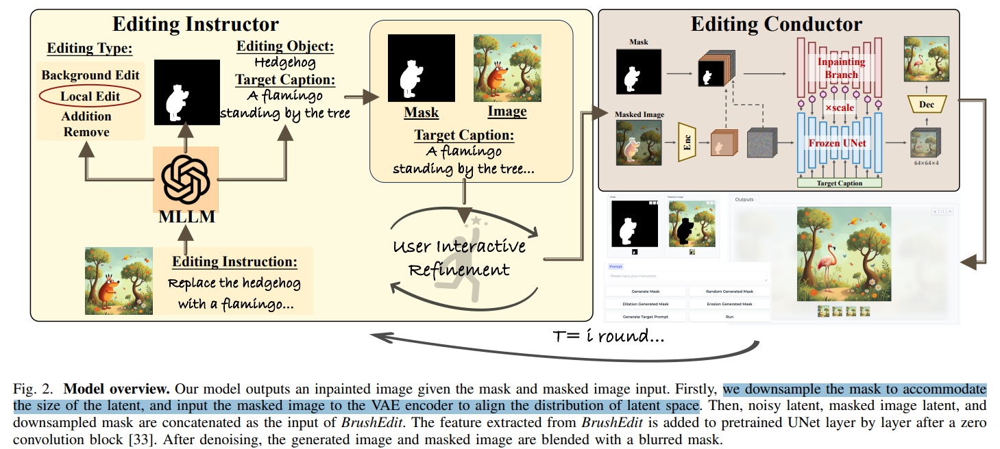

# BrushEdit: All-In-One Image Inpainting and Editing

> "BrushEdit: All-In-One Image Inpainting and Editing" Arxiv, 2024 Dec 13
> [paper](http://arxiv.org/abs/2412.10316v2) [code]() [web](https://liyaowei-stu.github.io/project/BrushEdit/) [pdf](./2024_12_Arxiv_BrushEdit--All-In-One-Image-Inpainting-and-Editing.pdf) [note](./2024_12_Arxiv_BrushEdit--All-In-One-Image-Inpainting-and-Editing_Note.md)
> Authors: Yaowei Li, Yuxuan Bian, Xuan Ju, Zhaoyang Zhang, Ying Shan, Yuexian Zou, Qiang Xu

## Key-point

- Task
- Problems
- :label: Label:

## Contributions

## Introduction

## methods

给需要修改的目标区域文本，让 MLLM 去构造 mask & 构建适合 BrushNet 的 Prompt 

## setting

## Experiment

> ablation study 看那个模块有效，总结一下

## Limitations

## Summary :star2:

> learn what

### how to apply to our task

