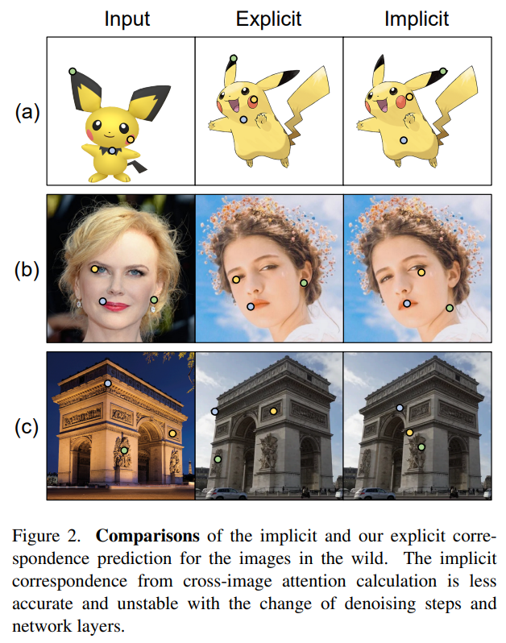
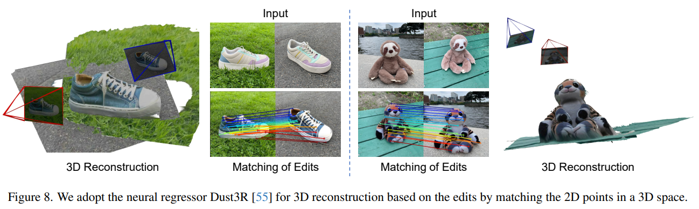

# Edicho: Consistent Image Editing in the Wild

> "Edicho: Consistent Image Editing in the Wild" Arxiv, 2024 Dec 30
> [paper](http://arxiv.org/abs/2412.21079v2) [code]() [web](https://ezioby.github.io/edicho/) [pdf](./2024_12_Arxiv_Edicho--Consistent-Image-Editing-in-the-Wild.pdf) [note](./2024_12_Arxiv_Edicho--Consistent-Image-Editing-in-the-Wild_Note.md)
> Authors: Qingyan Bai, Hao Ouyang, Yinghao Xu, Qiuyu Wang, Ceyuan Yang, Ka Leong Cheng, Yujun Shen, Qifeng Chen

## Key-point

- Task: consistent editing across in-the-wild images
- Problems
  - 难以同时在编辑多张图像时，保持编辑的内容在多张图中的一致性

- :label: Label:

## Contributions

- 使用显示的关键点匹配辅助

> Edicho1 steps in with a training-free solution based on diffusion models, featuring a fundamental design principle of using explicit image correspondence to direct editing.

- Plug & play

> Such an inference-time algorithm enjoys a plug-and-play nature and is compatible to most diffusionbased editing methods, such as ControlNet and BrushNet.

## Introduction

隐式的关键点匹配，随着 denoise step 变化，匹配不稳定

>  The implicit correspondence from cross-image attention calculation is less accurate and unstable with the change of denoising steps and network layers.

### Correspondence

- "Emergent Correspondence from Image Diffusion" NIPS, 2023 Jun 6
  [paper](http://arxiv.org/abs/2306.03881v2) [code](https://diffusionfeatures.github.io) [pdf](./2023_06_NIPS_Emergent-Correspondence-from-Image-Diffusion.pdf) [note](./2023_06_NIPS_Emergent-Correspondence-from-Image-Diffusion_Note.md)
  Authors: Luming Tang, Menglin Jia, Qianqian Wang, Cheng Perng Phoo, Bharath Hariharan

发现 SD upsample 的几层特征能够做关键点匹配

## methods

用匹配点做 warp，类似之前光流的操作

## setting

## Experiment

> ablation study 看那个模块有效，总结一下

搞一个模型预测相机位姿，去 3D 做一致性 :star:

## Limitations

## Summary :star2:

> learn what

### how to apply to our task

