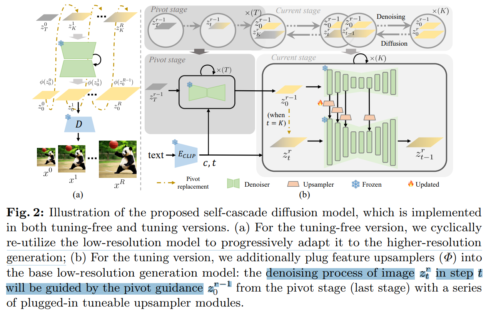

# FreeScale: Unleashing the Resolution of Diffusion Models via Tuning-Free Scale Fusion

> "FreeScale: Unleashing the Resolution of Diffusion Models via Tuning-Free Scale Fusion" Arxiv, 2024 Dec 12
> [paper](http://arxiv.org/abs/2412.09626v1) [code]() [web](http://haonanqiu.com/projects/FreeScale.html) [pdf](./2024_12_Arxiv_FreeScale--Unleashing-the-Resolution-of-Diffusion-Models-via-Tuning-Free-Scale-Fusion.pdf) [note](./2024_12_Arxiv_FreeScale--Unleashing-the-Resolution-of-Diffusion-Models-via-Tuning-Free-Scale-Fusion_Note.md)
> Authors: Haonan Qiu, Shiwei Zhang, Yujie Wei, Ruihang Chu, Hangjie Yuan, Xiang Wang, Yingya Zhang, Ziwei Liu (NTU, Ali, Fudan)

## Key-point

- Task

- Problems

  - 重复物体，想从频域搞

    > However, these methods are still prone to producing low-quality visual content with repetitive patterns.
    >
    >  The key obstacle lies in the inevitable increase in high-frequency information when the model generates visual content exceeding its training resolution, leading to undesirable repetitive patterns deriving from the accumulated errors.

- :label: Label:

## Contributions

- 提取 FreeScale，提取不同 scale 的频域信息，**把 SDXL 生成初始的细节（原来很拉）进行增强**

> we propose FreeScale, a tuning-free inference paradigm to enable higher-resolution visual generation via scale fusion. Specifically, FreeScale processes information from **different receptive scales** and then fuses it by **extracting desired frequency components.**

- SOTA, 8K SR

## Introduction

用 SDXL 先生成 $1024^2$，一个 80G/40G A800 做 8K 生成（类似 SR），不训练。

看下 [web](http://haonanqiu.com/projects/FreeScale.html) 展示的图

一致性细看还是能看出来 SR 和 初始图像不一致。但是**这篇工作发现 SDXL 生成一些图像的细节就很拉，选择在 SR 后重新优化。**

支持增加 mask

- **先说 motivation，为啥要做这个任务。:star:**

SD 效果经验，但是现有 SD 都是做 512x1024 左右分辨率的，生成 8K 的效果有潜力。

> Diffusion models have revolutionized visual generation [10, 11, 36, 45, 48, 50], empowering individuals without any artistic expertise to effortlessly create distinctive and personalized designs, graphics, and short films using specific textual descriptions. Nonetheless, current visual diffusion models are generally trained on data with limited resolution, such as 5122 for SD 1.5 [39], 10242 for SDXL [36], and 320 × 512 for VideoCrafter2 [10], hampering their ability to generate high-fidelity images or videos at higher resolutions.

8K 训练数据少，总结下现有方法都在做不微调的方案

> Given the scarcity of high-resolution visual data and the substantially greater model capacity required for modeling such data, recent efforts have focused on employing tuning-free strategies for high-resolution visual generation to inherit the strong generation capacities of existing pretrained diffusion models.

- **介绍相关方法的发现 + 缺陷**

> Despite the advances achieved by existing methods, they are still prone to producing low-quality images or videos, particularly manifesting as repetitive object occurrences and unreasonable object structures. 

ScaleCrafter 发现重复物体原因在于 Conv 感受野太小，只是减少了一些重复。

> ScaleCrafter [18] puts forward that the primary cause of the object repetition issue is the limited convolutional receptive field and uses dilated convolutional layers to achieve tuning-free higherresolution sampling. But the generated results of ScaleCrafter still suffer from the problem of local repetition

DemoFusion 用全局 patch resize 的全局残差，几乎没重复了 

> Inspired by MultiDiffusion [2] fusing the local patches of the whole images, DemoFusion [13] designed a mechanism by fusing the local patches and global patches, almost eliminating the local repetition. Essentially, this solution just transfers the extra signal of the object to the background, leading to small object repetition generation.

- "DemoFusion: Democratising High-Resolution Image Generation With No" CVPR, 2023 Nov 24 :star:
  [paper](http://arxiv.org/abs/2311.16973v2) [code](https://github.com/PRIS-CV/DemoFusion) [web](https://ruoyidu.github.io/demofusion/demofusion.html) [pdf](./2023_11_CVPR_DemoFusion--Democratising-High-Resolution-Image-Generation-With-No.pdf) [note](./2023_11_CVPR_DemoFusion--Democratising-High-Resolution-Image-Generation-With-No_Note.md)
  Authors: Ruoyi Du, Dongliang Chang, Timothy Hospedales, Yi-Zhe Song, Zhanyu Ma

FouriScale 的结果几乎看不到重复，但是颜色和纹理很奇怪

> FouriScale [23] reduces those extra signals by removing the high-frequency signals of the latent before the convolution operation. Although FouriScale completely eliminates all types of repetition, the generated results always have **weird colors and textures due to its violent editing on the frequency domain**

- "FouriScale: A Frequency Perspective on Training-Free High-Resolution Image Synthesis" ECCV, 2024 Mar 19
  [paper](http://arxiv.org/abs/2403.12963v1) [code](https://github.com/LeonHLJ/FouriScale.) [pdf](./2024_03_ECCV_FouriScale--A-Frequency-Perspective-on-Training-Free-High-Resolution-Image-Synthesis.pdf) [note](./2024_03_ECCV_FouriScale--A-Frequency-Perspective-on-Training-Free-High-Resolution-Image-Synthesis_Note.md)
  Authors: Linjiang Huang, Rongyao Fang, Aiping Zhang, Guanglu Song, Si Liu, Yu Liu, Hongsheng Li

把 UNet 的 Conv Kernel 变成 dilated，去和 Low-frequency 特征相乘

- **介绍本文方法创新点 + 能力**

参考先前方法搞了一个 dilated conv

> To generate satisfactory visual contents without any unexpected repetition, we propose FreeScale, a tuning-free inference paradigm that enables pre-trained image and video diffusion models to generate vivid higher-resolution results.
>
>  Building on past effective modules [14, 18], **we first propose tailored self-cascade upscaling and restrained dilated convolution** to gain the basic visual structure and maintain the quality in higher-resolution generation. 

在 self-attn 加入不同 scale 得频域特征

> To further elim inate all kinds of unexpected object repetitions, FreeScale processes information from different receptive scales and then fuses it by extracting desired frequency components, ensuring both the structure’s overall rationality and the ob ject’s local quality. This fusion is smoothly integrated into the original self-attention layers, thereby bringing only min imal additional time overhead.

- "Make a Cheap Scaling: A Self-Cascade Diffusion Model for Higher-Resolution Adaptation" Arxiv, 2024 Feb 16
  [paper](http://arxiv.org/abs/2402.10491v2) [code]() [pdf](./2024_02_Arxiv_Make-a-Cheap-Scaling--A-Self-Cascade-Diffusion-Model-for-Higher-Resolution-Adaptation.pdf) [note](./2024_02_Arxiv_Make-a-Cheap-Scaling--A-Self-Cascade-Diffusion-Model-for-Higher-Resolution-Adaptation_Note.md)
  Authors: Lanqing Guo, Yingqing He, Haoxin Chen, Menghan Xia, Xiaodong Cun, Yufei Wang, Siyu Huang, Yong Zhang, Xintao Wang, Qifeng Chen, Ying Shan, Bihan Wen

### related work

- 先介绍下 DM 历程，说明自己为啥选 SDXL 作为 backbone

image & video 一共两段

> The advent of diffusion models has transformed the landscape of image and video generation by enabling the production of excep tionally high-quality outputs [10, 11, 36, 41, 45, 47–50].

说明为什么不用 DiT structure，使用 UNet，显存不够，推理不了

> Since the DiT structure models often take up more mem ory, achieving high-resolution generation on a single GPU is difficult even in the inference phase. Therefore, we still use the U-Net structure models in this work. We chose SDXL [36] as our pre-trained image model, and VideoCrafter2 [10] as our pre-trained video model.

- Higher-Resolution 生成

> High-resolution visual synthesis is classic challenging in the generative f ield due to the difficulty of collecting plenty of high resolution data and the requirement of substantial compu tational resources. 

先总结归类一下训练 & 不训练两类方法，说明为什么不直接生成 8K 得原因

1. 最好是直接生成 8K，但数据太少。
2. 计算资源不够

> Training with high-resolution data on larger models should be a more fundamental solution. How ever, high-resolution visual data, especially high-resolution videos, only accounts for a small proportion. 

总结 patch 不一致的问题，具体总结每个方法特点 + 缺点，重点强调下本文优化方向（重复物体 + 纹理）

> One straightforward approach is to generate video patches of the same resolution as the training video and then stitch them together. Although eliminating the training inference gap, this method results in disconnected and in coherent patches.
>
> MultiDiffusion [2] addresses this issue by smoothly fusing patches during the denoising process. DemoFusion [13] utilizes this mechanism and adds global perception to ensure the rationality of the overall layout.

## methods

- Preliminaries 列一下 LDM 公式，水一段

### Tailored Self-Cascade Upscaling

参考了相关工作的 framework

- Q：前一个 stage 的特征怎么 upsample ? **RGB resize 或者 VAE resize?** :star:

> There are two options for ϕ: directly upsampling in la tent (ϕ(z) = UP(z)) or upsampling in RGB space (ϕ(z) = E(UP(D(z))), where E and D are the encoder and decoder of pre-trained VAE, respectively. 

发现在 RGB resize 会增加一些 blur，对 video 生成效果不好，对图像还可以？

> Upsampling in RGB space is closer to human expectations but will add some blurs. We empirically observe that these blurs will **hurt the video generation but help to suppress redundant over frequency information in the image generation.**
>
> Therefore, we adopt upsampling in RGB space for higher-solution image generation and latent space upsampling in higher solution video generation.

### Flexible Control for Detail Level

和 SR 稍微有点区别，会改变纹理的。。增强纹理。。。**需要平衡下 LR 结构 & 新生成的纹理。**

> Different from super resolution tasks, FreeScale will endlessly add more details as the resolution grows. This behavior will hurt the generation when all reasonable details are generated.

参考先前 NTU 的一个 SD 频域的工作，对前后两个 stage 的 vae 特征加个权重融合起来

> - "FreeU: Free Lunch in Diffusion U-Net" CVPR-oral, 2023 Sep 20 :star:
>   [paper](http://arxiv.org/abs/2309.11497v2) [code](https://chenyangsi.top/FreeU/) [pdf](./2023_09_CVPR_FreeU--Free-Lunch-in-Diffusion-U-Net.pdf) [note](./2023_09_CVPR_FreeU--Free-Lunch-in-Diffusion-U-Net_Note.md)
>   Authors: Chenyang Si, Ziqi Huang, Yuming Jiang, Ziwei Liu
>
> 发现 diffusion 去噪过程，高频分量逐渐消失。。
>
> 

### Restrained Dilated Convolution

发现在 upBlocks **用 dilated conv 会引入 messy texture**，所以只在 Down&MidBlock 用？

> To avoid catastrophic quality decline, ScaleCrafter [18] only applies dilated convolution to some layers of UNet while still consisting of several up-blocks. However, we find that dilated convolution in the layers of up-blocks will bring many messy textures. Therefore, unlike previous works, we only apply dilated convolution in the layers of down-blocks and mid-blocks.

### Scale Fusion

x16SR  (512->8129) 还是有重复

> Although tailored self-cascade upscaling and restrained dilated convolution can maintain the rough visual structures and effectively generate 4× resolution images, generating 16× resolution images still leads to artifacts such as local repetition, e.g., additional eyes or noses.

DemoFusion  使用全局 Patch，发现还是会有物体重复？？？

> DemoFusion [13] addresses this by using local patches to enhance local focus. However, although the local patch operation mitigates local repetition, **it brings small object repetition globally.**

- Q：提出的方法里面 global 特征怎么来？

**用 LR 的 self-attn 之后的特征**，认为 self-attn 能基于相似度增强细节。。。

> To combine the advantages of both strategies, we design Scale Fusion, which fuses information from different receptive scales to achieve a balanced enhancement of local and global details.
>
> Regarding global information extraction, we utilize global self-attention features. The reason is that the self-attention layer enhances the patch information based on similarity, making it easier for the subsequent crossattention layer to aggregate semantics into a complete object

- Q：local 特征怎么搞？

VAE 搞滑动窗口，不同 patch 在 self-attn concat。重叠区域取平均。。。

> Regarding local information extraction, we follow previous works [2, 13, 37] by calculating self-attention locally to enhance the local focus. Specifically, we first apply a shifted crop sampling, Slocal(·), to obtain a series of local latent representations before each self-attention layer, i.e., Hlocal in = Slocal (hin) = [hin, 0 · · · , hin, n · · · , hin, N] , hin, n ∈ R c×h×w

- Q：两个怎么融合？:star:

局部特征生成内容更好，但是会引入重复物体。

**把 local feature 里面高频换成 global feature 的高频**。。用局部特征的低频 & 用全局特征的高频。。。。纹理会垃。。。

> While **h local out tends to produce better local results, it can bring unexpected small object repetition globally**. These artifacts mainly arise from dispersed high-frequency signals, which will originally be gathered to the right area through global sampling. Therefore, we replace the highfrequency signals in the local representations with those from the global level h global out 

## setting

- SDXL 做 image x16 SR，VideoCrafter2 做 video x2 SR

  > We conduct experiments based on an open-source T2I diffusion model SDXL [36] and an open-source T2V diffusion model VideoCrafter2 [10]. 

- 实验章节，图像对比 2048(x2), 4096(x4SR) 的效果，视频对比 (320->640 x2SR)

> Considering the computing resources that can be afforded, we evaluate the image generation at resolutions of 20482 and 40962 , and video generation at resolutions of 

- Dataset

  从 LAION5B 随机选 1024 个 caption 生成图像。

  > We evaluate image generation on the **LAION5B dataset [40] with 1024 randomly sampled captions**. 
  >
  > Specifically, **to better align with human preference**, we randomly selected prompts from the LAION-Aesthetics-V2- 6.5plus dataset to evaluate image generation. The LAIONAesthetics-V2-6.5plus is a subset of the LAION 5B dataset, characterized by its high visual quality, where images have scored 6.5 or higher according to aesthetic prediction mod

  视频 SR 从 WebVid10M 随机选取 512 个视频

  > Regarding the evaluation of video generation, we use randomly sampled 512 captions from the WebVid-

- Metrics

  Image

  - FID，KID 看看就好，需要把图像 resize 到 299^2.。。。还做什么 SR 呢。。。

    > . FID and KID need to resize the images to 299 before the comparison and this operation may cause quality loss for high-resolution ima

  - FIDc, KIDc 计算 local patch 的

    > s. Inspired by previous work [8], we also use cropped local patches to calculate these metrics without resizing, termed FIDc and KI

  视频生成评估

  - Frechet Video Distance (FVD) [44] to evaluate the quality of video generat
  - VBench [24] to evaluate the dynamics and aesthetic

  

## Experiment

> ablation study 看那个模块有效，总结一下

### image

搞成重绘了。。。主要看物体重复（重复也不放出来啊。。。）。 都不是一个图的对比，backbone 用的一个纹理大差不差。。。

对比下 LR & SR 后的，纹理改变太多了。。鸟头都不一样了（看 pdf）。。。但不考虑一致性的话纹理确实可以

**不考虑一致性的前提**：FIDc, KIDc 指标更低，说明**纹理确实生成的比之前方法好。。。** SOTA 认为是 SDXL 直接生成目标分辨率的细节更好。。。说明 backbone 生成细节能力的空间还有

### video

使用 320x512 的 VideoCrafter2 生成 ，640x1024 的视频，没怎么看出来 patch 不一致还可以哈

[FreeScale_6.mp4](docs/2024_12_Arxiv_FreeScale--Unleashing-the-Resolution-of-Diffusion-Models-via-Tuning-Free-Scale-Fusion_Note/FreeScale_6.mp4)

视频生成结果和 DemoFusion 差不多。。。一致性还是 DemoFusion 更好，但 DemoFusion 有重复物体

### ablation

- 对比  RGB resize 和 VAE resize，左下角的图，**发现 VAE resize 生成出来纹理太乱了。。。**

- Scale Fusion，局部特征融合：直接把 local 特征的高频，换成全局特征的高频。

  **看 RGB 没啥差异把，还觉得不这么搞得好一些。。。指标 KIDc  倒是低 70。。。**

- Restrained Dilated Convolution, 对 UpBlock 里面 Conv 不换成可分离 conv，**没看出来差别。。。**

## Limitations

- 推理满，显存要求不低 40G/80G。。。

> We employ the scale fusion only in the self-attention layers thus bringing negligible time cost
>
> However, the inference cost is still huge for ultrahigh-resolution generation. In future work, when users require image generation at resolutions exceeding 8k, memory constraints may be mitigated through multi-GPU inference strategies, while computational efficiency can be enhanced by employing inference acceleration techniques.

- SR 到一定倍率，效果垃圾

> When the desired resolution is beyond the prior knowledge that the model has learned, no more details can be reasonably added

- :star: 也还是需要先生成个小的图

> During the tailored self-cascade process, the intermediate 1× result is equivalent to direct inference with base models. Some artifacts caused by inherently flawed (e.g., extra legs), will be inherited in further upscaling.

- 提出的方法现在只使用 SD Unet （可分离卷积 UpBlock 不用）

> Therefore, FreeScale currently only supports the UNet-based LDMs without further modification. 

## Summary :star2:

> learn what

### how to apply to our task

- 训练时候增加一次全局图像的 vae -> 局部图像的 vae

- 发现在 RGB resize 会增加一些 blur，对 video 生成效果不好，对图像还可以；所以对图像 SR 用 resize RGB. videoSR 用 resize VAE

- 训练一个全局图像特征，融入 local patch 的模块，训个 5w it??

  > "Make a Cheap Scaling: A Self-Cascade Diffusion Model for Higher-Resolution Adaptation" Arxiv, 2024 Feb 16
  > [paper](http://arxiv.org/abs/2402.10491v2) [code]() [pdf](./2024_02_Arxiv_Make-a-Cheap-Scaling--A-Self-Cascade-Diffusion-Model-for-Higher-Resolution-Adaptation.pdf) [note](./2024_02_Arxiv_Make-a-Cheap-Scaling--A-Self-Cascade-Diffusion-Model-for-Higher-Resolution-Adaptation_Note.md)
  > Authors: Lanqing Guo, Yingqing He, Haoxin Chen, Menghan Xia, Xiaodong Cun, Yufei Wang, Siyu Huang, Yong Zhang, Xintao Wang, Qifeng Chen, Ying Shan, Bihan Wen
