# HunyuanVideo: A Systematic Framework For Large Video Generative Models

> "HunyuanVideo: A Systematic Framework For Large Video Generative Models" Arxiv, 2024 Dec 3
> [paper](http://arxiv.org/abs/2412.03603v2) [code](https://github.com/Tencent/HunyuanVideo) [pdf](./2024_12_Arxiv_HunyuanVideo--A-Systematic-Framework-For-Large-Video-Generative-Models.pdf) [note](./2024_12_Arxiv_HunyuanVideo--A-Systematic-Framework-For-Large-Video-Generative-Models_Note.md)
> Authors: Weijie Kong, Qi Tian, Zijian Zhang, Rox Min, Zuozhuo Dai, Jin Zhou, Jiangfeng Xiong, Xin Li, Bo Wu, Jianwei Zhang, Kathrina Wu, Qin Lin, Junkun Yuan, Yanxin Long, Aladdin Wang, Andong Wang, Changlin Li, Duojun Huang, Fang Yang, Hao Tan, Hongmei Wang, Jacob Song, Jiawang Bai, Jianbing Wu, Jinbao Xue, Joey Wang, Kai Wang, Mengyang Liu, Pengyu Li, Shuai Li, Weiyan Wang, Wenqing Yu, Xinchi Deng, Yang Li, Yi Chen, Yutao Cui, Yuanbo Peng, Zhentao Yu, Zhiyu He, Zhiyong Xu, Zixiang Zhou, Zunnan Xu, Yangyu Tao, Qinglin Lu, Songtao Liu, Daquan Zhou, Hongfa Wang, Yong Yang, Di Wang, Yuhong Liu, Jie Jiang, Caesar Zhong (Tencent)

## Key-point

- Task: VDM
- Problems
  - VDM 开源闭源模型效果差距很大

- :label: Label:

## Contributions

- 提出新的 VDM 架构，包括数据构造，网络结构，训练策略，能够训练 13B 模型

> we present HunyuanVideo, a novel open-source video foundation model that exhibits performance in video generation that is comparable to, if not superior to, leading closed-source models. 
>
> data curation, advanced architecture design, progressive model scaling and training, and an efficient infrastructure designed to facilitate large-scale model training and inference

- SOTA，效果比 Runway Gen-3 好

  > According to professional human evaluation results, HunyuanVideo outperforms previous state-of-the-art models, including Runway Gen-3, Luma 1.6, and 3 top performing Chinese video generative models

  

## Introduction

### Model Scaling

模型参数量设置，提高 diffusion 训练收敛速度

- "On the Scalability of Diffusion-based Text-to-Image Generation" CVPR, 2024 Apr 03

> Finally, we provide scaling functions to predict the text-image alignment performance as functions of the scale of model size, compute and dataset size

数据集增大2倍能增加收敛速度！

> the combined scaling with both SDXL UNet and enlarged dataset significantly increases the performance and speeds up the convergence of TIFA score by 6×.

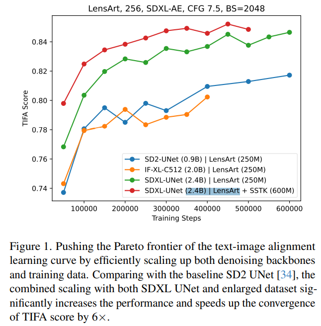

## methods

### DA

> Our data acquisition process is rigorously governed by the principles outlined in the General Data Protection Regulation (GDPR) [39] framework

高质量数据对于性能提升很重要

> We experimentally verified that incorporating high-quality data is instrumental in significantly enhancing model performance.

多个 data filter 选不同分辨率的高质量数据

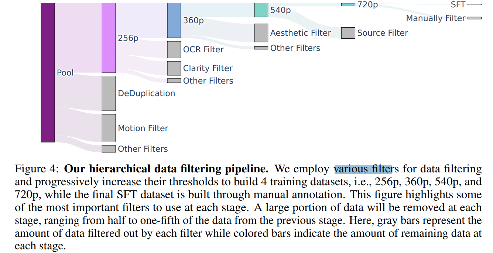

- Q：文本优化？

> Most previous work focus on providing either brief captions [14, 50] or dense captions [93, 9, 10]. However, these approaches are not without shortcomings, suffering from incomplete information, redundant discourse and inaccuracies. 

使用腾讯自己做的 VLM 生成文本，估计是 CogVLM

> we develop and implement an in-house Vision Language Model(VLM) designed to generate structured captions for images and videos. 

从 7 个角度细化文本

- Short Description
- Dense Description，描述相机运动，场景切换，物体细节
- Background 描述
- 拍摄风格描述，科幻风，
- Shot Type 相机距离，例如远景，中，近景
- Lighting 光线
- 视频传递的感觉，温馨，神秘。。。

训练一个识别 **14 种视频相机运动**的分类器

> We also train a camera movement classifier capable of predicting 14 distinct camera movement types, including zoom in, zoom out, pan up, pan down, pan left, pan right, tilt up, tilt down, tilt left, tilt right, around left, around right, static shot and handheld shot. 

### model

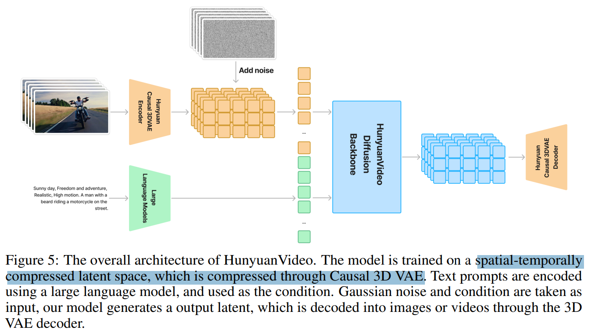

#### 3D VAE 训练

latent spatial 维度仍然是 f8, T 维度 4 帧搞一个特征；C增加到 16

> To handle both videos and images, we adopt CausalConv3D [95]. For a video of shape (T + 1) × 3 × H × W, our 3DVAE compresses it into latent features with shape$ ( T /ct + 1) × C × ( H / cs ) × ( W /cs )$ .  In our implementation, $ct = 4, cs = 8, and C = 16$

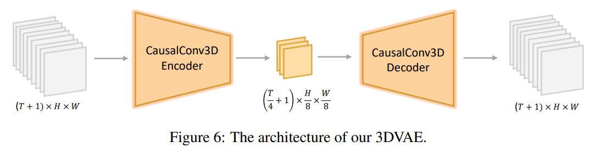

从头训练一个 VAE，混合视频 & 图像数据 4:1；

> In contrast to most previous work [67, 11, 104], we do not rely on a pre-trained image VAE for parameter initialization; instead, we train our model from scratch.
>
> To balance the reconstruction quality of videos and images, we mix video and image data at a ratio of 4 : 1.

L1，KL-Loss，Perceptual Loss，GanLoss

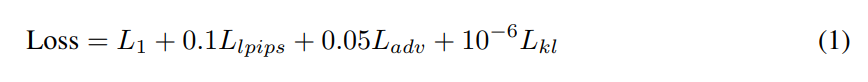

使用 Curriculum learning strategy，逐渐从小分辨率训练到大

> During training, we employ a curriculum learning strategy, gradually training from low-resolution short video to high-resolution long video.

frame interval 1-8 随机取

> To improve the reconstruction of high-motion videos, we randomly choose a sampling interval from the range 1 ∼ 8 to sample frames evenly across video clips.

##### infer 降显存

类似 RVRT 取 3D 滑动窗口

> Encoding and decoding high-resolution long videos on a single GPU can lead to out-of-memory (OOM) errors. To address this, we use a spatial-temporal tiling strategy, splitting the input video into overlapping tiles along the spatial and temporal dimensions.

- Q：会有 artifact 咋搞？？？

认为是训练 & 推理不一致导致的。。。训练时候也分一下 patch，有用？？？

> We observed that directly using the tiling strategy during inference can result in visible artifacts due to **inconsistencies between training and inference.** To solve this, **we introduce an additional finetuning phase where the tiling strategy is randomly enabled/disabled during training.** 

3D VAE 至少是目前开源的指标稍微高一点的

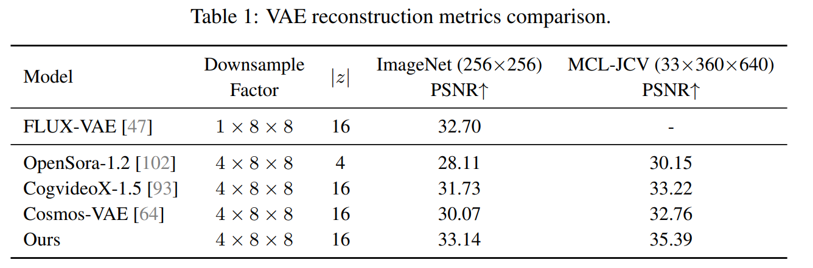

但从主观上效果没有差距很多啊。。考虑到挑图的成分

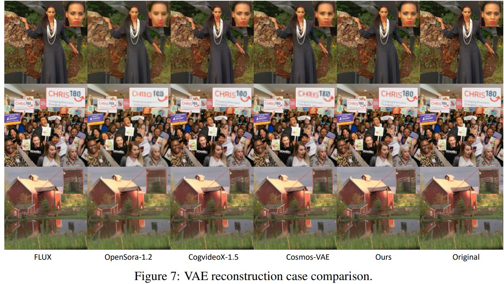

### DiT

> we introduce the Transformer design in HunyuanVideo, which employs a unified Full Attention mechanism for three main reasons

参考 FLUX，使用 1/3 用 dual-stream DiT, 其余用 single-stream DiT （使用 RoPE）:star:

> - Black Forest Labs. Flux, 2024

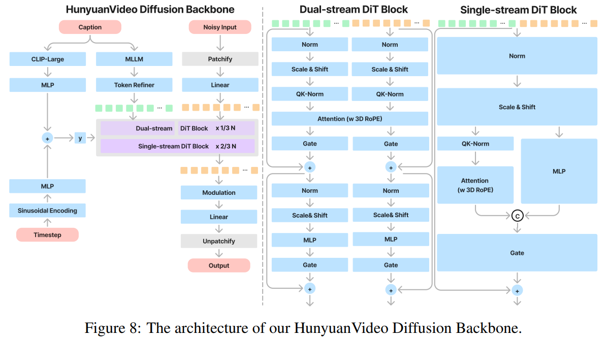

> Concurrently, we employ the CLIP model to extract a pooled text representation containing global information.

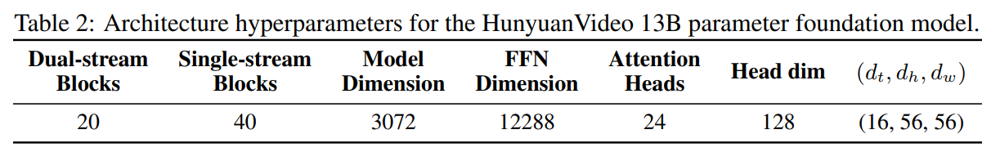

- Q：为什么要用 RoPE？

支持长宽比，可变 T 的训练

> To support multi-resolution, multi-aspect ratio, and varying duration generation, we use Rotary Position Embedding (RoPE) [77] in each Transformer block. 

- Q：RoPE  怎么用到 3D 上？

每个维度单独计算 RoPE

> Given the added complexity of the temporal dimension in video data, we extend RoPE to three dimensions. Specifically, we compute the rotary frequency matrix separately for the coordinates of time (T), height (H), and width (W). 

### Model Scaling

模型参数量，数据集大小，计算资源有相互依赖关系，**影响模型训练效率**

> By elucidating the relationships between **model size (N), dataset size (D), and computational resources (C)**, these laws help drive the development of more effective and efficient models, 

- Q：为什么要测这个 scaling law？

通过 N,D, C 对于 loss 的影响来**判断更优的模型设置，提升训练效率**

>  Building upon these foundational scaling laws, we subsequently derived the scaling laws applicable to the text-to-video model. By integrating these two sets of scaling laws, **we were able to systematically determine the appropriate model and data configuration for video generation tasks.**

看 MSE loss 找到最优的参数量

> SD3 [21] only study the scaling behavior between sample quality and network complexity, leaving the power-laws about the **computation resources and MSE loss** used by diffusion models unexplored
>
> - "On the scalability of diffusionbased text-to-image generation" CVPR, 2024 Apr 03 
>   [paper](https://arxiv.org/abs/2404.02883)

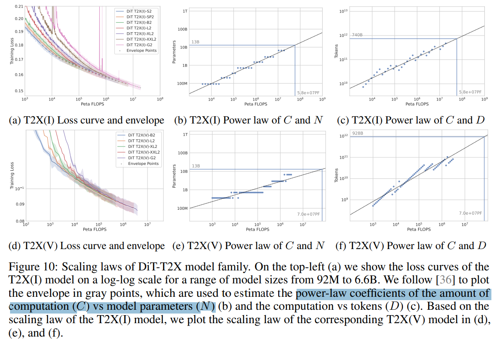

> named as DiT-T2X to distinguish from the original DiT, where X can be the image (I) or the video (V)

训练不同参数量的 DiT

> The DiT-T2X family has seven sizes ranging from **92M to 6.6B**. The models were trained using DDPM [34] and v-prediction [73] with consistent hyperparameters and the same dataset with 256px resolution
>
> - "Training compute-optimal large language models"

### few-step accelerate

熊的鼻子都歪了。。。

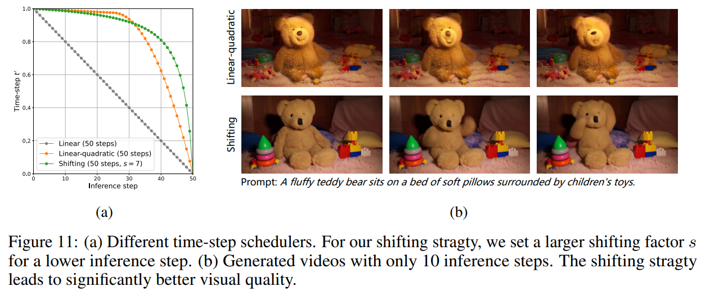

### I2V

在 C 维度 concat

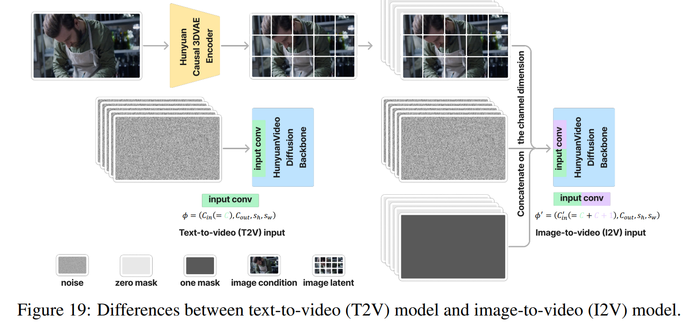

### Hardware Infrastucture

> To ensure efficient communication in large-scale distributed training, we setup a dedicated distributed training framework termed Tencent XingMai network [48] for highly efficient inter-server communication. 

## setting

没具体说多少训练资源，tencent 搞了个自己的集群

## Experiment

> ablation study 看那个模块有效，总结一下

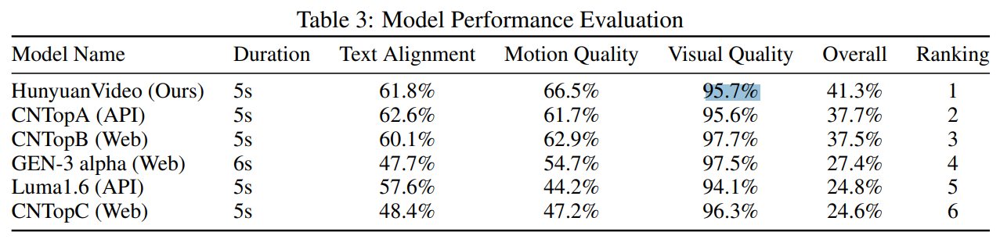

## Limitations

## Summary :star2:

> learn what

- Q：为什么要测这个 scaling law？

通过 N,D, C 对于 loss 的影响来**判断更优的模型设置，提升训练效率**

### how to apply to our task

- Q：咋训练 VAE？

从头训练一个 VAE，混合视频 & 图像数据 4:1；

> In contrast to most previous work [67, 11, 104], we do not rely on a pre-trained image VAE for parameter initialization; instead, we train our model from scratch.
>
> To balance the reconstruction quality of videos and images, we mix video and image data at a ratio of 4 : 1.

L1，KL-Loss，Perceptual Loss，GanLoss

使用 Curriculum learning strategy，逐渐从小分辨率训练到大
