# LTX-Video: Realtime Video Latent Diffusion

> "LTX-Video: Realtime Video Latent Diffusion" Arxiv, 2024 Dec 30
> [paper](http://arxiv.org/abs/2501.00103v1) [code]() [pdf](./2024_12_Arxiv_LTX-Video--Realtime-Video-Latent-Diffusion.pdf) [note](./2024_12_Arxiv_LTX-Video--Realtime-Video-Latent-Diffusion_Note.md)
> Authors: Yoav HaCohen, Nisan Chiprut, Benny Brazowski, Daniel Shalem, Dudu Moshe, Eitan Richardson, Eran Levin, Guy Shiran, Nir Zabari, Ori Gordon, Poriya Panet, Sapir Weissbuch, Victor Kulikov, Yaki Bitterman, Zeev Melumian, Ofir Bibi

## Key-point

- Task

  - VAE & DiT 一起优化

  > Unlike existing methods, which treat these components as independent, LTX-Video aims to optimize their interaction for improved efficiency and quality. At its core is a carefully designed Video-VAE that achieves a high compression ratio of 1:192, with spatiotemporal downscaling of 32×32×8 pixels per token, enabled by relocating the patchifying operation from the transformer’s input to the VAE’s input

- Problems

- :label: Label:

## Contributions

- VideoVAE 高压缩比 1:192，实现实时

> LTX-Video aims to optimize their interaction for improved efficiency and quality. At its core is a carefully designed Video-VAE that achieves a high compression ratio of 1:192, with spatiotemporal downscaling of 32×32×8 pixels per token

- VideoVAE & DiT 一起训练

> • A holistic approach to latent diffusion: LTX-Video seamlessly integrates the Video-VAE and the denoising transformer, optimizing their interaction within a compressed latent space and sharing the denoising objective between the transformer and the VAE’s decoder.

- 使用 latent-to-pixel conversion and the final denoising step 提升细节

> However, the high compression inherently limits the representation of fine details. To address this, our VAE decoder is tasked with both latent-to-pixel conversion and the final denoising step, producing the clean result directly in pixel space.

- 一个 H100 GPU, 2s 生成 5s fps24 的视频

> It achieves faster-than-real-time generation, producing 5 seconds of 24 fps video at 768×512 resolution in just 2 seconds on an Nvidia H100 GPU, outperforming all existing models of similar scale.

## Introduction

结构一致性还可以，不仔细看看不出来明显差异。压缩比太大，细节很垃圾

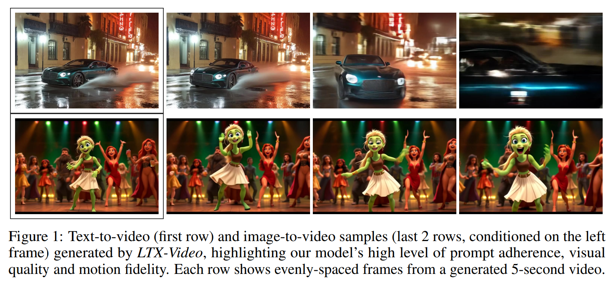

## methods

VAE 压缩比 F32x32x8 c128，对比 SD-VAE F8x8x1 C4，信息量为 SD-VAE 的 $\frac{3/(32*32*8) *128}{ 3/(8*8) *4} = 1/4$ 

> In contrast, our Video-VAE applies a spatio-temporal compression of 32 × 32 × 8 with 128 channels, resulting in a total compression of 1:192

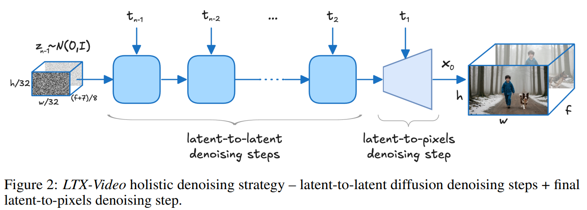

### Video VAE

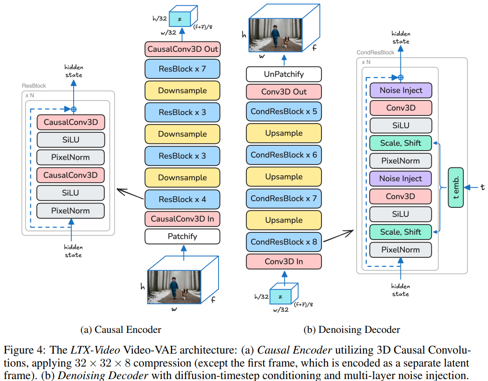

- Q：设计的 VAE 压缩比是否有冗余？

> We analyze the redundancy in our latent space using PCA [14] over the latent pixels of 128 video samples (see Fig 3). As training progresses, our VAE learns to utilize the available channels and reduces their redundancy. Note that naive patchification of the latents before passing them to the transformer, as done by recent models, does not contribute to reducing the redundancy.

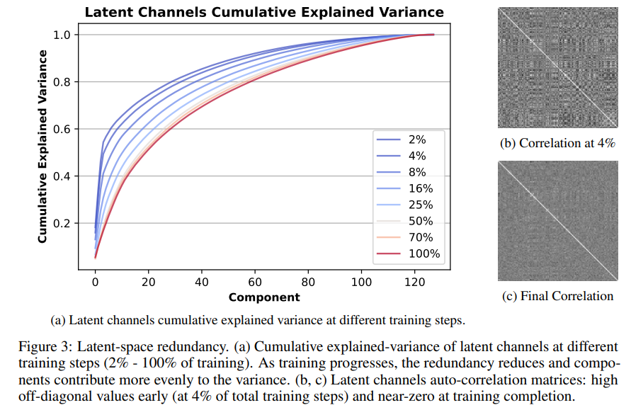

- Q：VAE 训练？

使用 3 个 loss，L2 & Perceptual & GAN loss

> A common approach in VAE training is to balance pixel-wise L2 loss, perceptual loss (LPIPS [16]), and a GAN discriminator.

改进 GAN loss，2个样本同时对比

> the discriminator sees both versions of the same sample (concatenated) and needs to decide which is the original and which is the reconstructed version.

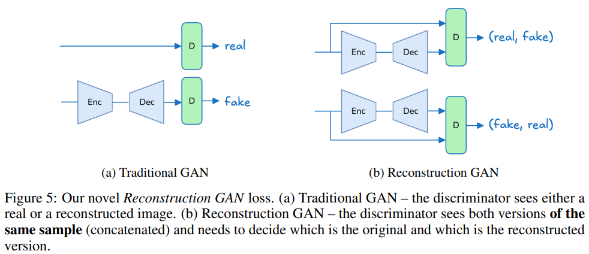

### DiT

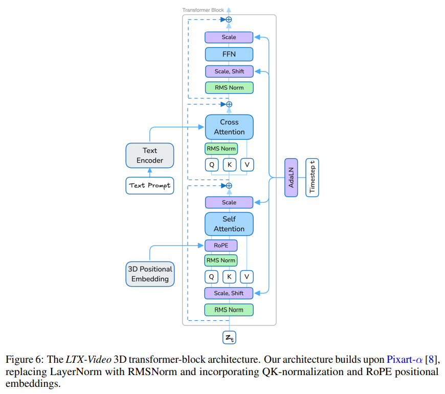

- Q：3D RoPE?

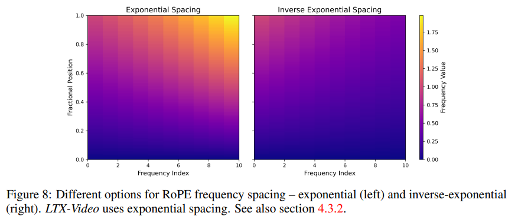

- Q：对比其他模型大小？

和 CogVideoX 大小差不多

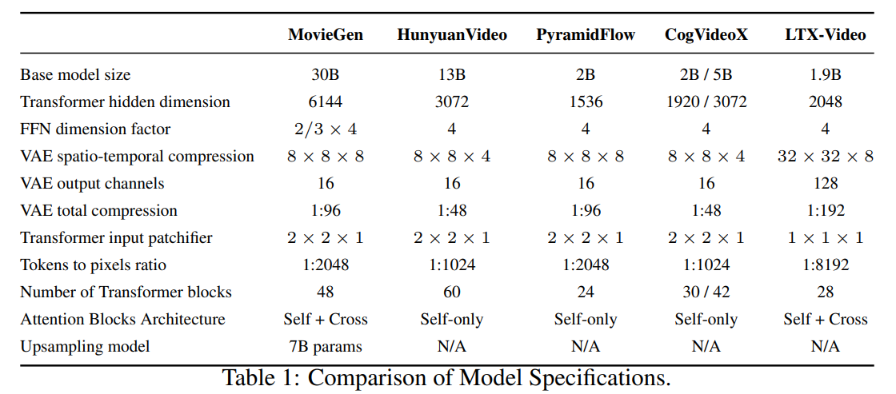

#### Image Condition

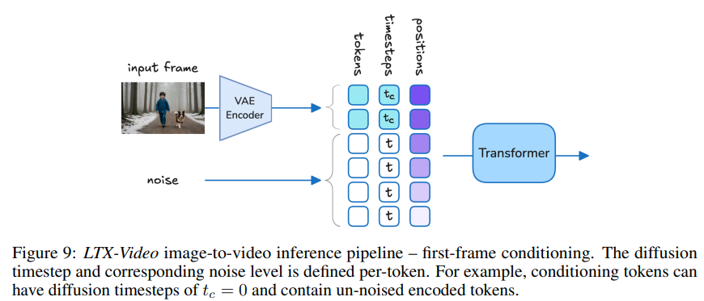

#### Timestep scheduling

使用 SD3 的 Log-Normal Scheduler，对于 v-pred 更难得 timestep 增加训练次数

> SD3 [12] proposed sampling the diffusion timestep t during training from the log-normal distribution, replacing the uniform distribution U(t) used in earlier models.
>
> The motivation is to assign more training steps to timesteps in which the velocity-prediction task is more difficult.

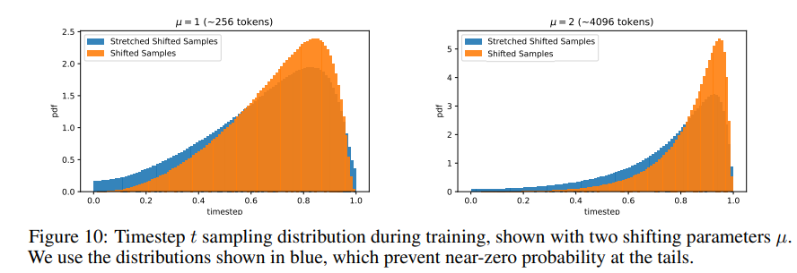

### Data

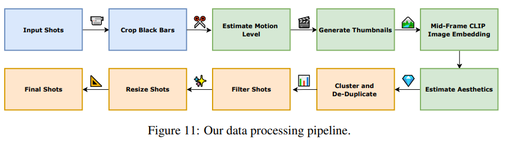

可视化了一下 caption 中词频

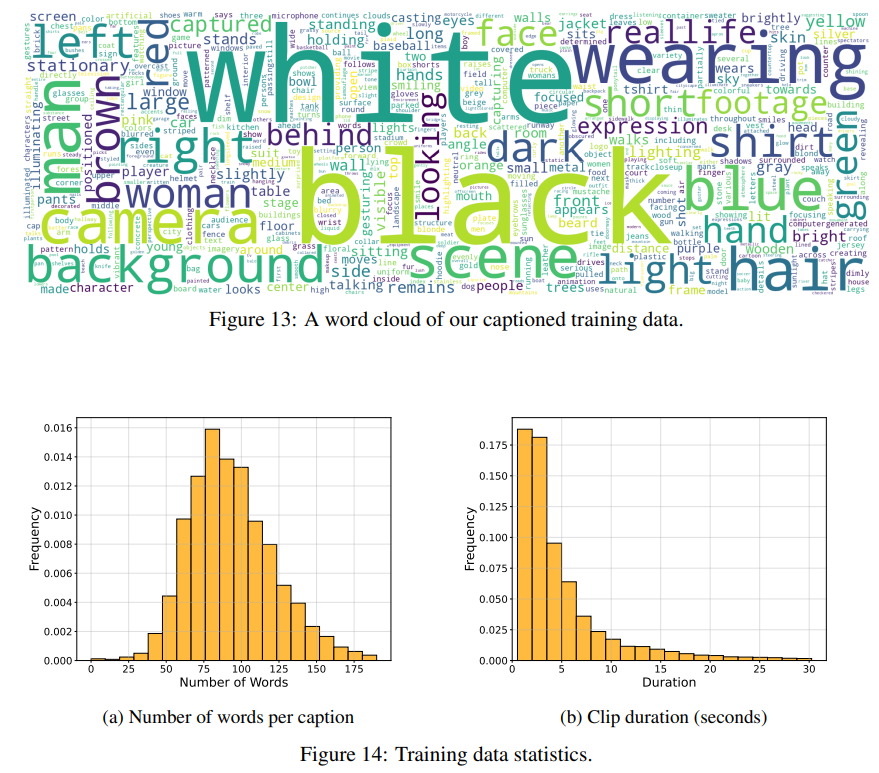

## setting

在 MovieGen 上测试

> - " Movie gen: A cast of media foundation models"
>
> Following MovieGen [2], we conducted a human survey to evaluate the quality of LTX-Video compared to current state-of-the-art models of similar size: Open-Sora Plan [4], CogVideoX [3] (2B) and PyramidFlow [5].

去噪 40step

>  We used 1,000 prompts for the text-to-video task and 1,000 pairs of images and prompts for the image-to-video task (the images were generated using FLUX.1 [30]). We then generated 5-second videos at resolution of 768 × 512 using all evaluated models with their default configurations. All videos were generated using 40 diffusion steps.

## Experiment

> ablation study 看那个模块有效，总结一下

找了 20 个人去评价效果

> The survey involved 20 participants, each of whom was shown each time a randomly ordered pair of videos from a randomly selected pair of evaluated models (not necessarily including LTX-Video).

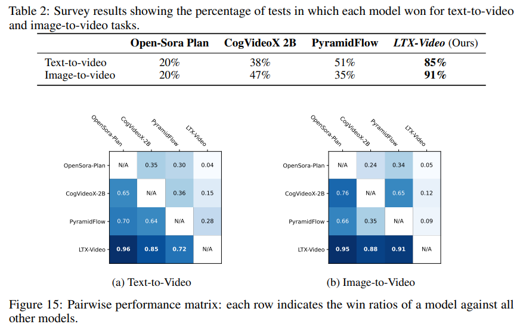

高压缩比生成出来太平滑了。。。

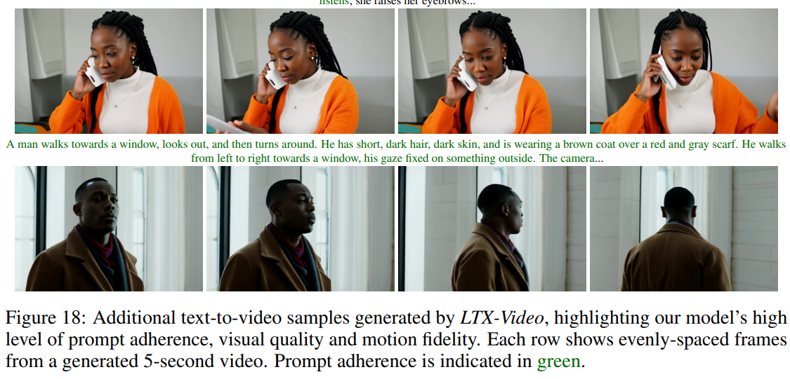

### Ablation

GAN loss

看改进得 GAN Loss 训练出来的 VAE，做重建的效果。。。细节差异看不出来。。

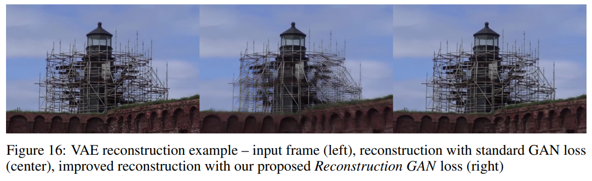

## Limitations

- 对细节要求高的场景没测试过

> The model’s ability to adapt to domain-specific tasks (e.g., multiview synthesis or fine-grained editing) has not been extensively tested

- 对 prompt 要求高。。。
- 最多只生成 10s，再长就不行了

> Currently, the model focuses on generating short videos of up to ten seconds. Extending the architecture to support longer durations while maintaining temporal consistency and prompt fidelity remains an open area for future research.

## Summary :star2:

> learn what

### how to apply to our task

- 改进的 GAN loss 学习一下，用来训练 VAE
- 高压缩比 VAE 提升速度？
