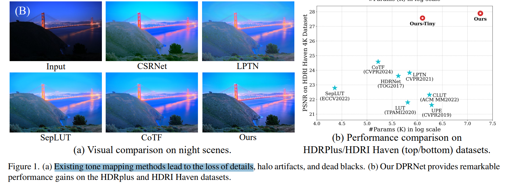

# Learning Differential Pyramid Representation for Tone Mapping

> "Learning Differential Pyramid Representation for Tone Mapping" Arxiv, 2024 Dec 2, `DPRNet`
> [paper](http://arxiv.org/abs/2412.01463v1) [code](https://xxxxxx2024.github.io/DPRNet/.) [pdf](./2024_12_Arxiv_Learning-Differential-Pyramid-Representation-for-Tone-Mapping.pdf) [note](./2024_12_Arxiv_Learning-Differential-Pyramid-Representation-for-Tone-Mapping_Note.md)
> Authors: Qirui Yang, Yinbo Li, Peng-Tao Jiang, Qihua Cheng, Biting Yu, Yihao Liu, Huanjing Yue, Jingyu Yang

## Key-point

- Task
- Problems
- :label: Label:

## Contributions

## Introduction

细节纹理出来了很多哦

- Q：先前低光图像增强方法，大多都是想办法从高频取特征

> Previous tone mapping methods mainly focus on how to enhance tones in low-resolution images and recover details using the high-frequent components extracted from the input image.

## methods

## setting

## Experiment

> ablation study 看那个模块有效，总结一下

## Limitations

## Summary :star2:

> learn what

### how to apply to our task

