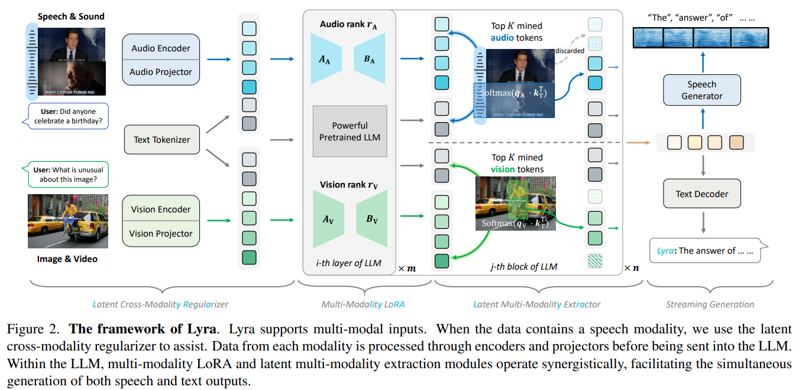

# Lyra: An Efficient and Speech-Centric Framework for Omni-Cognition

> "Lyra: An Efficient and Speech-Centric Framework for Omni-Cognition" Arxiv, 2024 Dec 12
> [paper](http://arxiv.org/abs/2412.09501v1) [code]() [pdf](./2024_12_Arxiv_Lyra--An-Efficient-and-Speech-Centric-Framework-for-Omni-Cognition.pdf) [note](./2024_12_Arxiv_Lyra--An-Efficient-and-Speech-Centric-Framework-for-Omni-Cognition_Note.md)
> Authors: Zhisheng Zhong, Chengyao Wang, Yuqi Liu, Senqiao Yang, Longxiang Tang, Yuechen Zhang, Jingyao Li, Tianyuan Qu, Yanwei Li, Yukang Chen, Shaozuo Yu, Sitong Wu, Eric Lo, Shu Liu, Jiaya Jia

## Key-point

- Task
- Problems
- :label: Label:

## Contributions

## Introduction

## methods

多种模态 -> 语言输出

## setting

## Experiment

> ablation study 看那个模块有效，总结一下

## Limitations

## Summary :star2:

> learn what

### how to apply to our task

