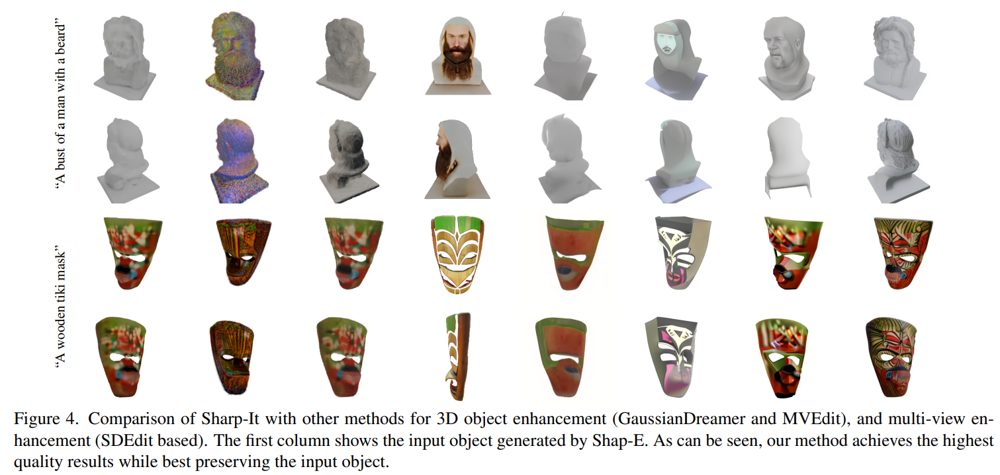

# Sharp-It: A Multi-view to Multi-view Diffusion Model for 3D Synthesis and Manipulation

> "Sharp-It: A Multi-view to Multi-view Diffusion Model for 3D Synthesis and Manipulation" Arxiv, 2024 Dec 3
> [paper](http://arxiv.org/abs/2412.02631v1) [code](https://github.com/YiftachEde/Sharp-It) [web](https://yiftachede.github.io/Sharp-It/) [pdf](./2024_12_Arxiv_Sharp-It--A-Multi-view-to-Multi-view-Diffusion-Model-for-3D-Synthesis-and-Manipulation.pdf) [note](./2024_12_Arxiv_Sharp-It--A-Multi-view-to-Multi-view-Diffusion-Model-for-3D-Synthesis-and-Manipulation_Note.md)
> Authors: Yiftach Edelstein, Or Patashnik, Dana Cohen-Bar, Lihi Zelnik-Manor（Tel Aviv University）

## Key-point

- Task: 粗糙 3D 模型增加纹理，fast 3D content creation

- Problems

  - 直接生成 3D 显存有限，纹理垃圾

    > An alternative approach involves native 3D generative models that directly produce 3D representations. These models, however, are typically limited in their resolution, resulting in lower quality 3D objects.

- :label: Label:

## Contributions

- In this work, we bridge the quality gap between methods that directly generate 3D representations and ones that reconstruct 3D objects from multi-view images. 

- 从多个视角去优化纹理，能不能搞到游戏视频上（找粗糙3D 模型容易些）？？？

  > We introduce a multi-view to multi-view diffusion model called Sharp-It, which takes a 3D consistent set of multi-view images rendered from a low-quality object and enriches its geometric details and texture
  >
  > A high-quality 3D model can then be reconstructed from the enriched multi-view set.

- 效果 & 应用前景好

  > fast synthesis, editing, and controlled generation, while attaining high-quality assets

## Introduction

## methods

和视频很接近嘛。。。用一个粗糙的模型生成个大概，-》生成多个视角（视频多帧），有的好有的拉；重点在于**维持多个视角生成的一致性！（视频多帧的一致性）**

- Q：细节怎么搞？不同 view 用不同 prompt

> we can apply a different prompt from the one used during the generation of the ShapE object, facilitating appearance editing that accurately preserves the original shape

## setting

- Zero123++ 生成分辨率低，小一点的一个大概

  > Zero123++ is a fine-tuned version of Stable Diffusion that accepts an image as input. Given an input image, it produces a 3 × 2 grid of 320 × 320 pixel images, with six constant azimuth and elevation angles. Originally, Zero123++ [61] was designed to generate this grid image with a grey background.

- Dataset

Finally, we split the dataset into training and test sets, resulting in 180,000 objects for training and 6,000 for testing.

- Q：训练消耗？？

We train our network for 500,000 steps, with a CFG drop probability of 0.1, and a batch size of 3 multi-views, using a single NVIDIA A6000 GPU.

> A6000 4wRMB 一张 48G 显存

## Experiment

> ablation study 看那个模块有效，总结一下

主观好了很多啊

## Limitations

## Summary :star2:

> learn what

### how to apply to our task

- 和视频很接近嘛。。。用一个粗糙的模型生成个大概，-》生成多个视角（视频多帧），有的好有的拉；重点在于**维持多个视角生成的一致性！（视频多帧的一致性）**
- 训练消耗：A6000 4wRMB 一张 48G 显存

We train our network for 500,000 steps, with a CFG drop probability of 0.1, and a batch size of 3 multi-views, using a single NVIDIA A6000 GPU.
