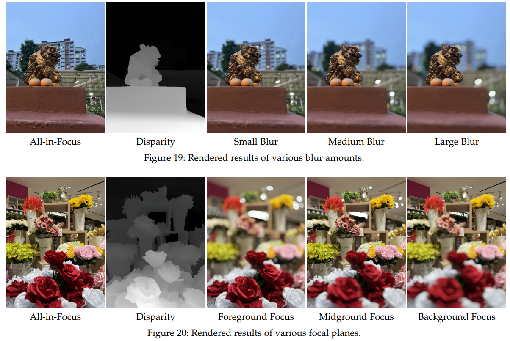

# BokehMe++: Harmonious Fusion of Classical and Neural Rendering for Versatile Bokeh Creation

> "BokehMe++: Harmonious Fusion of Classical and Neural Rendering for Versatile Bokeh Creation" TPAMI, 2024 Dec 18
> [paper](https://ieeexplore.ieee.org/document/10756626) [code]() [pdf](./2024_12_TPAMI_BokehMe++--Harmonious-Fusion-of-Classical-and-Neural-Rendering-for-Versatile-Bokeh-Creation.pdf) [note](./2024_12_TPAMI_BokehMe++--Harmonious-Fusion-of-Classical-and-Neural-Rendering-for-Versatile-Bokeh-Creation_Note.md)
> Authors: Juewen Peng, Zhiguo Cao, Xianrui Luo, Ke Xian, Wenfeng Tang, Jianming Zhang

## Key-point

- Task
- Problems
- :label: Label:

## Contributions

## Introduction

- "Vision transformers for dense prediction" ICCV, 2021 Mar
  [paper](https://arxiv.org/abs/2103.13413)

## methods

模型输入的 noisy disparity map 使用 DPT 生成

> imperfect disparity maps predicted by DPT [1]

## setting

## Experiment

> ablation study 看那个模块有效，总结一下

支持控制前景 or 背景虚化！

## Limitations

## Summary :star2:

> learn what

### how to apply to our task

