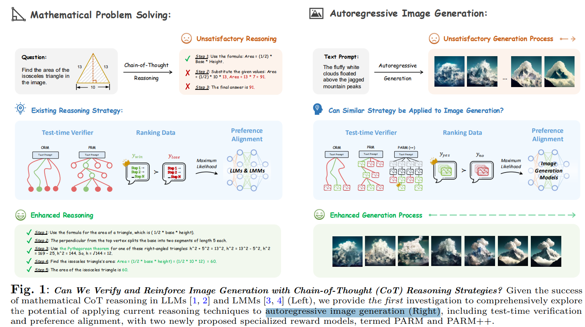
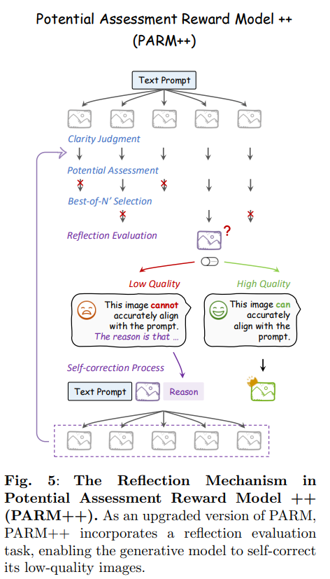
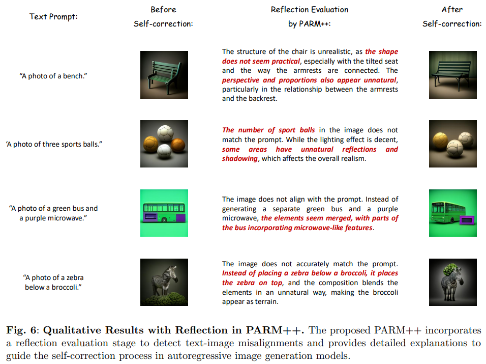
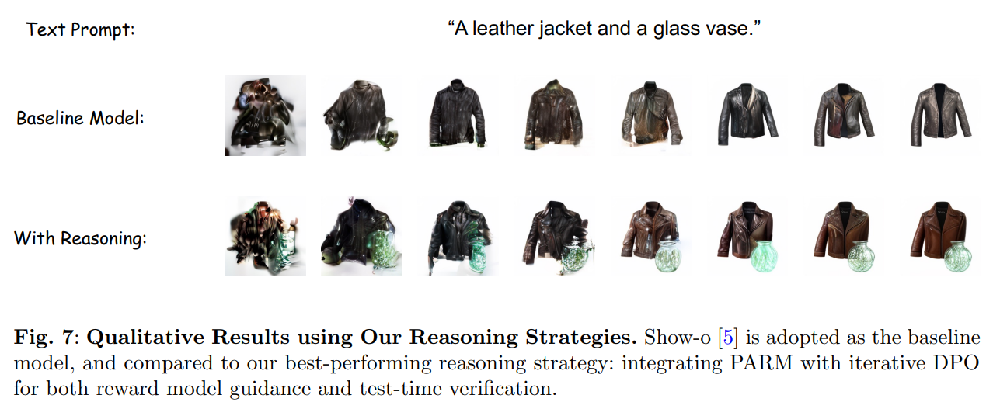

# Can We Generate Images with CoT? Let's Verify and Reinforce Image Generation Step by Step

> "Can We Generate Images with CoT? Let's Verify and Reinforce Image Generation Step by Step" Arxiv, 2025 Jan 23
> [paper](http://arxiv.org/abs/2501.13926v1) [code](https://github.com/ZiyuGuo99/Image-Generation-CoT) [pdf](./2025_01_Arxiv_Can-We-Generate-Images-with-CoT--Let's-Verify-and-Reinforce-Image-Generation-Step-by-Step.pdf) [note](./2025_01_Arxiv_Can-We-Generate-Images-with-CoT--Let's-Verify-and-Reinforce-Image-Generation-Step-by-Step_Note.md)
> Authors: Ziyu Guo, Renrui Zhang, Chengzhuo Tong, Zhizheng Zhao, Peng Gao, Hongsheng Li, Pheng-Ann Heng

## Key-point

- Task
- Problems
- :label: Label:

## Contributions

## Introduction

## methods

## setting

## Experiment

> ablation study 看那个模块有效，总结一下

## Limitations

## Summary :star2:

> learn what

### how to apply to our task

