# ComposeAnyone: Controllable Layout-to-Human Generation with Decoupled Multimodal Conditions

> "ComposeAnyone: Controllable Layout-to-Human Generation with Decoupled Multimodal Conditions" Arxiv, 2025 Jan 21
> [paper](http://arxiv.org/abs/2501.12173v1) [code](https://github.com/Zhangshy1019/ComposeAnyone) [pdf](./2025_01_Arxiv_ComposeAnyone--Controllable-Layout-to-Human-Generation-with-Decoupled-Multimodal-Conditions.pdf) [note](./2025_01_Arxiv_ComposeAnyone--Controllable-Layout-to-Human-Generation-with-Decoupled-Multimodal-Conditions_Note.md)
> Authors: Shiyue Zhang, Zheng Chong, Xi Lu, Wenqing Zhang, Haoxiang Li, Xujie Zhang, Jiehui Huang, Xiao Dong, Xiaodan Liang

## Key-point

- Task: human image generation

- Problems

  - text2image, 只用一张参考图的生成，效果不好

    > However, existing methods often focus solely on text-to-image or image reference-based human generation, which fails to satisfy the increasingly sophisticated demands.

- :label: Label:

## Contributions

- **支持多个人体/衣服的参考图**，去实现可控部件的人体生成。需要手工画的人体结构图（说是很容易画）

> We propose ComposeAnyone, a novel controllable Layout-to-Human generation method that utilizes handdrawn geometric shapes as layout, combined with textual and image references for different human components, to generate highly consistent and realistic human images for text-only, image-only, or mix-modal tasks

- 提出一个属性分解的数据集

> Additionally, we introduce the ComposeHuman dataset, which provides decoupled text and reference image annotations for different components of each human image, enabling broader applications in human image generation tasks

- SOTA

## Introduction

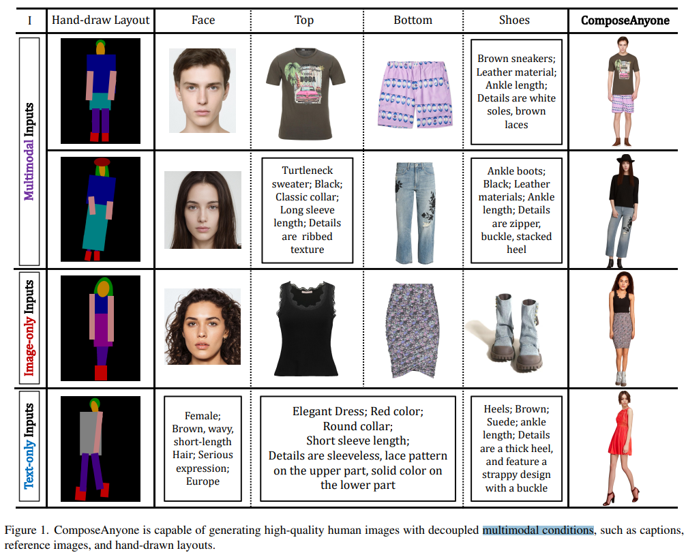

### Layout-Guided 

## methods

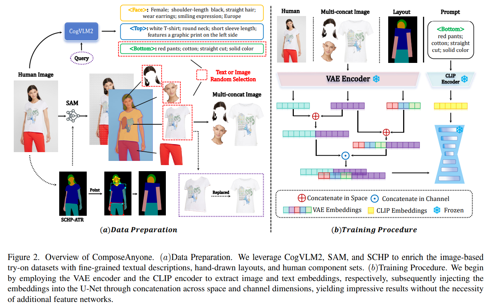

预训练模型准备数据，衣服组件图，人脸图，人体框架 or 骨架，text 描述

> We leverage **CogVLM2, SAM, and SCHP** to enrich the image-based try-on datasets with fine-grained textual descriptions, hand-drawn layouts, and human component sets

VAE 提取特征，多个 reference 图得 VAE 特征，两个 VAE 特征先在特征长度 L 上 concat，再在 C 上把前面的特征 concat 在一起

> We begin by employing the VAE encoder and the CLIP encoder to extract image and text embeddings, respectively

UNet 冻住，直接在 L，C 维度 concat？

> subsequently injecting the embeddings into the U-Net through concatenation across space and channel dimensions, yielding impressive results without the necessity of additional feature networks.

### data

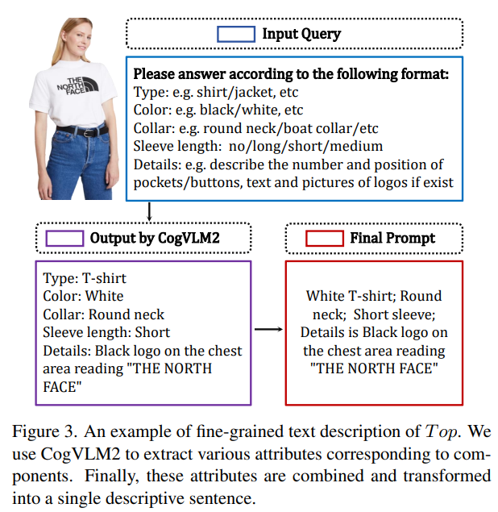

Hand-Draw Layouts 制作

> Based on SCHP [25], we calculated contour coordinates for color blocks and fitted them into basic shapes such as ellipses and rectangles to build a coarsegrained hand-draw layout set. 

### train

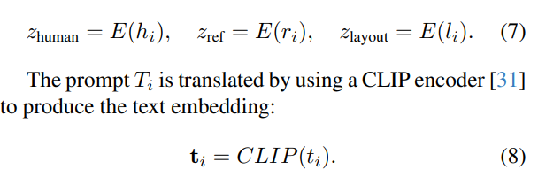

**把参考图的 VAE 特征在 UNet 输入的 noise 地方进行 concat**，去训练 UNet，就是在 Unet 输入加入了参考图特征

> The key step involves concatenating latent vectors along a chosen(-1) spatial dimension. Specifically, we concatenate the latents from the human image (zhuman) and reference image (zref) to form the ground truth latent:

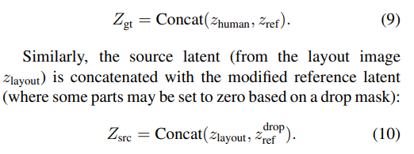

diffusion MSE loss 加了一个权重，说能增强信息质量

> we use signal-to-noise ratio (SNR) based loss weighting, enhancing the signal quality while mitigating the influence of noise. The loss is modified based on the SNR at each timestep:

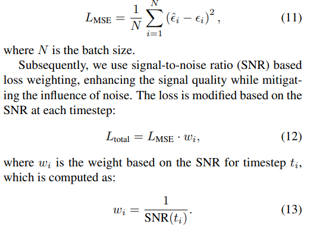

### infer cross-attn

推理的时候，类似 Cross-Attn map Loss，使用 Cross-Attn map 加入每一个组件的参考图。**一开始的 human layout 能对应到每一个组件，把这个组件相关的 text 筛出来**，并且物体能对应到文本里面的一个 token.

> During the inference step, we incorporate cross-attention control derived from hand-drawn layouts, thereby augmenting the quality and precision of text description generation

就是对每个部位，优化一下文本，这里没用到 reference image

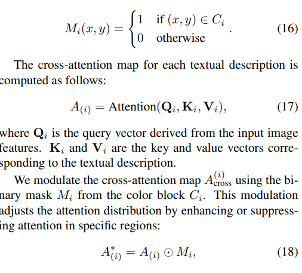

## setting

- All experiments were conducted on 4 NVIDIA A100 GPUs.

InstructPix2Pix 微调

> We initialized our model’s backbone with the weights from InstructPix2Pix [4], which is based on Stable Diffusion [32]
>
> We trained the model at a resolution of 384×512 with a batch size of 16 for 52,000 steps. To further improve visual quality, we fine-tuned the model at a higher resolution of 768×1024 for an additional 46,000 steps.

### Metrics

- VLM Rate 

CogVLM 去问

> Since CLIP may not capture intricate details effectively, we use CogVLM2 [17] to query and assess the alignment of instance features, facilitating more sophisticated, detailed, and varied evaluation.

- 每一个组件去何对准确率，GroundingDINO

> We first use GroundingDINO [28] to detect human component positions in generated images and then compute the Jaccard [19], Dice [11], and SSIM [42] metrics between the detected positions and the hand-drawn layout, weighted with 0.25, 0.25, and 0.50, respectively.

- FID [35] and KID
- LPIPS, SSIm

## Experiment

> ablation study 看那个模块有效，总结一下

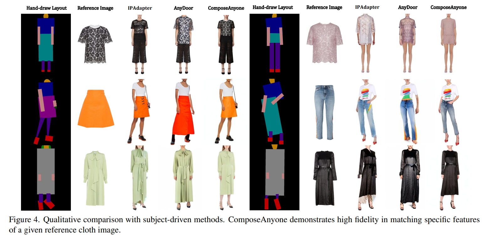

**other layout-guided methods**

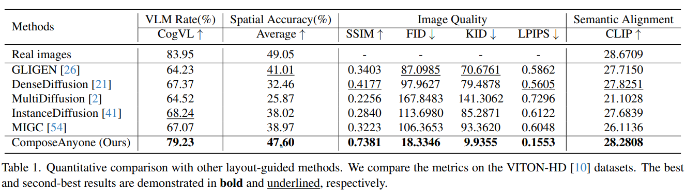

**other subject-driven methods**

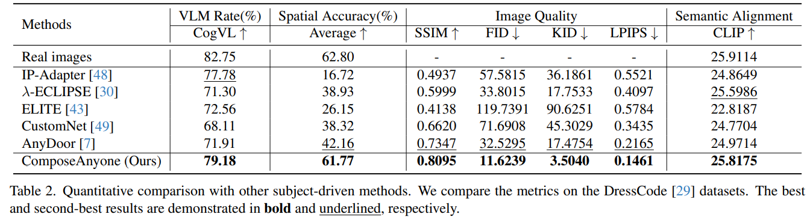

### ablation

> We conducted ablation studies on the DeepFashion[14] dataset, focusing on classifier-free guidance (CFG) and cross-attention modulation (CA). 

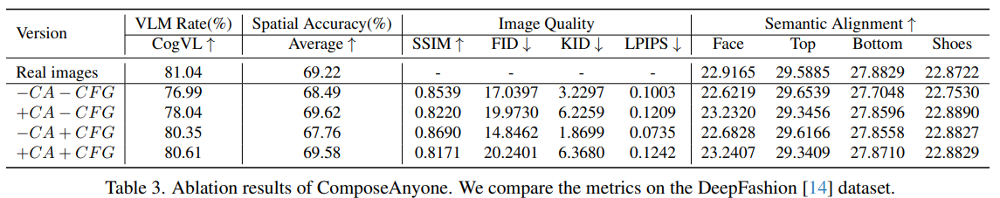

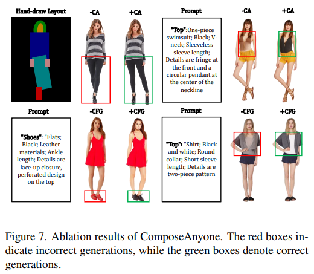

## Limitations

## Summary :star2:

> learn what

### how to apply to our task

- **把参考图的 VAE 特征在 UNet 输入的 noise 地方进行 concat**，去训练 UNet，就是在 Unet 输入 concat 参考图特征
- 多个参考图特征直接 concat 就可以了
